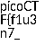

# Secret of the Polyglot (100 points)
The Network Operations Center (NOC) of your local institution picked up a suspicious file, they're getting conflicting information on what type of file it is. They've brought you in as an external expert to examine the file. Can you extract all the information from this strange file?

## Data
* flag2of2-final.pdf

## Solution
If we open the document we can find a part of the flag: `1n_pn9_&_pdf_1f991f77}`

The other part has to somewhere else. Let's analyse the file:
```
$ file flag2of2-final.pdf
flag2of2-final.pdf: PNG image data, 50 x 50, 8-bit/color RGBA, non-interlaced
$
```

Seems like there is also PNG data in the file. So let's adjust the file ending and open it:
```
$ cp flag2of2-final.pdf flag2of2-final.png
$
```


And here we got our second part.

The full flag is: `picoCTF{f1u3n7_1n_pn9_&_pdf_1f991f77}`
