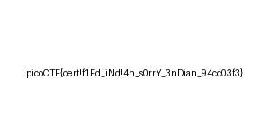

# endianness-v2 (300 points)
Here's a file that was recovered from a 32-bits system that organized the bytes a weird way. We're not even sure what type of file it is.

## Data
* challengefile

## Solution
I searched a bit for commands with that you can change the byte-order and I found [this](https://unix.stackexchange.com/questions/239543/is-there-a-oneliner-that-converts-a-binary-file-from-little-endian-to-big-endian) thread on StackExchange.

There was one command that worked for me:
```
$ hexdump -v -e '1/4 "%08x"' -e '"\n"' challengefile | xxd -r -p > output_file
$ file output_file
output_file: JPEG image data, JFIF standard 1.01, aspect ratio, density 1x1, segment length 16, baseline, precision 8, 300x150, components 3
$
```

So we got a JPEG file that shows us the flag:

