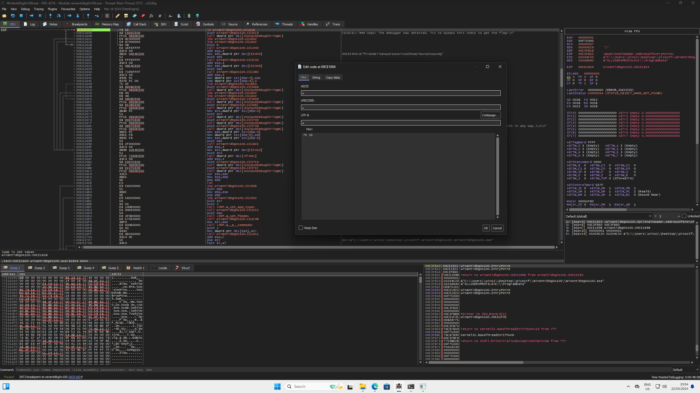

# WinAntiDbg0x100 (200 points)
This challenge will introduce you to 'Anti-Debugging.' Malware developers don't like it when you attempt to debug their executable files because debugging these files reveals many of their secrets! That's why, they include a lot of code logic specifically designed to interfere with your debugging process.

Now that you've understood the context, go ahead and debug this Windows executable!

This challenge binary file is a Windows console application and you can start with running it using `cmd` on Windows.

## Data
* WinAntiDbg0x100.zip

## Solution
If we run the exectuable we get the following message:
```
PS C:\Users\win11\Desktop\picoctf\WinAntiDbg0x100> .\WinAntiDbg0x100.exe


        _            _____ _______ ______
       (_)          / ____|__   __|  ____|
  _ __  _  ___ ___ | |       | |  | |__
 | '_ \| |/ __/ _ \| |       | |  |  __|
 | |_) | | (_| (_) | |____   | |  | |
 | .__/|_|\___\___/ \_____|  |_|  |_|
 | |
 |_|
  Welcome to the Anti-Debug challenge!
### To start the challenge, you'll need to first launch this program using a debugger!
PS C:\Users\win11\Desktop\picoctf\WinAntiDbg0x100>
```

There is some kind of check if the program is launched via a debugger. I we do so we get this output:
```
        _            _____ _______ ______  
       (_)          / ____|__   __|  ____| 
  _ __  _  ___ ___ | |       | |  | |__    
 | '_ \| |/ __/ _ \| |       | |  |  __|   
 | |_) | | (_| (_) | |____   | |  | |      
 | .__/|_|\___\___/ \_____|  |_|  |_|      
 | |                                       
 |_|                                       
  Welcome to the Anti-Debug challenge!
### Level 1: Why did the clever programmer become a gardener? Because they discovered their talent for growing a 'patch' of roses!
### Oops! The debugger was detected. Try to bypass this check to get the flag!
```
So to get the flag we have to skip the debug check.

Let's take a quick look inside the decompilation with IDA:
```c++
int __cdecl main(int argc, const char **argv, const char **envp)
{
  WCHAR *lpOutputString; // [esp+4h] [ebp-4h]

  if ( sub_401130() )
  {
    OutputDebugStringW("\n");
    OutputDebugStringW("\n");
    sub_4011B0();
    if ( sub_401200() )
    {
      OutputDebugStringW(
        L"### Level 1: Why did the clever programmer become a gardener? Because they discovered their talent for growing a"
         " 'patch' of roses!\n");
      sub_401440(7);
      if ( IsDebuggerPresent() )
      {
        OutputDebugStringW(L"### Oops! The debugger was detected. Try to bypass this check to get the flag!\n");
      }
      else
      {
        sub_401440(11);
        sub_401530(dword_405404);
        lpOutputString = (WCHAR *)sub_4013B0(dword_405408);
        if ( lpOutputString )
        {
          OutputDebugStringW(L"### Good job! Here's your flag:\n");
          OutputDebugStringW(L"### ~~~ ");
          OutputDebugStringW(lpOutputString);
          OutputDebugStringW(L"\n");
          OutputDebugStringW(L"### (Note: The flag could become corrupted if the process state is tampered with in any way.)\n\n");
          j_j_free(lpOutputString);
        }
        else
        {
          OutputDebugStringW(L"### Something went wrong...\n");
        }
      }
    }
    else
    {
      OutputDebugStringW(L"### Error reading the 'config.bin' file... Challenge aborted.\n");
    }
    free(Block);
  }
  else
  {
    sub_401060((char *)lpMultiByteStr);
    sub_401060("### To start the challenge, you'll need to first launch this program using a debugger!\n");
  }
  OutputDebugStringW(L"\n");
  OutputDebugStringW(L"\n");
  return 0;
}
```

Important for us is this condition:
```c++
if ( IsDebuggerPresent() )
      {
        OutputDebugStringW(L"### Oops! The debugger was detected. Try to bypass this check to get the flag!\n");
      }
      else
      {

[...]

```

The function `IsDebuggerPresent()` checks if a debugger launched the executable. To bypass that we can patch the if-condition.

In X64dbg, or our case in X32dbg, we can search for string references:


With the string from earlier we find the instructions that we are searching for:


The program calls the `IsDebuggerPresent()` function and jumps if the return value is not equal to the return value of another function. We know that the program exits here if we running it inside a debugger. So to continue we just have to invert the condition from `JNE` to `JE`.

To do we can insert a brakepoint at this position and restart the program. If it hits the brakepoint we can change the bytes `74 15` into `75 15`, which is the hex representation for `JE`:


If we know run the program further we can find our flag in the log or in the console:
```
        _            _____ _______ ______  
       (_)          / ____|__   __|  ____| 
  _ __  _  ___ ___ | |       | |  | |__    
 | '_ \| |/ __/ _ \| |       | |  |  __|   
 | |_) | | (_| (_) | |____   | |  | |      
 | .__/|_|\___\___/ \_____|  |_|  |_|      
 | |                                       
 |_|                                       
  Welcome to the Anti-Debug challenge!"
### Level 1: Why did the clever programmer become a gardener? Because they discovered their talent for growing a 'patch' of roses!
### Good job! Here's your flag:
### ~~~
picoCTF{d3bug_f0r_th3_Win_0x100_cc0ff664}
### (Note: The flag could become corrupted if the process state is tampered with in any way.)
```

### Windows problems
If I tried to run the executable on my Windows machine, I received the error that `VCRUNTIME140.dll` was not found. I researched a bit and found the solution to download and install the Microsoft Visual C++ 2015 Redistributable Update: https://www.microsoft.com/en-us/download/details.aspx?id=52685 (32 bit version since the executable is also 32 bit)
