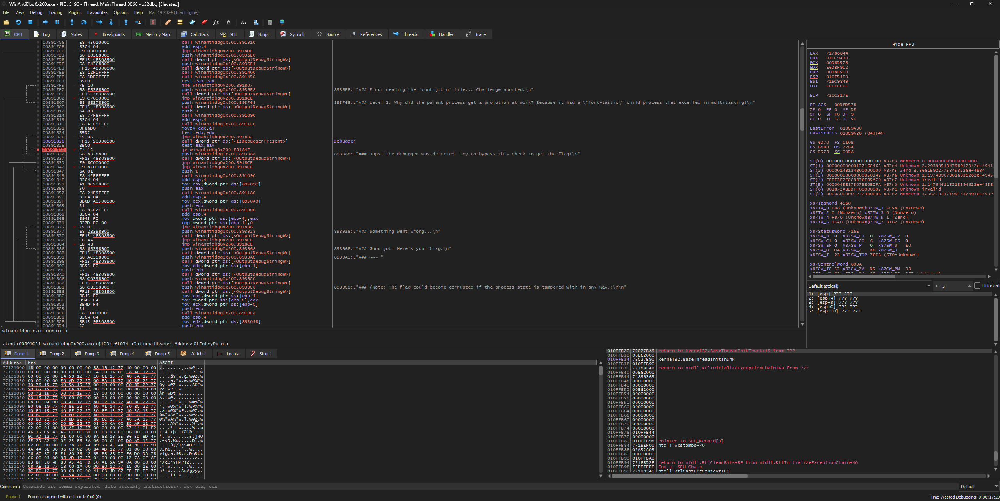
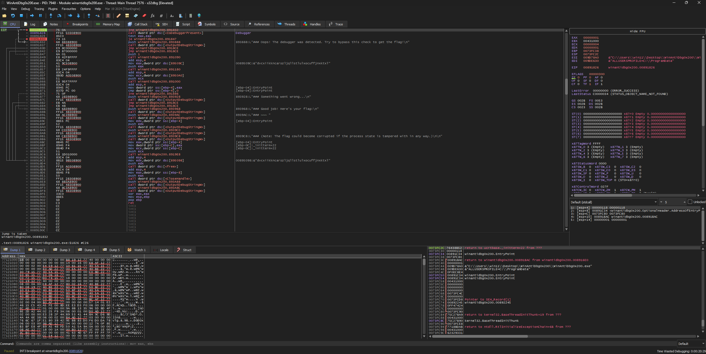
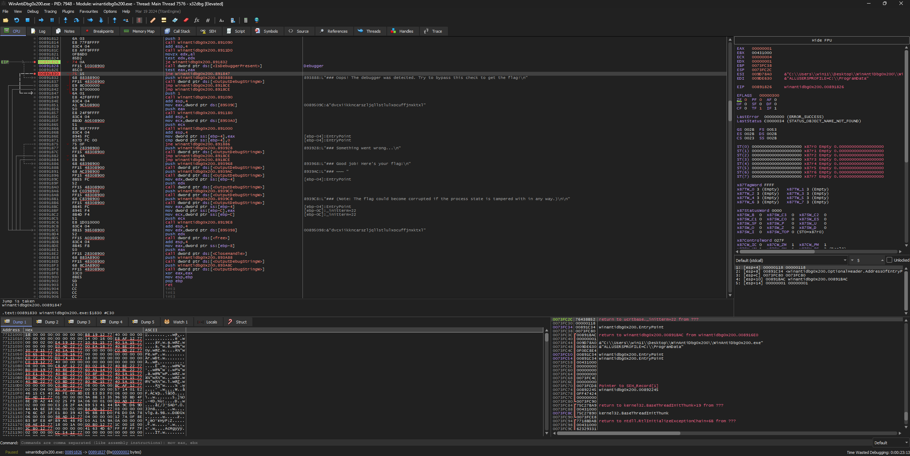

# WinAntiDbg0x200 (300 points)
If you have solved WinAntiDbg0x100, you'll discover something new in this one. Debug the executable and find the flag!

This challenge executable is a Windows console application, and you can start by running it using Command Prompt on Windows.

This executable requires admin privileges. You might want to start Command Prompt or your debugger using the 'Run as administrator' option.

Challenge can be downloaded [here]().

## Data
* WinAntiDbg0x200.zip

## Solution
If we analyse the executable with IDA, we get the following decompilation:
```c
int __cdecl main(int argc, const char **argv, const char **envp)
{
  int v3; // eax
  char Block; // [esp+0h] [ebp-Ch]
  char Blockb; // [esp+0h] [ebp-Ch]
  char Blocka; // [esp+0h] [ebp-Ch]
  HANDLE hObject; // [esp+4h] [ebp-8h]
  WCHAR *lpOutputString; // [esp+8h] [ebp-4h]

  if ( !sub_4012F0() )
  {
    sub_401910(
      "[ERROR] There are permission issues. This program requires debug privileges and hence you might want to run it as an Admin.\n",
      Block);
    sub_401910("Challenge aborted. Please run this program as an Admin. Exiting now...\n", Blockb);
    exit(255);
  }
  hObject = CreateMutexW(0, 0, L"WinAntiDbg0x200");
  if ( !hObject )
  {
    sub_401910("[ERROR] Failed to create the Mutex. Exiting now...\n", Block);
    exit(255);
  }
  if ( GetLastError() == 183 )
  {
    if ( argc != 2 )
    {
      sub_401910("[ERROR] Expected an argument\n", Block);
      exit(48879);
    }
    v3 = atoi(argv[1]);
    if ( DebugActiveProcess(v3) )
      exit(0);
    exit(48879);
  }
  sub_401910((char *)lpMultiByteStr, Block);
  if ( (unsigned __int8)sub_401600() )
  {
    OutputDebugStringW("\n");
    OutputDebugStringW("\n");
    sub_401400();
    if ( sub_401450() )
    {
      OutputDebugStringW(
        L"### Level 2: Why did the parent process get a promotion at work? Because it had a \"fork-tastic\" child process "
         "that excelled in multitasking!\n");
      sub_401090(3);
      if ( (unsigned __int8)sub_4011D0() || IsDebuggerPresent() )
      {
        OutputDebugStringW(L"### Oops! The debugger was detected. Try to bypass this check to get the flag!\n");
      }
      else
      {
        sub_401090(1);
        sub_401180(dword_40509C);
        lpOutputString = (WCHAR *)sub_401000(dword_4050A0);
        if ( lpOutputString )
        {
          OutputDebugStringW(L"### Good job! Here's your flag:\n");
          OutputDebugStringW(L"### ~~~ ");
          OutputDebugStringW(lpOutputString);
          OutputDebugStringW(L"\n");
          OutputDebugStringW(L"### (Note: The flag could become corrupted if the process state is tampered with in any way.)\n\n");
          j_j_free(lpOutputString);
        }
        else
        {
          OutputDebugStringW(L"### Something went wrong...\n");
        }
      }
    }
    else
    {
      OutputDebugStringW(L"### Error reading the 'config.bin' file... Challenge aborted.\n");
    }
    free(::Block);
  }
  else
  {
    sub_401910("### To start the challenge, you'll need to first launch this program using a debugger!\n", Blocka);
  }
  CloseHandle(hObject);
  OutputDebugStringW(L"\n");
  OutputDebugStringW(L"\n");
  return 0;
}
```

The important part is this condition:
```c
      if ( (unsigned __int8)sub_4011D0() || IsDebuggerPresent() )
      {
        OutputDebugStringW(L"### Oops! The debugger was detected. Try to bypass this check to get the flag!\n");
      }
      else
      {
        sub_401090(1);
        sub_401180(dword_40509C);
        lpOutputString = (WCHAR *)sub_401000(dword_4050A0);
        if ( lpOutputString )
        {
          OutputDebugStringW(L"### Good job! Here's your flag:\n");
          OutputDebugStringW(L"### ~~~ ");
          OutputDebugStringW(lpOutputString);
          OutputDebugStringW(L"\n");
          OutputDebugStringW(L"### (Note: The flag could become corrupted if the process state is tampered with in any way.)\n\n");
          j_j_free(lpOutputString);
        }
        else
        {
          OutputDebugStringW(L"### Something went wrong...\n");
        }
      }
```

Here checks the program if there is a debugger present. If so, it won't print out the flag. But there is also another part in the condition. Let's take a look in the debugger what we can do to bypass it.

First we have to search again for the position in the program. We can look for the strings that are being printed. Once we found the `IsDebuggerPresent` call, we can set a brakepoint into the corresponding condition:


If we run the program we will notice that we never hit this condition. This is because of the other part in the if-statemant, connected via the `||` operator. So we have to go up to the next condition and set there a brakepoint aswell:


Now can we patch the conditions again. The first one is a `JNE` with `75 0A` and the second one a `JE` with `74 15`. To bypass the check we have to invert those conditions. So we patch the first one to `74 0A` (`JE`) and the second one to `75 15` (`JNE`):


If we now continue the program we will receive the flag (shortened log output of x32dbg):
```
[...]

DebugString: "_            _____ _______ ______  
       (_)          / ____|__   __|  ____| 
  _ __  _  ___ ___ | |       | |  | |__    
 | '_ \| |/ __/ _ \| |       | |  |  __|   
 | |_) | | (_| (_) | |____   | |  | |      
 | .__/|_|\___\___/ \_____|  |_|  |_|      
 | |                                       
 |_|                                       
  Welcome to the Anti-Debug challenge!"
DebugString: "### Level 2: Why did the parent process get a promotion at work? Because it had a "fork-tastic" child process that excelled in multitasking!"
INT3 breakpoint at winantidbg0x200.00891830!
DebugString: "### Good job! Here's your flag:"
DebugString: "### ~~~"
DebugString: "picoCTF{0x200_debug_f0r_Win_3fa9b221}"
DebugString: "### (Note: The flag could become corrupted if the process state is tampered with in any way.)"
DLL Loaded: 741D0000 C:\Windows\SysWOW64\kernel.appcore.dll
Thread 9624 exit
Thread 5192 exit
Thread 3192 exit
Process stopped with exit code 0x0 (0)
```
