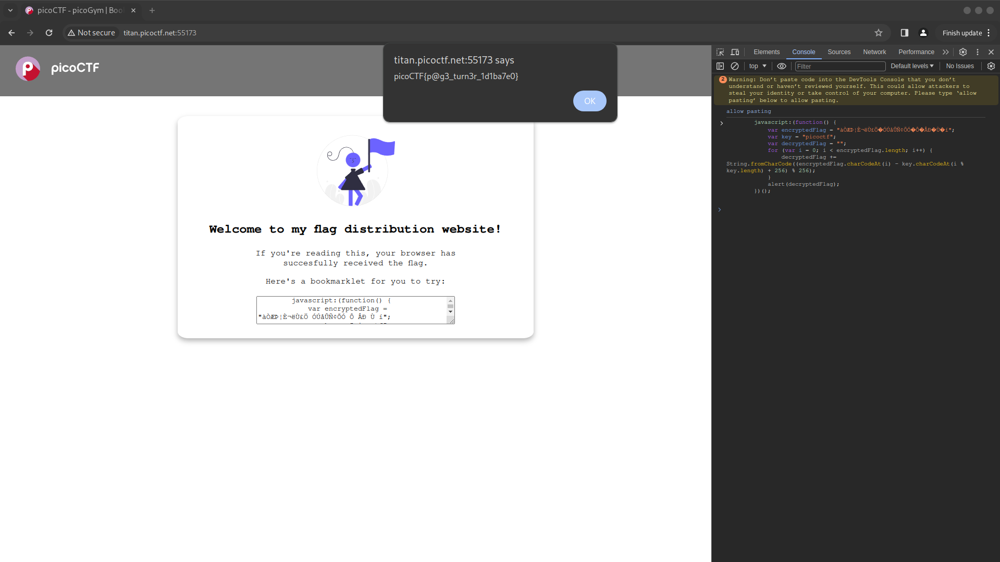

# Bookmarklet (50 points)
Why search for the flag when I can make a bookmarklet to print it for me?

Browse [here](http://titan.picoctf.net:55173/), and find the flag!

## Solution
On the website we can find some JavaScript code:
```js
javascript:(function() {
    var encryptedFlag = "àÒÆަȬë٣֖ÓÚåÛÑ¢ÕӗԚÅКٖí";
    var key = "picoctf";
    var decryptedFlag = "";
    for (var i = 0; i < encryptedFlag.length; i++) {
	decryptedFlag += String.fromCharCode((encryptedFlag.charCodeAt(i) - key.charCodeAt(i % key.length) + 256) % 256);
    }
    alert(decryptedFlag);
})();
```

Seems like this code will simply generate the flag and print it out in an alert. For example we can open the developer console and execute that code to get the flag:

