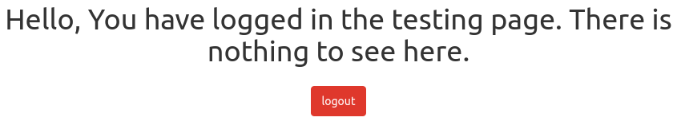
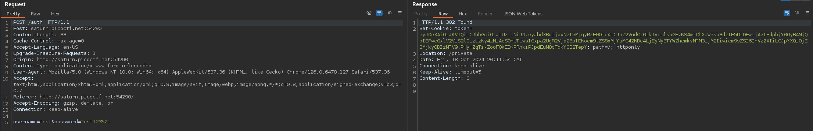
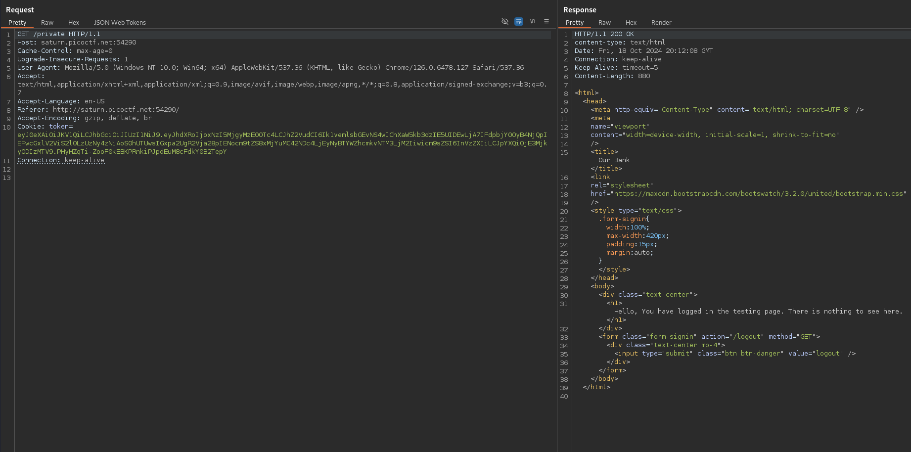
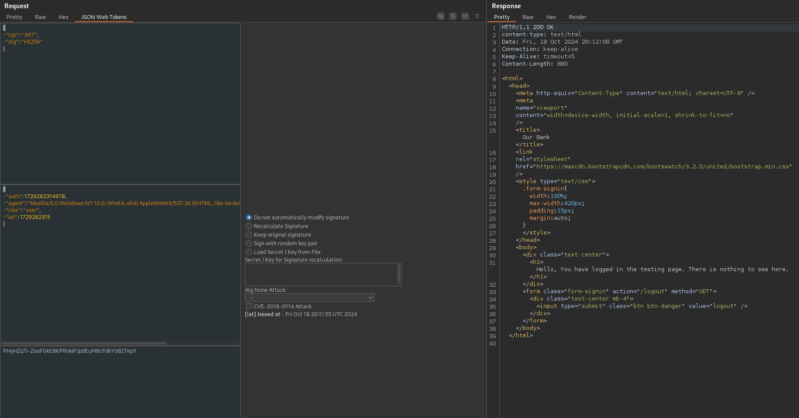
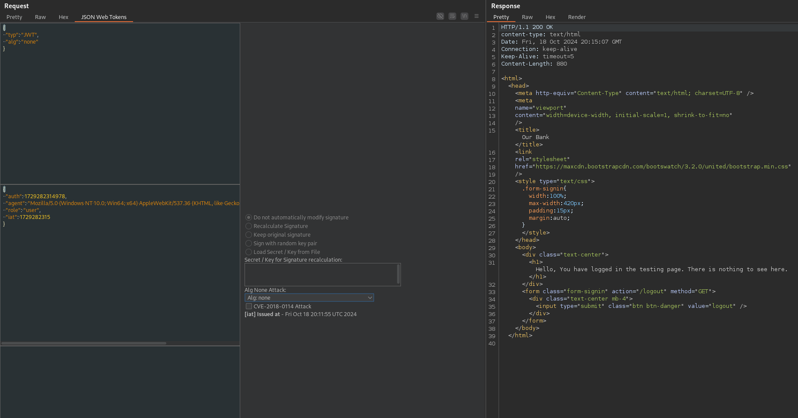
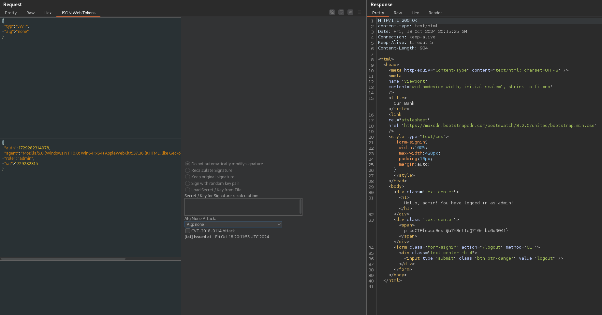

# JAuth (Medium)
Most web application developers use third party components without testing their security. Some of the past affected companies are:
* Equifax (a US credit bureau organization) - breach due to unpatched Apache Struts web framework CVE-2017-5638
* Mossack Fonesca (Panama Papers law firm) breach - unpatched version of Drupal CMS used
* VerticalScope (internet media company) - outdated version of vBulletin forum software used

Can you identify the components and exploit the vulnerable one?

The website is running here. Can you become an `admin`?

You can login as `test` with the password `Test123!` to get started.

## Solution
If we log in with the given credentials, we find the following site:

We can inspect the traffic and notice that there if a JWT generated for our logged-in user:

Since there is nothing else around this login form and because I couldn't find any other information, the vulnerability has to be this JWT.

The Burp extension 'JSON Web Tokens' can help to analyze those tokens in the web traffic. It's much easier than using a web interface like https://jwt.io/ or https://token.dev/. We can inspect the token for example in the Repeater tab. I used the request where we send the JWT to the server to get access to `/private`:

Here we can switch to the extension tab:

The extension gives us to opportunity to manipulate the token directly before it is sent to the server. We will do so and use the 'Alg None Attack':

A further description of this attack can be found by [OWASP](https://owasp.org/www-project-web-security-testing-guide/latest/4-Web_Application_Security_Testing/06-Session_Management_Testing/10-Testing_JSON_Web_Tokens) or by [HackTricks](https://book.hacktricks.xyz/pentesting-web/hacking-jwt-json-web-tokens#modify-the-algorithm-to-none). The goal is that we set the algorithm of the JWT validation to 'none'. This causes that there is none algorithm for the validation chunk and the JWT isn't validated. If the application isn't secured against this, we can enter an arbitrary content into the JWT, and it will be valid.

_(If a system seems to be secured against the 'none' algorithm, we can also try different bypasses like 'None' or 'NoNe'.)_

And as we can see in the screenshot above, we get an authenticated response from the server. The last thing that we have to do, is to set the role in the JWT to 'admin':

And as we can already see, we got our flag.
