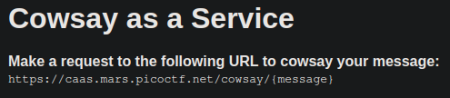
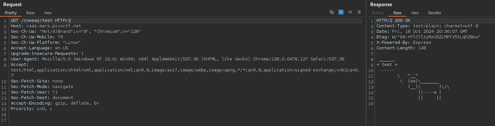
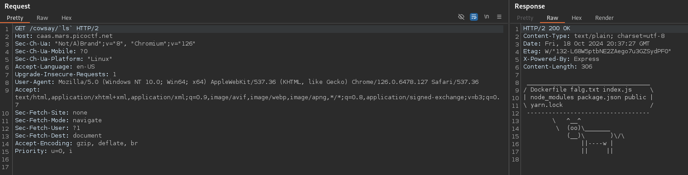
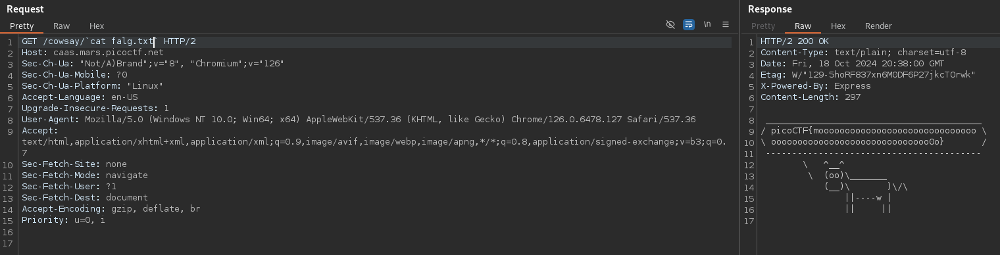

# caas (Medium)
Now presenting [cowsay as a service](https://caas.mars.picoctf.net/)

## Solution
The website show the following text:

So accessing the link gives us the ability to create Cowsay messages over the web:

This can be called in several ways. My first (and right) guess was, that it is simply called as CLI command. If so, we can inject bash commands. We can test this:

Perfect. We can see a `falg.txt` file. If we print this out, we find the flag:

