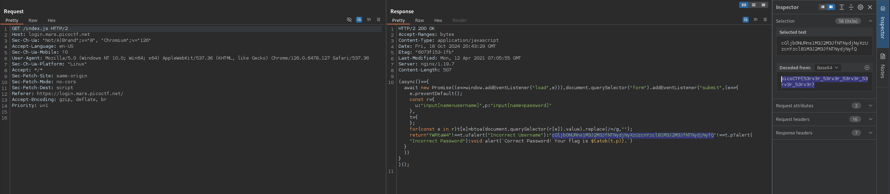

# login (Medium)
My dog-sitter's brother made this website but I can't get in; can you help?

http://login.mars.picoctf.net

## Solution
If we access the website and inspect the source, we can see that there is a `index.js` called:
```html
<!doctype html>
<html>
    <head>
        <link rel="stylesheet" href="styles.css">
        <script src="index.js"></script>
    </head>
    <body>
        <div>
          <h1>Login</h1>
          <form method="POST">
            <label for="username">Username</label>
            <input name="username" type="text"/>
            <label for="username">Password</label>
            <input name="password" type="password"/>
            <input type="submit" value="Submit"/>
          </form>
        </div>
    </body>
</html>
```

Inspecting the JavaScript file shows the content check for the username and password inputs. Both are hard coded in here and are base64 encoded. Burp can quickly show the content and so the flag:


