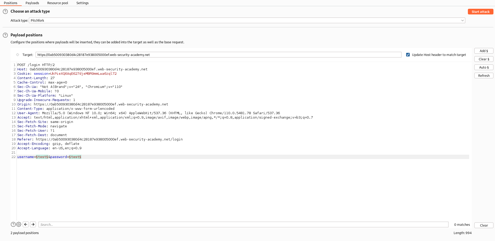
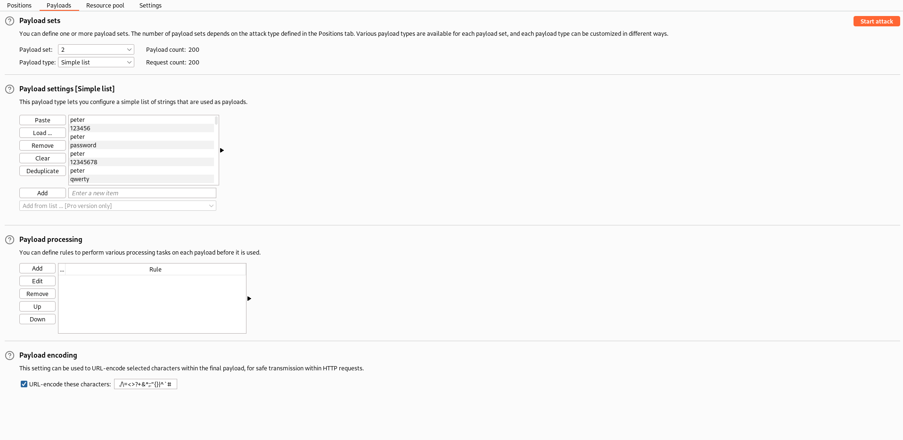
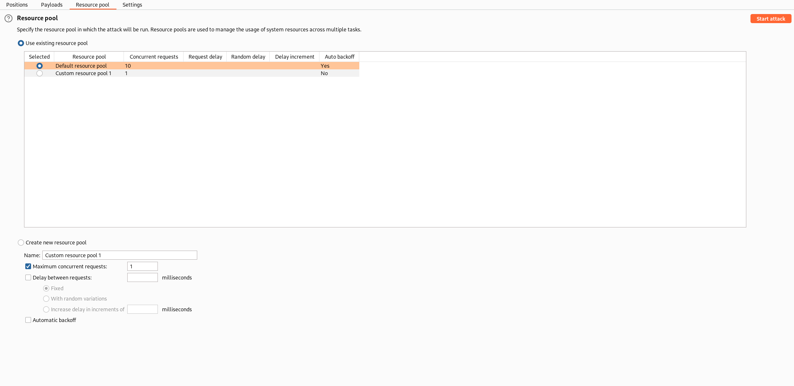
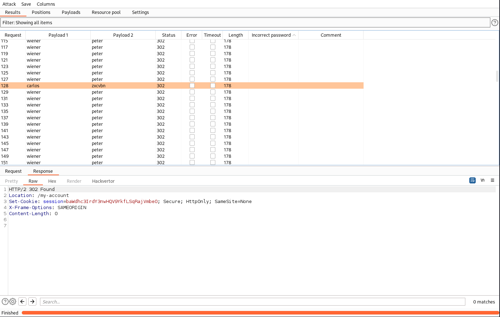

# Lab: Broken brute-force protection, IP block
This lab is vulnerable due to a logic flaw in its password brute-force protection. To solve the lab, brute-force the victim's password, then log in and access their account page.

- Your credentials: wiener:peter
- Victim's username: carlos
- [Candidate passwords](https://portswigger.net/web-security/authentication/auth-lab-passwords)

## Generating lists
This lab uses again an IP-based brute-force protection. But in this case it isn't possible to bypass it via the X-Forwarded-For header. However there is a logic flaw in the machanic. If you successful login into your own account, the block will be removed. So the goal is to brute-force the victims password and periodic login into our own account for resetting the IP block.

For doing so, we can create a username and password list, which ensures that we will login automatic after every guess of the victims password. The lists should look for example like this:
```
peter
123456
peter
password
peter
12345678
peter
qwerty
peter
123456789

[...]
```
```
wiener
carlos
wiener
carlos
wiener
carlos
wiener
carlos
wiener
carlos

[...]
```

This causes that we login, brute-force, login, brute-force and so on. Every login the ip block will be resetted.

To generate the list I wrote a short [pyhon script](Broken_brute-force_protection_IP_block.py).

## Solution
In the Burp Intruder we configure two positions (username and password) and select the attack type Pitchfork. For both, we use the payload type Simple list and import our created lists. Also we have to define a new Resource pool with a maximum concurrent request amount of 1. Otherwise the simultaneous threads would cause, that the ip block isn't resetted as we wish.

| Positions | Payloads | Resource pool | Results |
| --------- | -------- | ------------- | ------- |
|  |  |  |  |

We can filter the results for the status code 302, which means a successful login, and search for the entry with the username 'carlos'. And as we can see, we found the related password `zxcvbn`.

Logging in with these credentials will solve the lab.
