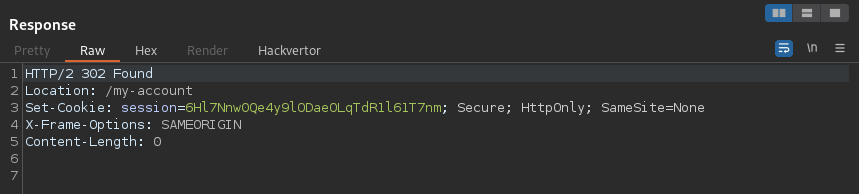

# Lab: Broken brute-force protection, multiple credentials per request
This lab is vulnerable due to a logic flaw in its brute-force protection. To solve the lab, brute-force Carlos's password, then access his account page.

- Victim's username: carlos
- [Candidate passwords](https://portswigger.net/web-security/authentication/auth-lab-passwords)


## Solution
This lab uses kinda different anti brute-force techniques. Probably a user rate limiting based on the rate of HTTP request sent from the users IP. Just iterating all password won't success here.

But if we take a closer look into the POST request of the login, we notice that the application uses a different approach to POST the login data:
```json
{
    "username":"test",
    "password":"test"
}
```
It uses a JSON statement.

So we could try to just give an array with all password from the list as the value of 'password':
```json
{
    "username":"carlos",
    "password":[
        "123456",
        "password",
        "12345678",
        "qwerty",

        [...]
    ]
}
```

We get a 302 message:


As we often saw in labs with this application, this means that we hit a correct login. If we right click the response and pick 'Show response in browser', we will get to the logged in prompt of the user. So we successfully tested several passwords with a single request.

The lab is solved at this point.
