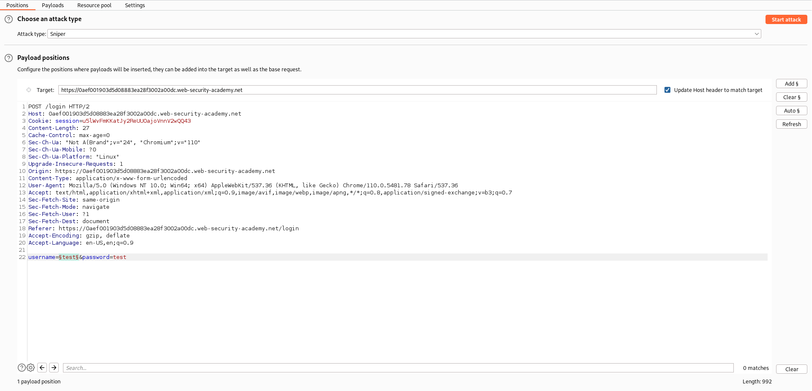
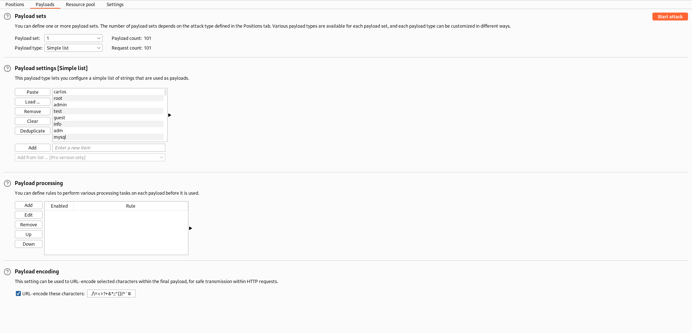
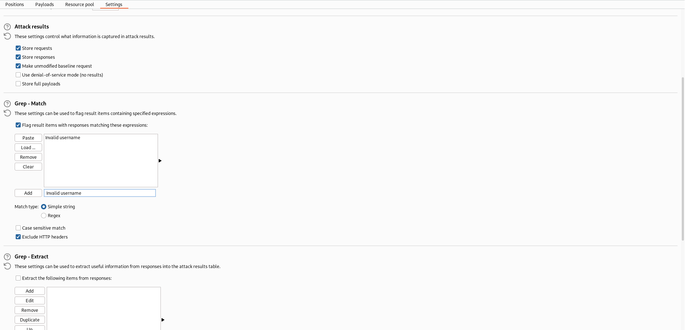
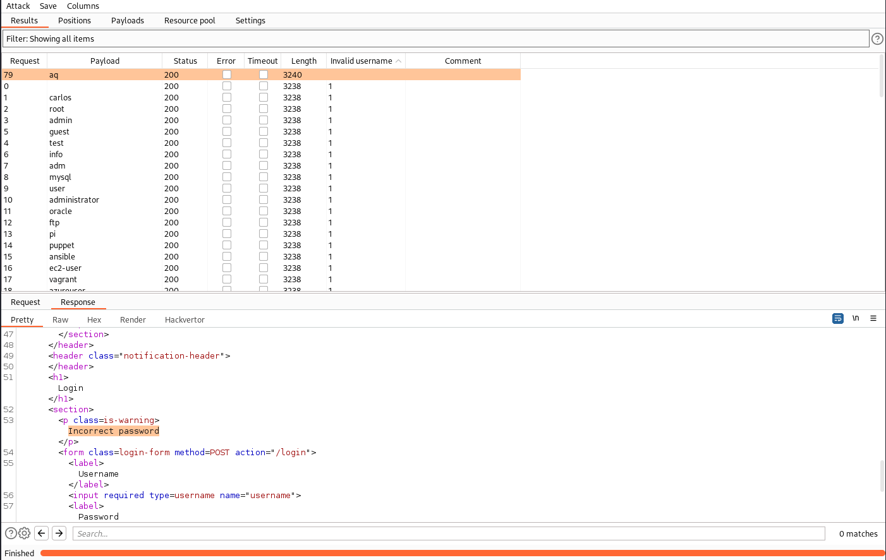

# Lab: Username enumeration via different responses
This lab is vulnerable to username enumeration and password brute-force attacks. It has an account with a predictable username and password, which can be found in the following wordlists:
- [Candidate usernames](https://portswigger.net/web-security/authentication/auth-lab-usernames)
- [Candidate passwords](https://portswigger.net/web-security/authentication/auth-lab-passwords)
To solve the lab, enumerate a valid username, brute-force this user's password, then access their account page.

## Solution
The application gives us a blog, with the ability to login. If we type in an invalid user in the interface, we get an 'Invalid username' error:


So probably we get a different error, if the username is correct and only the password is incorrect.

With Burp Intruder we can brute-force the username over the POST-request of the login. We pick the Attack type Sniper and change only the username. As payload we pick the type Simple list and import the provided username list. Also we grep for the value 'Invalid username' in the response and start the attack:
| Positions | Payloads | Resource pool | Results |
| --------- | -------- | ------------- | ------- |
|  |  |  |  |

As we can see in the results, we found the username `aq`, which is responding the error message 'Incorrect password'.

With this information we can adjust the positions:
```
username=aq&password=§test§
```
And load the password list as payload. Also we have to adjust the settings to grep for the new error message. If we start the attack we find the password to the user:
[Found password](images/Username_enumeration_via_different_responses_5.png)

We found the password `jennifer`.

If we login with the credentials, the lab is solved:
[Solved lab](images/Username_enumeration_via_different_responses_6.png)
