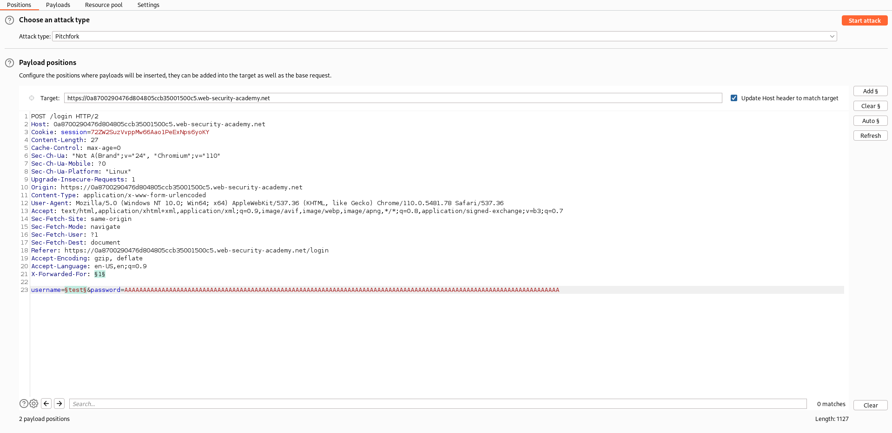
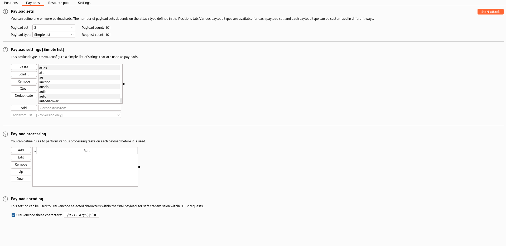
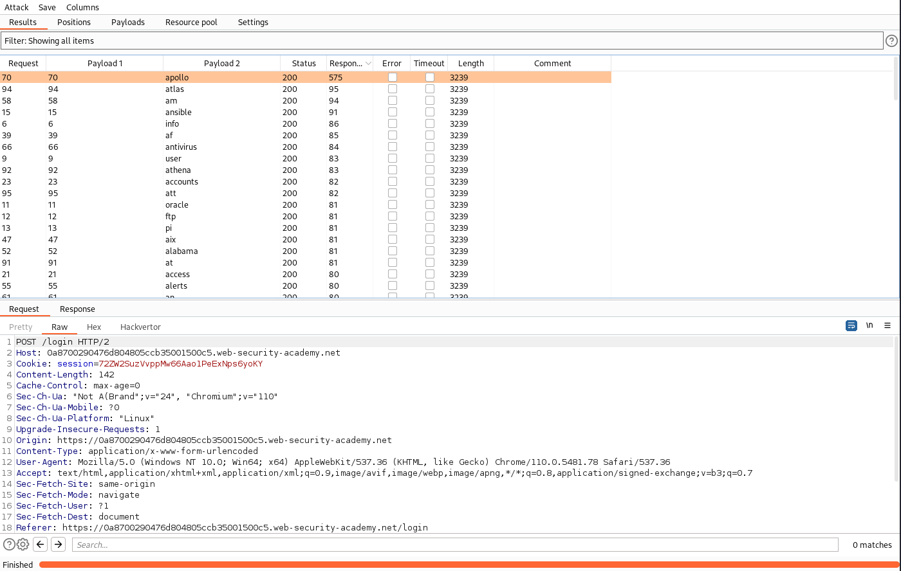
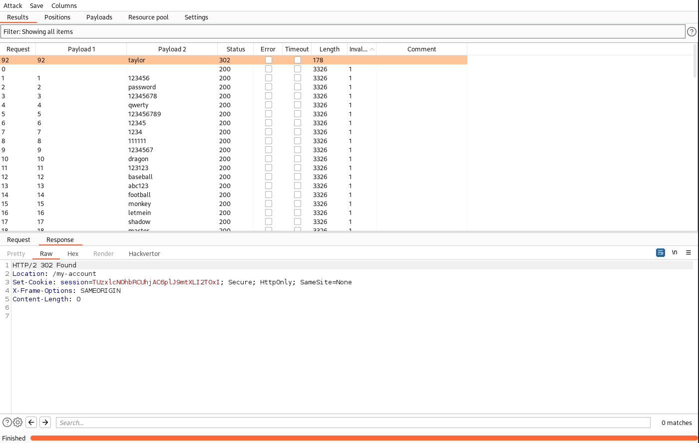

# Lab: Username enumeration via response timing
This lab is vulnerable to username enumeration using its response times. To solve the lab, enumerate a valid username, brute-force this user's password, then access their account page.

Your credentials: wiener:peter

- [Candidate usernames](https://portswigger.net/web-security/authentication/auth-lab-usernames)
- [Candidate passwords](https://portswigger.net/web-security/authentication/auth-lab-passwords)

## X-Forwarded-For header
In this lab the login error message is the same for valid and invalid users. Additional there is a IP-based brute-force protection, which causes the error message 'You have made too many incorrect login attempts. Please try again in 30 minute(s).'.

This can be bypassed by using the 'X-Forwarded-For' HTTP header. This header is original used for identifying the originating IP address of a client connecting to a web server through a proxy server.

When a client connects directly to a server, the client's IP address is sent to the server. But if a client connection passes through any proxies, the server only sees the final proxy's IP address. So, to provide a more-useful client IP address to the server, the X-Forwarded-For request header is used.

Syntax:
```
X-Forwarded-For: <client>, <proxy1>, <proxy2>
```

## Solution
To make use of the X-Forwarded-For header, we add this to the payload positions. So the value of the header will be changed in every request. The second position will be the username.

If we want to exploit the response time, we have to enter a long password. The password will be only checked if the username is correct. And if the password is pretty long, it will take more response time by the server to check it, telling us that the users exists.

As attack type, we use Pitchfork. With that the values are changed together in every request. Different to the Cluster bomb, which tries for one value every combination with the other value.

| Positions | Payloads | Results |
| --------- | -------- | ------- |
|  |  |  |

As we can see in the results, there is one entry, which took a lot more of time. So our username is `apollo`.

In the next step we adjust the positions. The username is now known. So we brute-force the password with the password list and the added header will be increased again:
```
X-Forwarded-For: §1§
username=apollo&password=§test§
```

After we start the attack, the password can be found in the results:


The password is `taylor`.

If we login with those credentials, the lab is solved.
