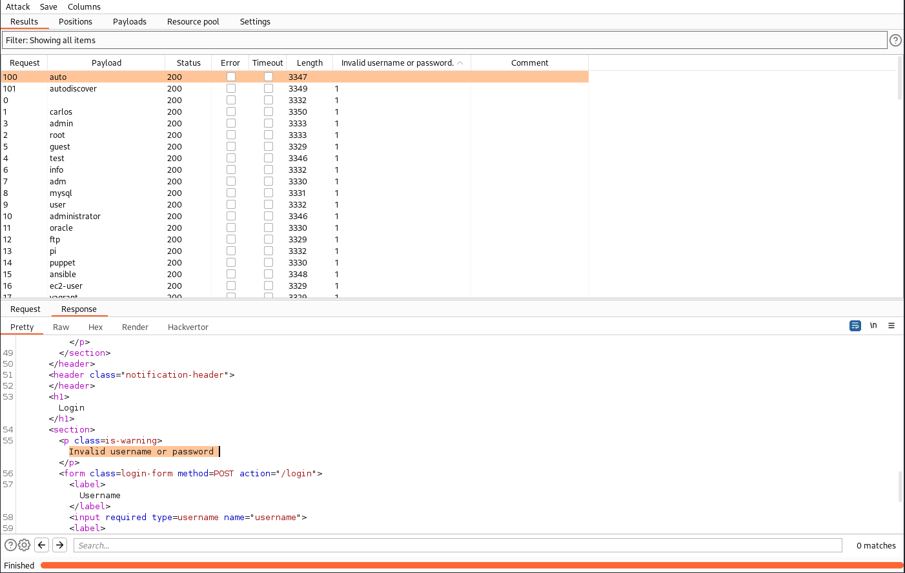
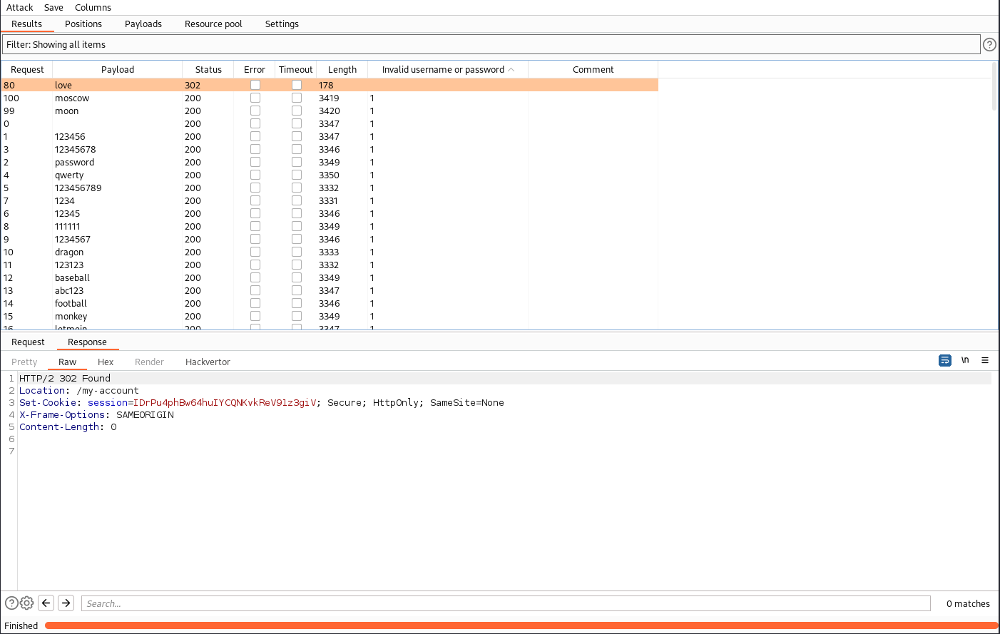

# Lab: Username enumeration via subtly different responses
This lab is subtly vulnerable to username enumeration and password brute-force attacks. It has an account with a predictable username and password, which can be found in the following wordlists:

- [Candidate usernames](https://portswigger.net/web-security/authentication/auth-lab-usernames)
- [Candidate passwords](https://portswigger.net/web-security/authentication/auth-lab-passwords)

To solve the lab, enumerate a valid username, brute-force this user's password, then access their account page.

## Solution
Again we have our blog with a login prompt. If we now take an incorrect username, we get the error message 'Invalid username or password.'. Since there must be a subtly different response, we just brute-force again with the username list and check for the error message. The configuration of Intruder is shown in the lab before ([Username enumeration via different responses](Username_enumeration_via_different_responses.md)).

If we grep for this specific error message, we find one different response:

If we take a closer look, we can see that the dot is missing in the error message of the user `auto`. The error message is only 'Invalid username or password'. Probably that indicates, that the user exists.

Again we adjust the configurtion and brute-force our password list with the user 'auto':

And as we an see, we found the password `love`.

If we login with those credentials, the lab is solved.
