# 2FA bypass using a brute-force attack
This lab's two-factor authentication is vulnerable to brute-forcing. You have already obtained a valid username and password, but do not have access to the user's 2FA verification code. To solve the lab, brute-force the 2FA code and access Carlos's account page.

Victim's credentials: `carlos:montoya`

_Note: As the verification code will reset while you're running your attack, you may need to repeat this attack several times before you succeed. This is because the new code may be a number that your current Intruder attack has already attempted._

## Solution
Again, we got a blog with a login feature and a 2FA verification after a correct login:

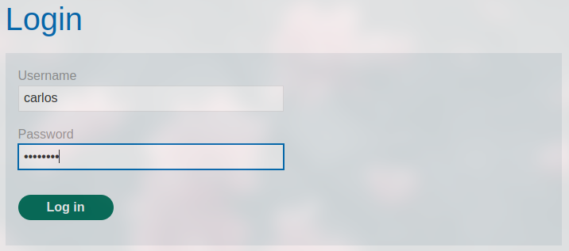

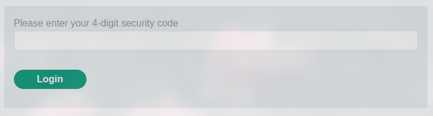

If we enter wrong verification codes for two times, we are sent back to the login page:

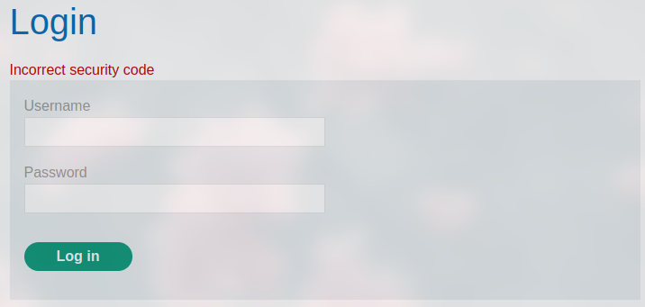

When we take a look into the corresponding HTTP traffic, we notice, that a CSRF token is generated and send with every POST request when we enter a verification code:

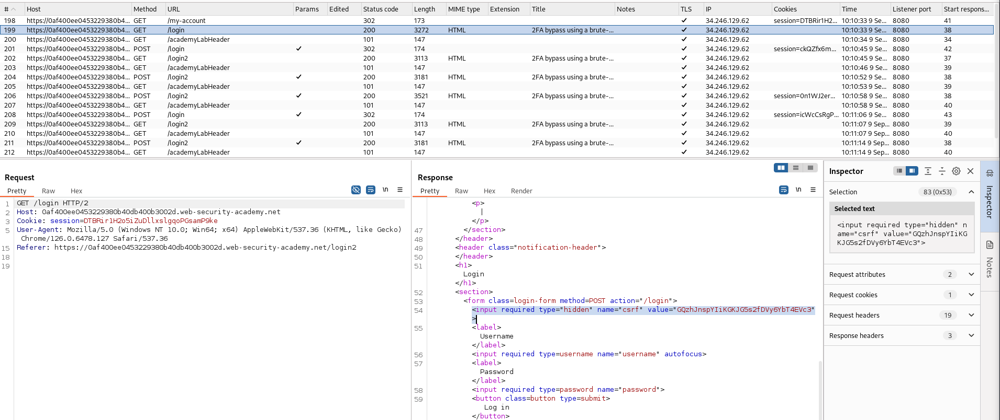

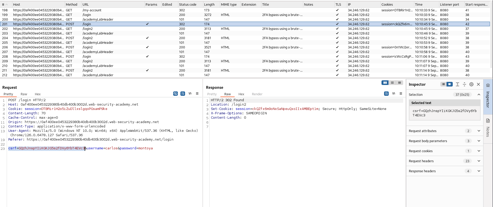

So if we resent a code after we already entered two times a wrong one, we receive this error:
```
HTTP/2 400 Bad Request
Content-Type: application/json; charset=utf-8
Set-Cookie: session=T57HvI9qCxjW0xc5IQ5ssMqcxomILewj; Secure; HttpOnly; SameSite=None
X-Frame-Options: SAMEORIGIN
Content-Length: 60

"Invalid CSRF token (session does not contain a CSRF token)"
```

The goal of this method is to avoid brute force attacks on the 2FA verification code. To bypass this, we can for example use a macro in Burp. The idea is the following.

### Burp Macro
If we log in successful, we get a new CSRF token from the server and are redirected to the `/login2` page (input site for the verification code). This first CSRF token is probably to secure the normal login from brute force attack, because the GET request for the verification site receives another CSRF token. Latter will be validated in the POST request, that we make to enter a code. So a macro can be used to automate these steps and get a valid CSRF token before we can enter a verification code in the POST request. The macro would log in the user with the credentials, get the CSRF token afterwards and prepares it to use it further.

To create such a macro, we go to the Burp "Settings", "Sessions" and scroll down to Macros. Click "Add" and choose the mentioned HTTP packets:

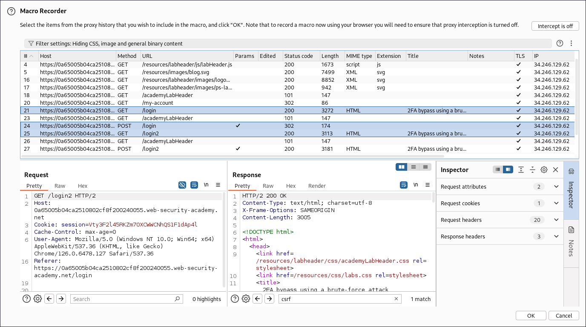

Create the macro and scroll in the settings up to "Session handling rules". Add a new one and add the created macro (Rule actions -> Add -> Run a macro). In the scope of the handling rule, we select "Repeater" and "Intruder" and add the URL of our site to the URL scope:

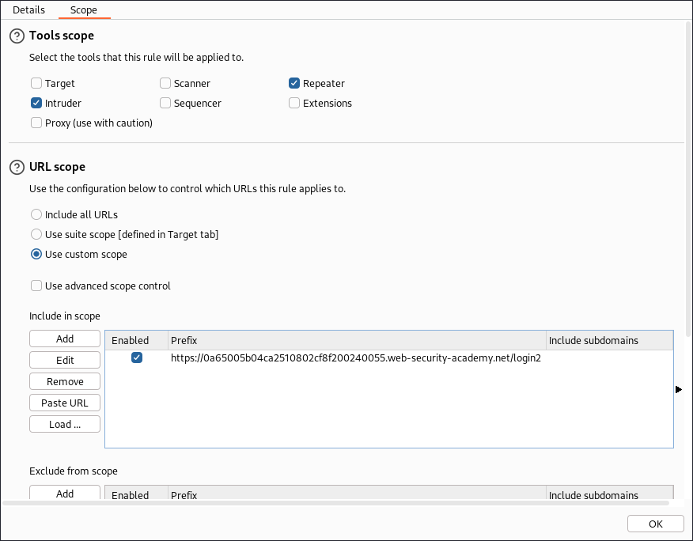

This macro ensures now that the selected HTTP steps (GET `/login`, POST `/login` with credentials, GET `login2` with CSRF) are automatically done, before every request we make to the selected domain.

If we send the POST request for the verification code to the Repeater and run several requests, we can see that each one uses a different CSRF token.

So let's set up the Intruder:

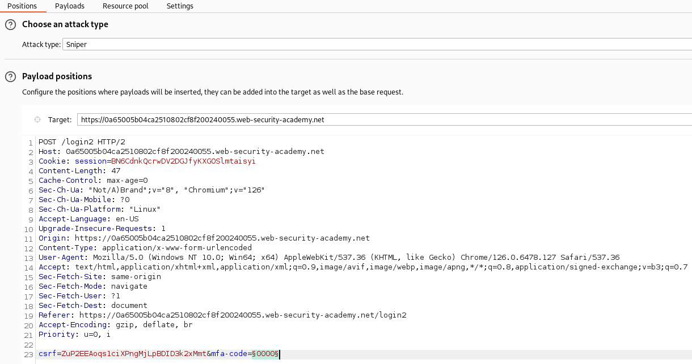

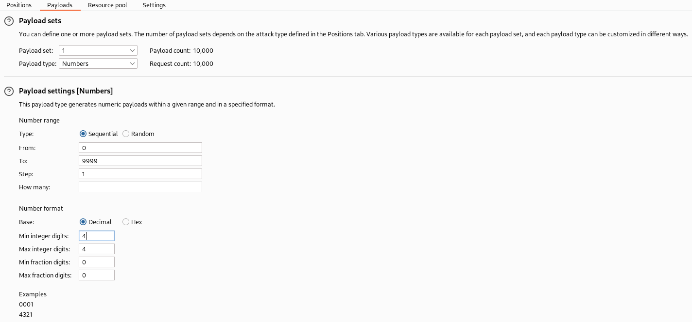

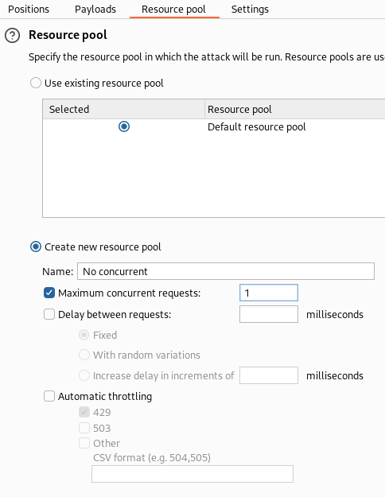

Running this will brute force the verification code for the user. As you can see, those are all valid request with different CSRF tokens:

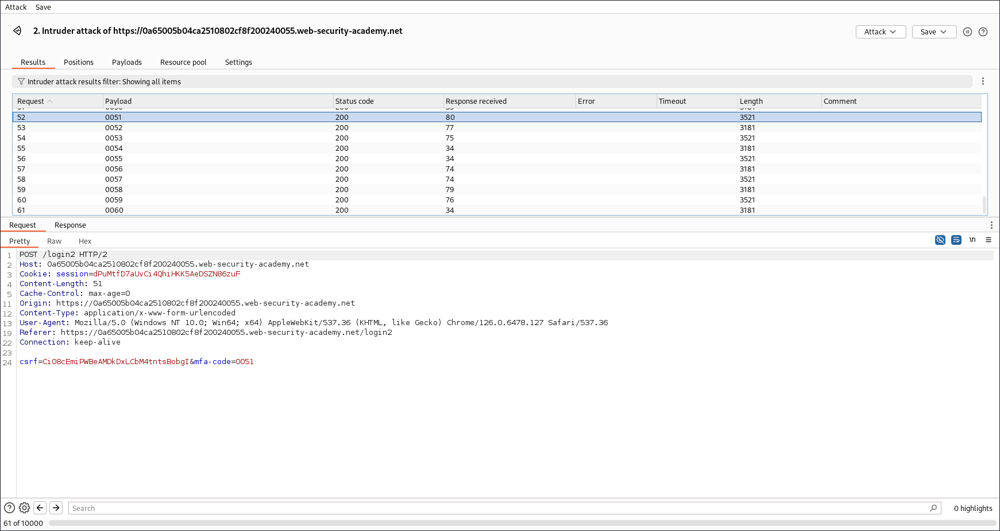

### Turbo Intruder
To make the macro work with the Turbo Intruder extension, we have to add little configurations. First, in the scope of the "Session handling rule", we have to add "Extensions" to the "Tools scope". Second, also in the "Session handling rule", edit the macro and exclude the parameter `mfa-code` from the updated parameters of the current request:

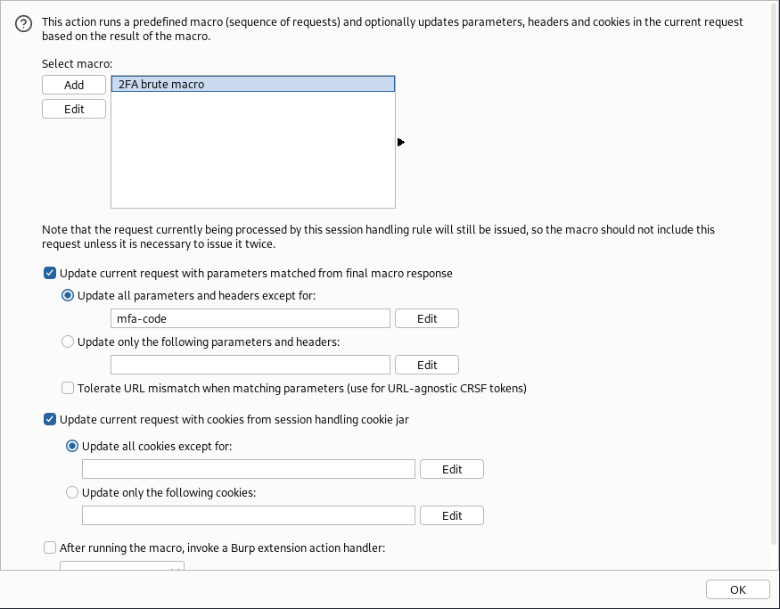

Otherwise, we would receive a 400 error with the message `"Missing parameter 'mfa-code'"` in every response.

Next, we can send the POST request to the extension and set up the Turbo Intruder script:

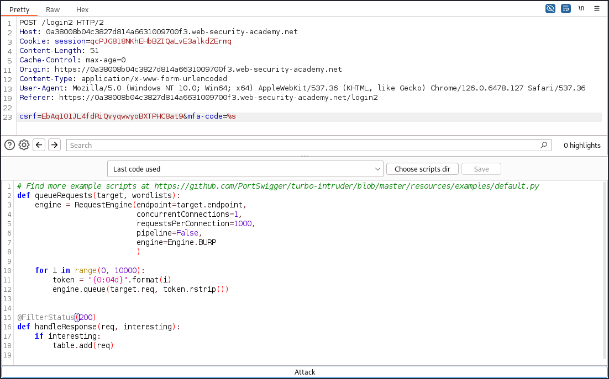

It's pretty much the same as in the [lab before](../labs/2FA_broken_logic.md), but we have to run only on concurrent connection: `concurrentConnections=1`.

_Note: The requests in the Turbo Intruder are showing the same CSRF token. I think this is a bug. You can verify this if you take a look into the responses. They are valid (200 status) and they all are showing a different CSRF._

After some time we found a valid verification code (keep in mind that it could take several tries):

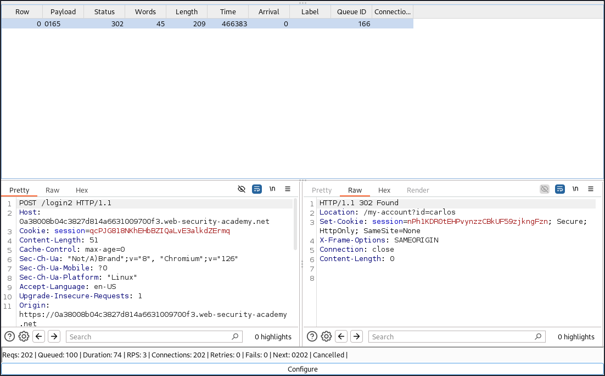

If we show the response in the browser, we are successfully logged in and solved the lab:

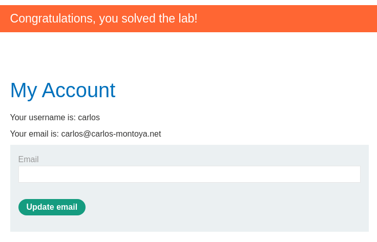
