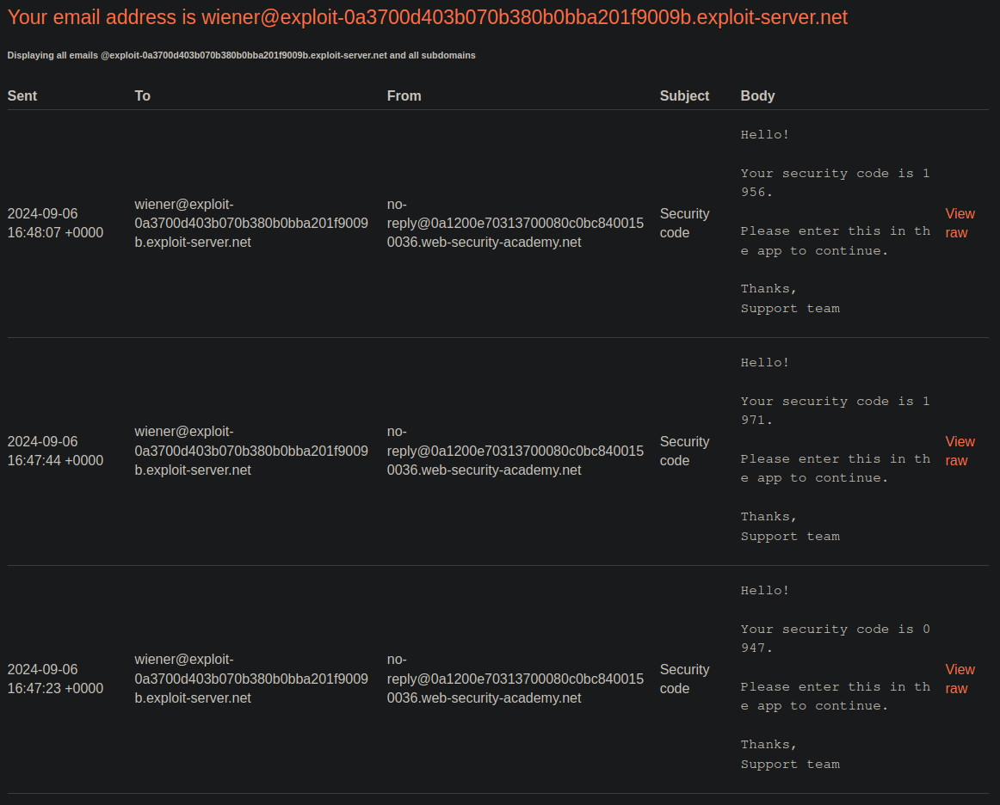
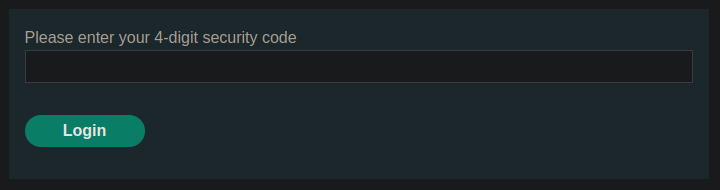
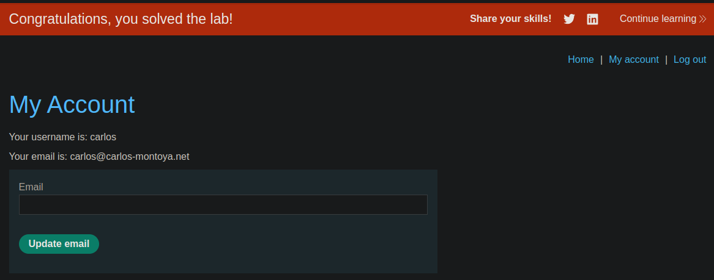

# Lab: 2FA simple bypass
This lab's two-factor authentication can be bypassed. You have already obtained a valid username and password, but do not have access to the user's 2FA verification code. To solve the lab, access Carlos's account page.

* Your credentials: `wiener:peter`
* Victim's credentials: `carlos:montoya`

## Solution
The application gives us a blog, with the ability to login and an "Email client". In the latter, we can receive the verification codes for the user `wiener`:



So we can successful login as the user with the password and the code. Notice the different login URLs for the password and the code:
```
https://0a1200e70313700080c0bc8400150036.web-security-academy.net/login
https://0a1200e70313700080c0bc8400150036.web-security-academy.net/login2
```

Then, we got redirected to the account managing page with the URL `https://0a1200e70313700080c0bc8400150036.web-security-academy.net/my-account?id=wiener`.

To abuse the vulnerability, we have now to log in as the user `carlos` with the password. Afterwards we are redirected to the 2FA verification site:



On this site, we can simply change the URL from
```
https://0a1200e70313700080c0bc8400150036.web-security-academy.net/login2
```
to 
```
https://0a1200e70313700080c0bc8400150036.web-security-academy.net/my-account?id=carlos
```

And we are logged in and bypassed the 2FA:


