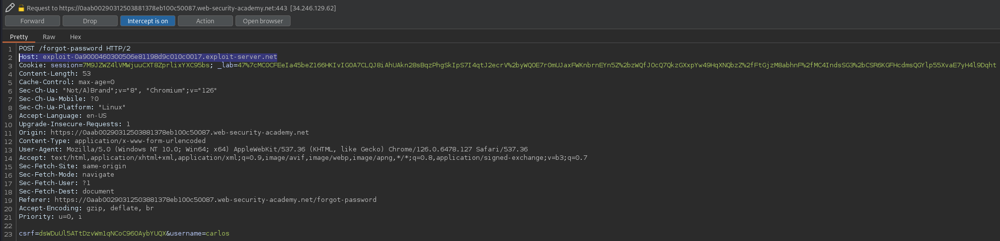
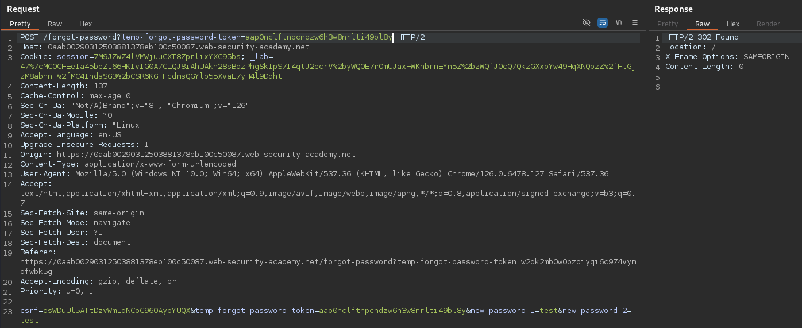

# Basic password reset poisoning
This lab is vulnerable to password reset poisoning. The user `carlos` will carelessly click on any links in emails that he receives. To solve the lab, log in to Carlos's account.

You can log in to your own account using the following credentials: `wiener:peter`. Any emails sent to this account can be read via the email client on the exploit server.

## Solution
If we query a password reset, we will receive an email with a reset link containing the unique token:


The goal is now to do this request for the user `carlos`, intercept the request and manipulate the host header and wait for the user clicking the link. If he does, our exploit server will receive the token, and we can reset the password for the user.

To do so, we will intercept the traffic with Burp the following request:


The corresponding request looks like this:


Now we can change the `Host` header to our exploit server:



The user should now get an email with a URL pointing to our server. We can also do this step with our own user `wiener` to show the email:


The link contains our domain and the generated token. So if the user clicks the link, he requests our domain with the contained token, and we can find it in the logs of our exploit server:

```
10.0.3.80       2024-09-20 16:13:34 +0000 "GET /forgot-password?temp-forgot-password-token=aap0nclftnpcndzw6h3w8nrlti49bl8y HTTP/1.1" 404 "user-agent: Mozilla/5.0 (Victim) AppleWebKit/537.36 (KHTML, like Gecko) Chrome/125.0.0.0 Safari/537.36"
```

All we have to do know is to add this token to a POST request that resets our password, and change the username to `carlos`. We can to so if we send our earlier test request for resetting to the Repeater and change the request like this:



The password of `carlos` is now changed to `test`. If we login the lab is solved:


