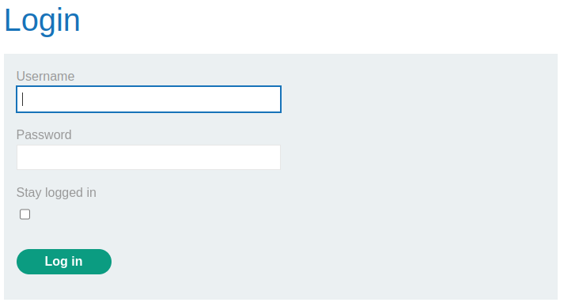
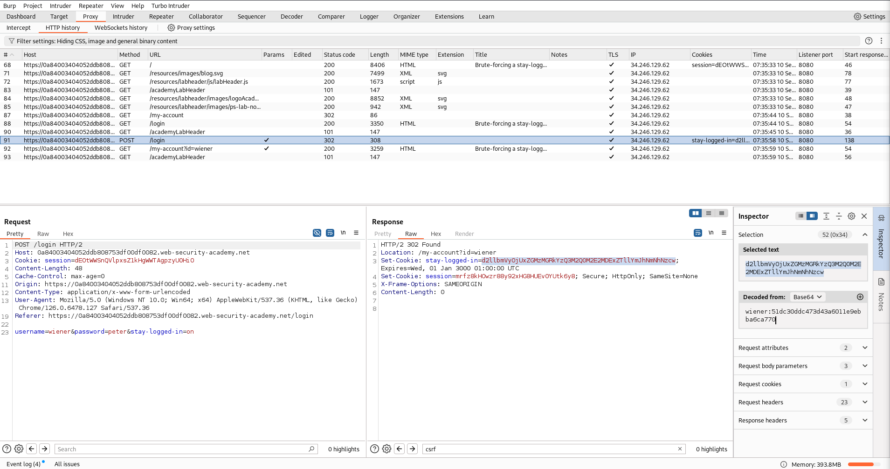
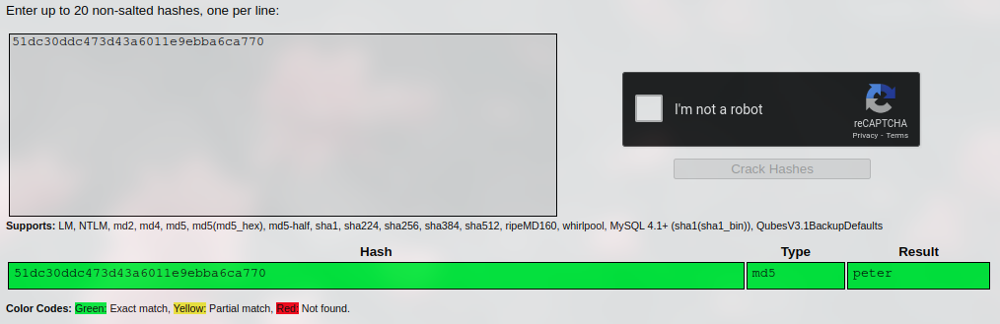
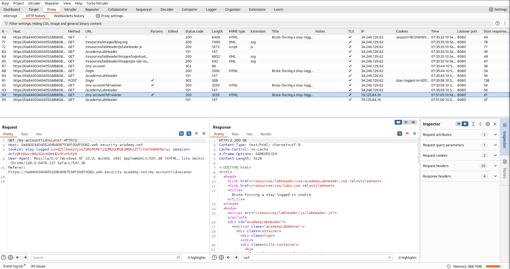
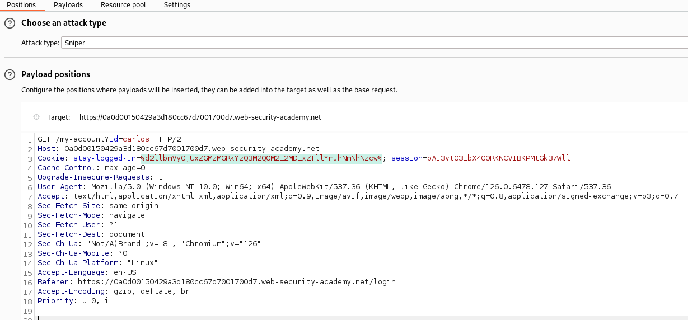
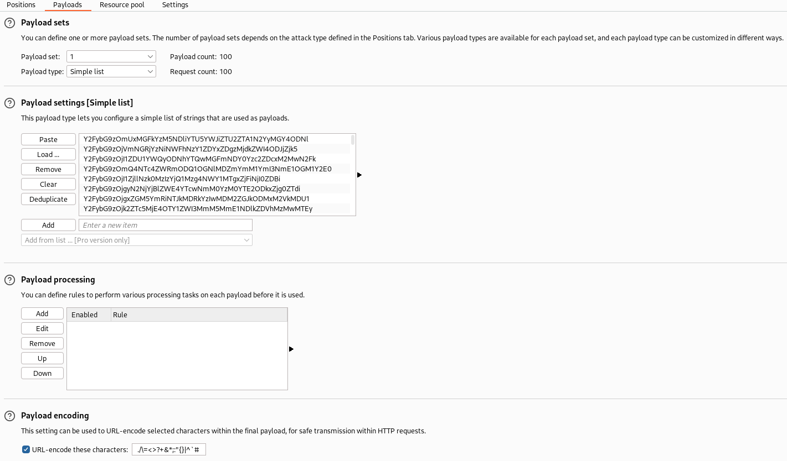
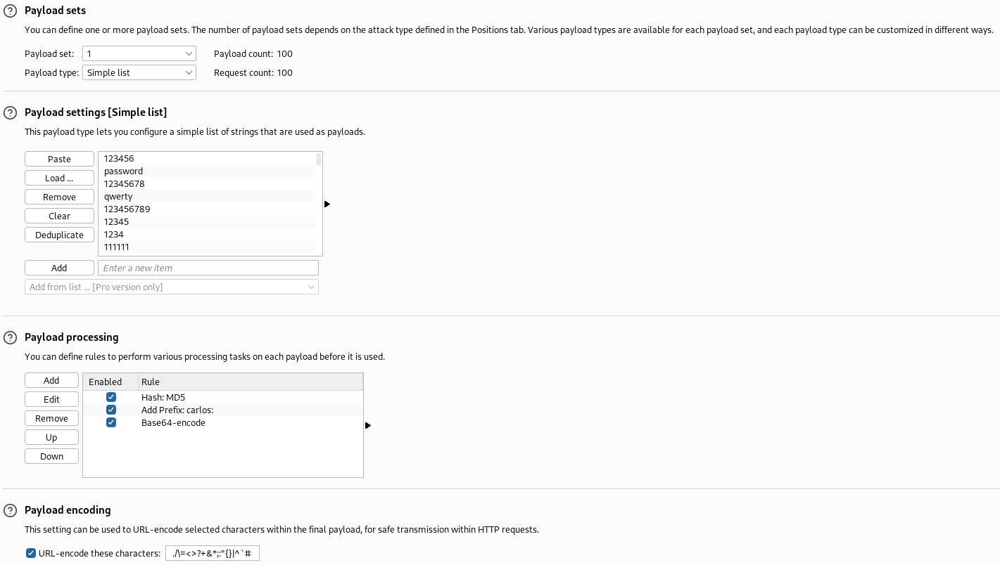
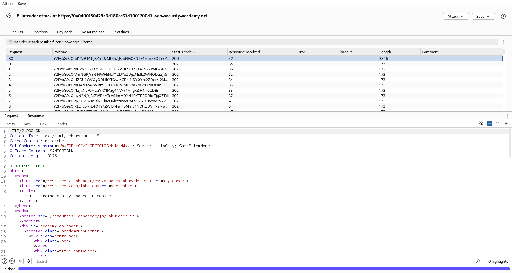
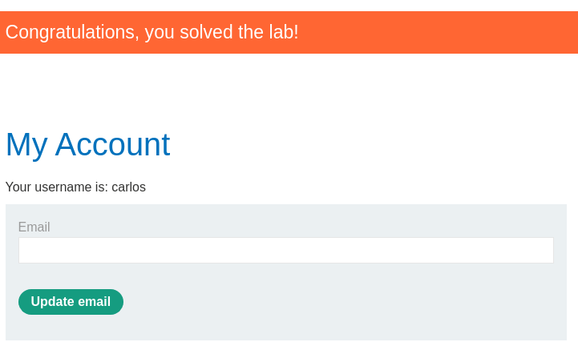

# Brute-forcing a stay-logged-in cookie
This lab allows users to stay logged in even after they close their browser session. The cookie used to provide this functionality is vulnerable to brute-forcing.

To solve the lab, brute-force Carlos's cookie to gain access to his "My account" page.

* Your credentials: `wiener:peter`
* Victim's username: `carlos`
* Candidate [passwords](https://portswigger.net/web-security/authentication/auth-lab-passwords)

## Solution
On the website, we can log in and select the "Stay logged in" feature:



If we log in with the given credentials and activate the feature, the site will generate a cookie. With the Inspector in Burp, we can directly identify it's content as Base64 encoded string:



The decoded cookie is `wiener:51dc30ddc473d43a6011e9ebba6ca770`. The username followed by some kind of hash.

We can try a service like [CrackStation](https://crackstation.net/) to identify the algorithm:



The content of the hash is `peter`. It's just the password of the logged-in user, hashed with MD5.

The cookie itself is then used to keep the user logged in:



This can be easily brute forced.

### Burp Intruder
We can send this request to the Intruder and set up the following Positions:



_Notice that we also have to change the requested URL._

As a payload, we have to convert the passwords a little bite. For each entry we have to translate it to the corresponding MD5 hash with the user prefix in front of it (`carlos:MD5`). And as last step we have to encode this in Base64.

That can be done with a Python script or within the payload settings. See here an example:
```python
import hashlib
import base64

with open("authentication_lab_passwords.txt", "r") as file:
    passwords = [line.strip() for line in file.readlines()]

for password in passwords:
    md5 = hashlib.md5(password.encode())
    hex_md5 = md5.hexdigest()
    token_str = f"carlos:{hex_md5}"
    token_b64 = base64.b64encode(token_str.encode("utf-8"))
    print(token_b64.decode("utf-8"))
```

Then we can save the output to a file and import it as a payload:



An alternative payload with the clear password list, would be the following:



Running this attack will give us access to the user `carlos`:



If we show the response in the browser, we solved the lab:


