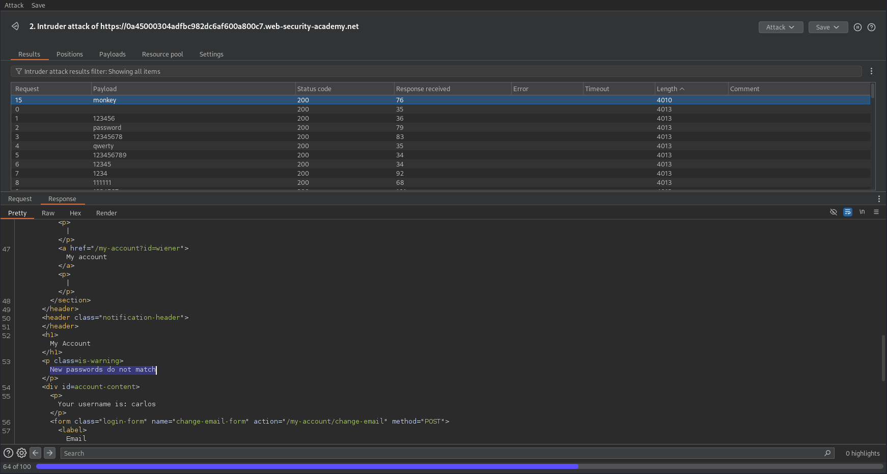

# Password brute-force via password change
This lab's password change functionality makes it vulnerable to brute-force attacks. To solve the lab, use the list of candidate passwords to brute-force Carlos's account and access his "My account" page.

* Your credentials: `wiener:peter`
* Victim's username: `carlos`
* [Candidate passwords](https://portswigger.net/web-security/authentication/auth-lab-passwords)

## Solution
If we are logged in, we have the ability change our password:

The corresponding request looks like this:

If we change the current password of the request to a wrong one, we are getting redirected to the main login page:

But if we enter the wrong password and non-matching new passwords, we get the error `Current password is incorrect`:

If it's correct and the new password mismatch, the error is `New passwords do not match`.

Note that there is a `username` key in the body as well. You can also see it in the response as hidden value. If we insert the user `carlos` inhere, we are logging into this user and get the same error message:

So we can brute-force the password here. If the password is correct the site should show `New password do not match`.

We can set up the following Intruder and run the attack:

| Positions                                                              | Payloads                                                              |
| ---------------------------------------------------------------------- | --------------------------------------------------------------------- |
|  |  |

As a result, we can find one different response, with the mentioned error message:

So we got our password: `monkey`

We can now try to log in and solve the lab:

