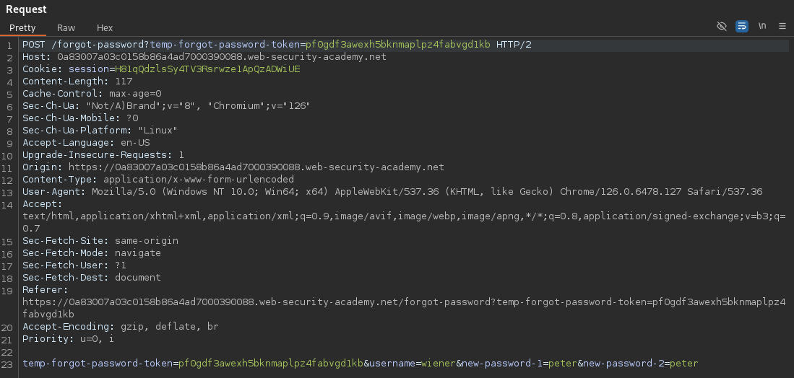

# Password reset broken logic
This lab's password reset functionality is vulnerable. To solve the lab, reset Carlos's password then log in and access his "My account" page.
* Your credentials: `wiener:peter`
* Victim's username: `carlos`

## Solution
In the login page, we got a _Forgot password?_ button:

Inhere, we can enter a username or email to get a change password link:

If we do so with the username `wiener`, we get an email with a link to reset our password:

Clicking that link, we can reset the password and the process is done:

We can now inspect the POST request of this form:

The token `temp-forgot-password-token=pf0gdf3awexh5bknmaplpz4fabvgd1kb` is submitted as well. But the flaw is that it's not checked again by the backend. Neither is the username checked to see if they have made a request to reset their password.

So can simply manipulate the POST request and change the username to `carlos` with a password that we want:

After the request, we are redirected to the main page.

And now we can log in as `carlos` with our new password. If we do so, the lab is solved:

