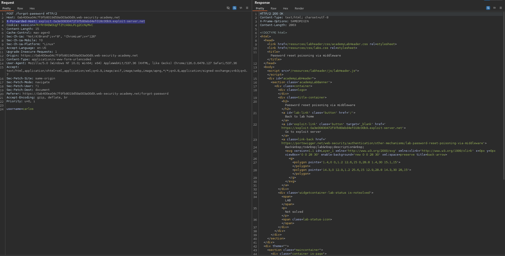
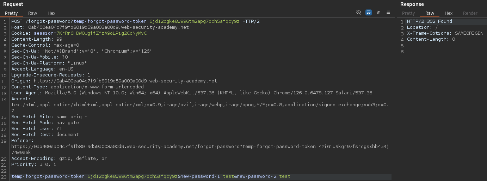
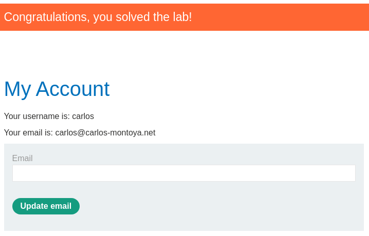
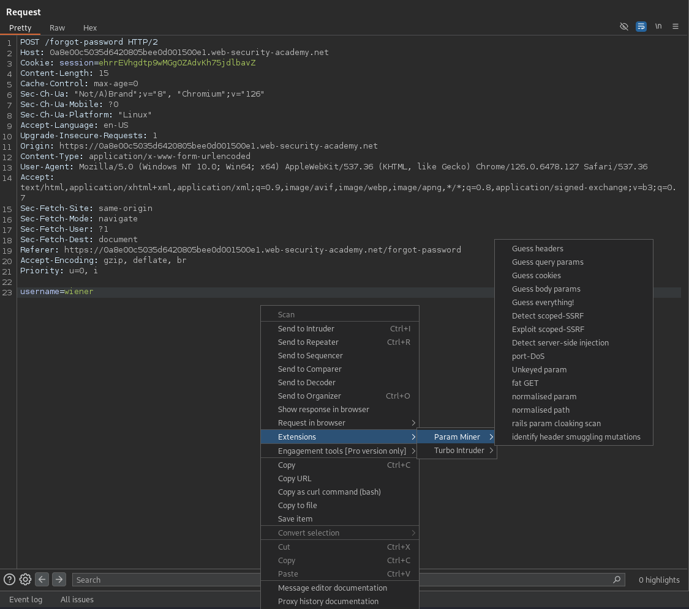
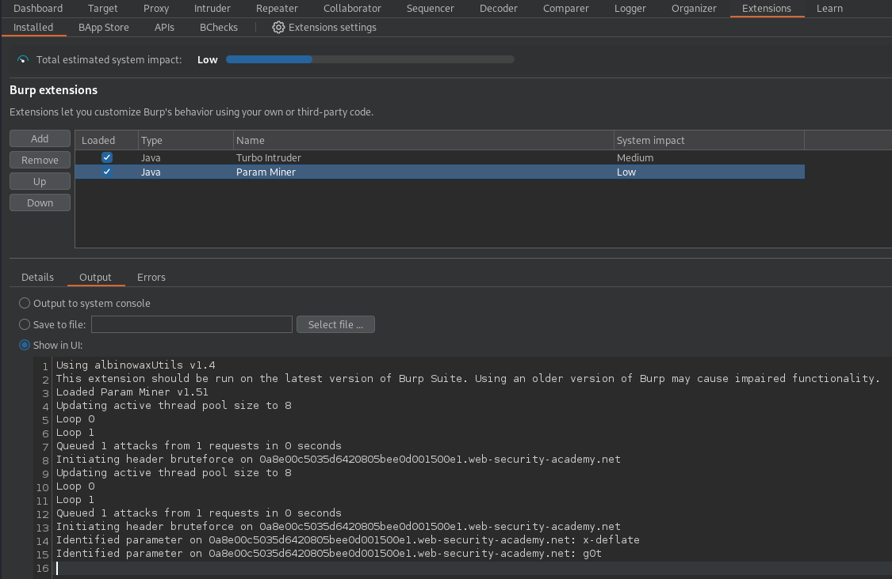

# Password reset poisoning via middleware
This lab is vulnerable to password reset poisoning. The user `carlos` will carelessly click on any links in emails that he receives. To solve the lab, log in to Carlos's account. You can log in to your own account using the following credentials: `wiener:peter`. Any emails sent to this account can be read via the email client on the exploit server.

## Solution
Our approach will be the same as in the [lab before](./Basic_password_reset_poisoning.md). But this time, we can't abuse the `Host` header. Instead, we can make usage of the `X-Forwarded-Host` header. This header identifies the initial hostname, where the request came from. For example can a web server detect the original host of the request if the traffic was sent through a proxy server.

In our case this header is used to generate the password reset link. So to manipulate the link, we can change the request like this:



In the logs, we can verify that the user accessed the link:
```
10.0.4.249      2024-09-20 16:48:59 +0000 "GET /forgot-password?temp-forgot-password-token=6jd12cgke8w996tm2apg7och5afqcy9z HTTP/1.1" 404 "user-agent: Mozilla/5.0 (Victim) AppleWebKit/537.36 (KHTML, like Gecko) Chrome/125.0.0.0 Safari/537.36"
```

Using this token, we can change to password of the user `carlos`:



And finally, we can log in as the user and solve the lab:



## Additional information
To detect if the header is supported, we can use the Param Miner plugin form the BApp Store. With that we can detect usable headers:



The output can be found under _Extensions -> Installed -> Param Miner -> Output_:


