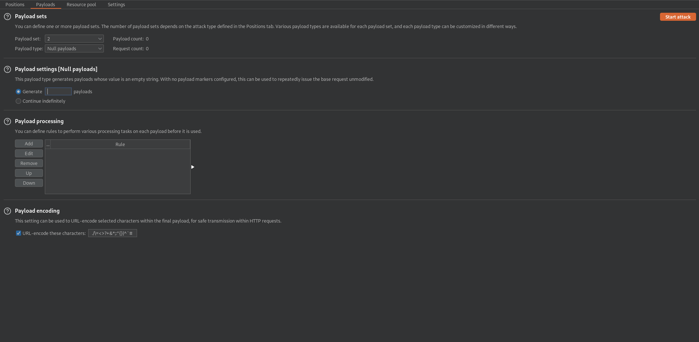

# Lab: Username enumeration via account lock
This lab is vulnerable to username enumeration. It uses account locking, but this contains a logic flaw. To solve the lab, enumerate a valid username, brute-force this user's password, then access their account page.

- [Candidate usernames](https://portswigger.net/web-security/authentication/auth-lab-usernames)
- [Candidate passwords](https://portswigger.net/web-security/authentication/auth-lab-passwords)

## Solution
The application locks an account for a short amount of time, if you enter a wrong password a few times. Otherwise it will just prompt 'Invalid username or password.'.

The idea is now to brute-force the username and try to lock one of the users. If this happens, the application responses with a different message than in the normal failed login. If we hit such a case, we found a valid username and can fourther investigate it.

For doing so, we set up two payload positions in Burp Intruder. One for the username and one empty one for the password. We pick the Cluster bomb attack type, to create for every username five login attempts. The first payload type will be a Simple list with the username list and the second one will be Null payloads. This will be configured to generate 5 payloads. After starting the attack we are looking for the result, that does not conain 'Invalid username or password.' or has in general a different length than the other responses.

| Positions | Payloads | Results |
| --------- | -------- | ------- |
|  |  |  |

_If you are using Burp CE, the time throttle will cause, that the lock time is expired before the 5th login attempt was run. If you change the order of the username/password parameters in the POST request, you can run five attempts with one user straight: `password=test§§&username=§test§`_

As we can see in the results, there is one username called `adm`, that was successful locked.

In the next step we just try to brute-force the password of this user. Maybe there is a flaw, that reveals the user password, even if there is a account lock. The hope is that there will be a different response, if the password is correct. So we configure the username and use one payload position for the password. Using the Sniper attack type and the Simple list payload type with the password list to brute-force the login.

We found one password that has a 'Invalid username or password.' or 'You have made too many incorrect login attempts. Please try again in 1 minute(s).' error message: `moon`

After one minute we can login with the credentials and the room will be solved.
