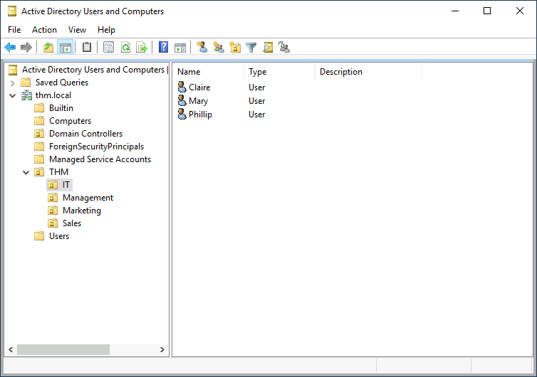
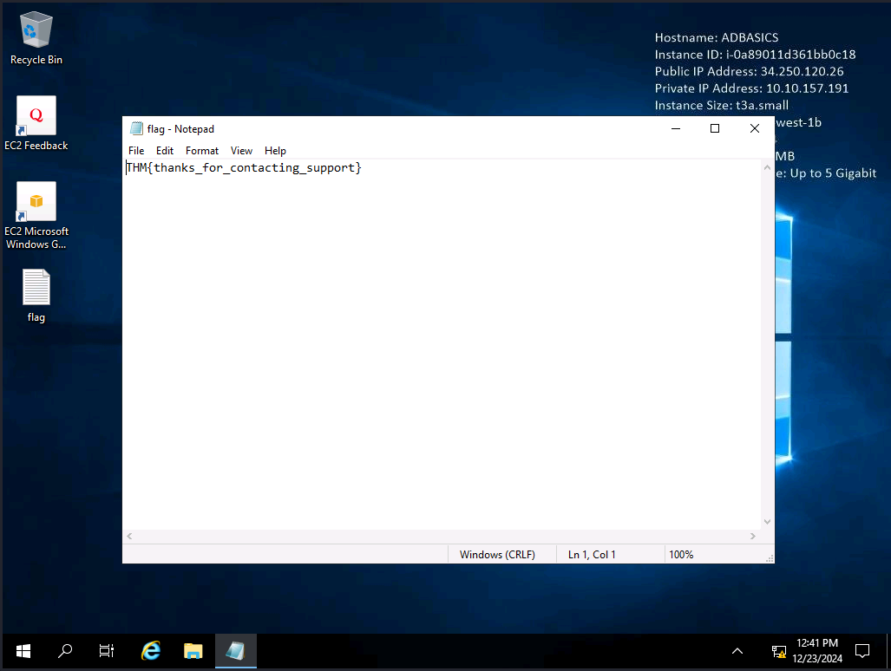
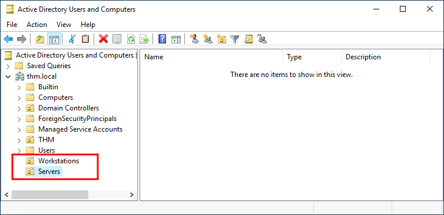
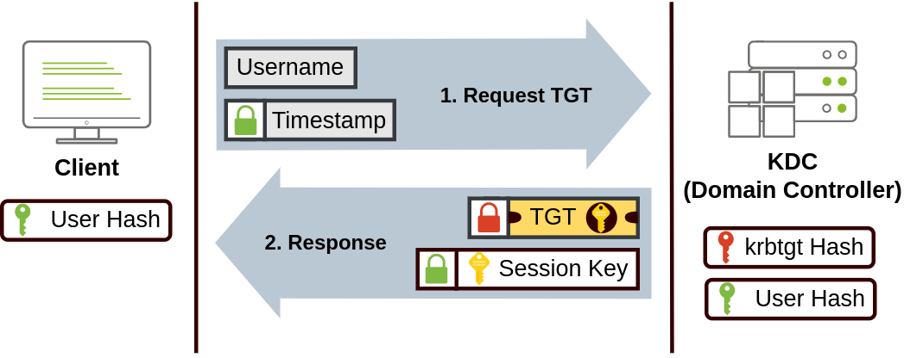
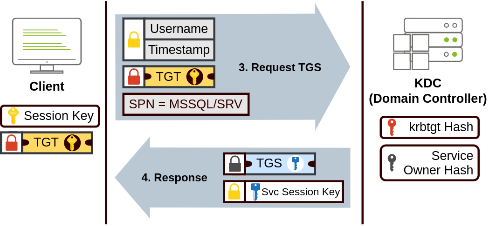
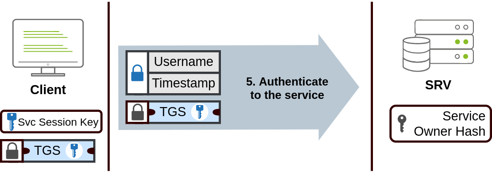
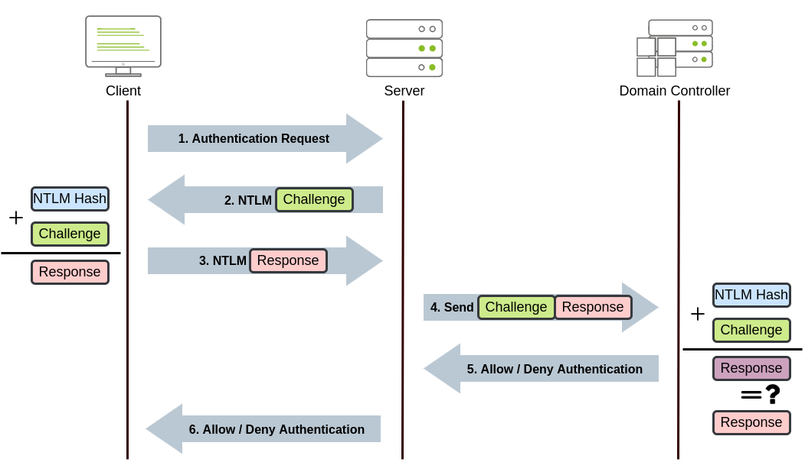

# Active Directory Basics
Microsoft's Active Directory is the backbone of the corporate world. It simplifies the management of devices and users within a corporate environment. In this room, we'll take a deep dive into the essential components of Active Directory.

## Windows Domains (Task 2)
Used for larger businesses with many users on different places.

**Windows Domain**: Group of users and devices that can be central administered

The server that runs the Active Directory (AD) is the domain controller (DC).

Main advantages:
* **Centralised identity management**: All users across the network can be configured from Active Directory with minimum effort.
* **Managing security policies**: You can configure security policies directly from Active Directory and apply them to users and computers across the network as needed.

Gives the ability to log into several machines with specific access rights. The authentication runs against the DC.

### Questions
In a Windows domain, credentials are stored in a centralised repository called...
```
> Active Directory
```

The server in charge of running the Active Directory services is called...
```
> Domain Controller
```

## Active Directory (Task 3)
**AD Domain Service (AD DS)**: Core of every Windows Domain. Holds the information of all objects.

The resources of an AD are managed via the software "Active Directory Users and Computers", which is pre-installed on a DC Windows Server. Inhere we can for example edit users or reset their passwords.

### Objects
Security principal: Object can be authenticated by the domain and can be assigned privileges

The objects are:
* **Users**: Security principal; can be people or services (IIS, MSSQL, ...)
* **Machines**: Security principal; object for every computer that joins the domain
  * machine accounts (local administrators)
  * naming is with a dollar sign: `DC01` -> `DC01$`
* **Security Groups**: Security principal; user groups with access rights
  * can contain users, machines, groups

### Default Groups
| Group              | Description                                                                            |
| ------------------ | -------------------------------------------------------------------------------------- |
| Domain Admins      | Users of this group have administrative privileges over the entire domain. By default, | they can administer any computer on the domain, including the DCs. |
| Server Operators   | Users in this group can administer Domain Controllers. They cannot change any          | administrative group memberships.                                  |
| Backup Operators   | Users in this group are allowed to access any file, ignoring their permissions.        | They are used to perform backups of data on computers.             |
| Account Operators  | Users in this group can create or modify other accounts in the domain.                 |
| Domain Users       | Includes all existing user accounts in the domain.                                     |
| Domain Computers   | Includes all existing computers in the domain.                                         |
| Domain Controllers | Includes all existing DCs on the domain.                                               |

See more [here](https://learn.microsoft.com/en-us/windows-server/identity/ad-ds/manage/understand-security-groups).

### Organizational Units
The objects are organized in Organizational Units (OUs), which are like folders. They often represent the business' structure, like in the following example:



There are also a few default OUs:
* Builtin: Contains default groups available to any Windows host.
* Computers: Any machine joining the network will be put here by default. You can move them if needed.
* Domain Controllers: Default OU that contains the DCs in your network.
* Users: Default users and groups that apply to a domain-wide context.
* Managed Service Accounts: Holds accounts used by services in your Windows domain.

Difference between OUs and groups:
* OUs: applying policies, only one OU per user
* Security Group: grant permissions over resources, multiple groups per user

### Questions
Which group normally administrates all computers and resources in a domain?
```
> Domain Admins
```

What would be the name of the machine account associated with a machine named TOM-PC?
```
> TOM-PC$
```

Suppose our company creates a new department for Quality Assurance. What type of containers should we use to group all Quality Assurance users so that policies can be applied consistently to them?
```
> Organizational Units
```

## Managing Users in AD (Task 4)
### Delegation
You can give specific users control over OUs, which is known as delegation. They can get specific privileges and perform advanced tasks without the domain admin.

For example an IT support user can get the right to reset the password of the users of an OU.

### Resetting passwords
Password can be reset by the Active Directory Users and Computers software or via Powershell:
```
Set-ADAccountPassword sophie -Reset -NewPassword (Read-Host -AsSecureString -Prompt 'New Password') -Verbose
Set-ADUser -ChangePasswordAtLogon $true -Identity sophie -Verbose
```

### Questions
What was the flag found on Sophie's desktop?

To get this flag we have to RDP into the system and login with the user `THM\sophie` and with their reset password. Then we can find a file with the flag on the desktop:



The process of granting privileges to a user over some OU or other AD Object is called...
```
> delegation
```

## Managing Computers in AD (Task 5)
Here we will create two new OUs and move the existing computers into them:



They should be seperated with the OUs `Workstations`, `Servers` and `Domain Controllers`.

### Questions
After organising the available computers, how many ended up in the Workstations OU?
```
> 7
```

Is it recommendable to create separate OUs for Servers and Workstations? (yay/nay)
```
> yay
```

## Group Policies (Task 6)
Set up different policies for different OUs. GPOs are a collection of settings that can be applied to OUs. For example, we could set the options for password policies or an auto lock screen inhere.

They can be edited with the tool "Group Policy Management".

GPOs are created under the OUs `Group Policy Objects`. From here we can link them to the OU that we want them to apply.

### GPO distribution
GPOs are distributed via the network share `SYSVOL` from the DC. Everyone in the network should be able to access this share to sync thier GPOs.

After a change it can take up to 2 hours until it's synced with every device. To test immediately you could use the following command on the target:
```
gpupdate /force
```

### Questions
What is the name of the network share used to distribute GPOs to domain machines?
```
> SYSVOL
```

Can a GPO be used to apply settings to users and computers? (yay/nay)
```
> yay
```

## Authentication Methods (Task 7)
Credentials are stored in the DC. Authentication will be redirected to the DC to check if the credentials are correct. Two protocols are used for this:
* **Kerberos**: default in recent versions
* **NetNTLM**: legacy

If a local account is used, the password is checked with the local SAM database.

### Kerberos Authentication
Default authentication protocol for recent Windows versions.

Users who log into something with Kerberos get tickets (kind of proof of a previous authentication). They can demonstrate a service that they have already authenticated before. The process looks as followed:



* Ticket Granting Ticket (TGT): allows the user to request tickets for specific services ("ticket to get more tickets" -> credentials don't have to pass every time)
  * session key is used for the following requests
  * encrypted with `krbtgt`
* Key Distribution Center (KDC): service running on the DC



* Ticket Granting Service (TGS): users ask for a TGS with their TGT if they access a service
  * tickets that allow connection to a specific service
  * the KDC responses with a TGS (encrypted with service owner hash) with a session key
* Service Principal Name (SPN): service and server name that the user is willing to access



* TGS is send to the service
* service can decrypt with the service owner hash

### NetNTLM Authentication
NetNTLM works using a challenge-response mechanism. The entire process is as follows:



### Questions
Will a current version of Windows use NetNTLM as the preferred authentication protocol by default? (yay/nay)
```
> nay
```

When referring to Kerberos, what type of ticket allows us to request further tickets known as TGS?
```
> Ticket Granting Ticket
```

When using NetNTLM, is a user's password transmitted over the network at any point? (yay/nay)
```
> nay
```

## Trees, Forests and Trusts (Task 8)
Managing more than one Windows Domain. For example because of more countries of the business or more companies.

### Trees
Joining subdomains with own DCs of our main Windows Domain into a tree. For example because of different countries:
* DC-ROOT: thm.local (root domain)
* DC-UK: uk.thm.local (subdomain)
* DC-US: us.thm.local (subdomain)

New security group: **Enterprise Admin** (can control every DC)

### Forests
Joining trees for example because of different companies (each company with their own tree mange aged by their own IT):
* THM tree
  * DC-ROOT: `thm.local` (root domain)
  * DC-UK: `uk.thm.local` (subdomain)
  * DC-US: `us.thm.local` (subdomain)
* MHT tree
  * DC-ROOT: `mht.local` (root domain)
  * DC-UK: `eu.mht.local` (subdomain)
  * DC-US: `asia.mht.local` (subdomain)

### Trust Relationships
For example if a user from THM must access some resources of MHT.

A trust relationship could allow to authorize a user from domain `uk.thm.local` to `eu.mht.local`.

* **One-way trust relationship**: if A trusts B, then a user from B can be authorized to access resources from A
  * only one direction
* **Two-way trust relationship**: both domains authorize users from the other
  * used per default by joining domains into a tree or a forest

Gives only the chance to authorize. But the access rights have to be set up.

### Questions
What is a group of Windows domains that share the same namespace called?
```
> Tree
```

What should be configured between two domains for a user in Domain A to access a resource in Domain B?
```
> A Trust Relationship
```
