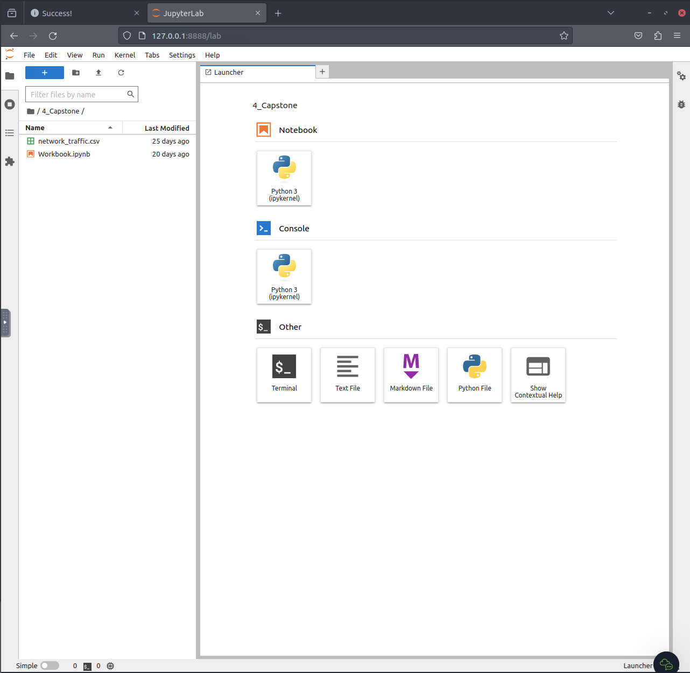
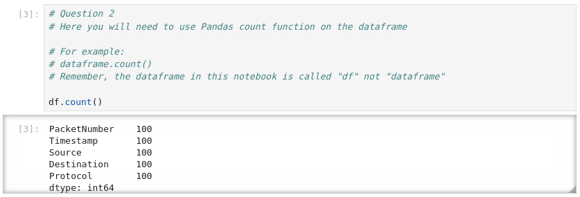
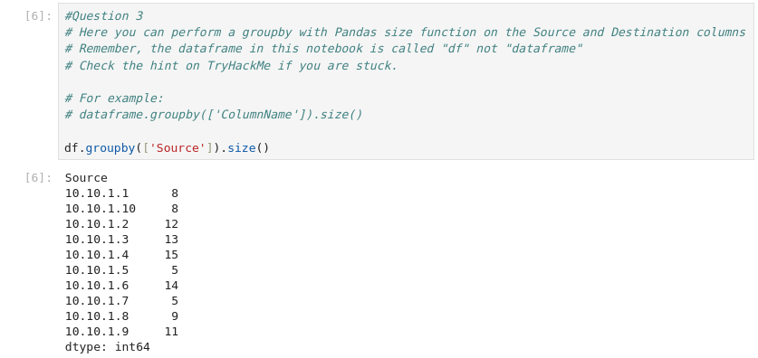
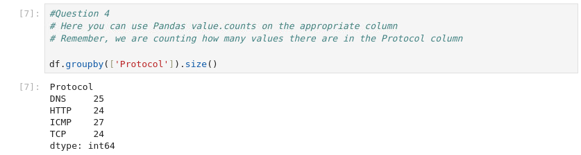

# [Day 2] Log analysis - O Data, All Ye Faithful
After yesterday’s resounding success, McHoneyBell walks into AntarctiCrafts’ office with a gleaming smile. She takes out her company-issued laptop from her knapsack and decides to check the news. “Traffic on the North-15 Highway? Glad I skied into work today,” she boasts. A notification from the Best Festival Company’s internal communication tool (HollyChat) pings.

It’s another task. It reads, “The B-Team has been tasked with understanding the network of AntarctiCrafts’ South Pole site”. Taking a minute to think about the task ahead, McHoneyBell realises that AntarctiCrafts has no fancy technology that captures events on the network. “No tech? No problem!” exclaims McHoneyBell.

She decides to open up her Python terminal…

## Overview
The core element of data science is interpreting data to answer questions. Data science often involves programming, statistics, and, recently, the use of Artificial Intelligence (AI) to examine large amounts of data to understand trends and patterns and help businesses make predictions that lead to informed decisions. The roles and responsibilities of a data scientist include:
* Data Collection
* Data Processing
* Data Mining (Clustering/Classification)
* Analysis (Exploratory/Confirmatory)
* Communication (Visualisation)

Other uses of data science in Cybersecurity include:
* SIEM
* Threat trend analysis
* Predictive analysis

### Jupyter Notebooks
Jupyter Notebooks are open-source documents containing code, text, and terminal functionality. They are popular in the data science and education communities because they can be easily shared and executed across systems. Additionally, Jupyter Notebooks are a great way to demonstrate and explain proof of concepts in Cybersecurity.

## Solution
I skipped directly to the challenges since I already worked with Python and Jupyter Notebooks.

We have to run all cells to get our data and can fill out the cells for this room.

### Open the notebook "Workbook" located in the directory "4_Capstone" on the VM. Use what you have learned today to analyse the packet capture.

### How many packets were captured (looking at the PacketNumber)?

### What IP address sent the most amount of traffic during the packet capture?

### What was the most frequent protocol?

### If you enjoyed today's task, check out the Intro to Log Analysis room.
Of course, I did.