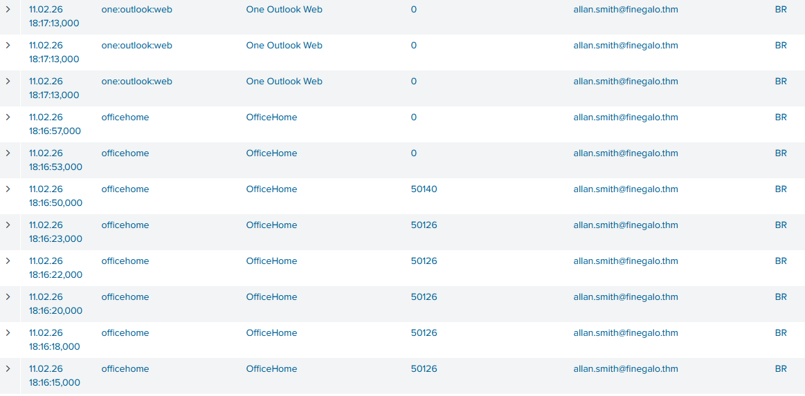
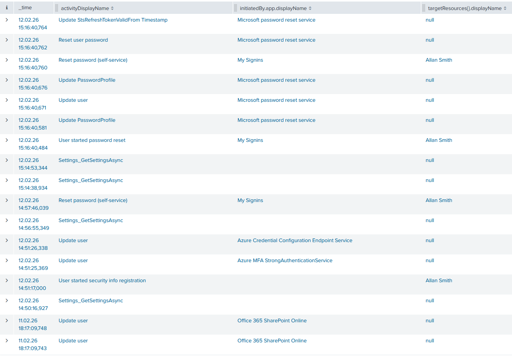
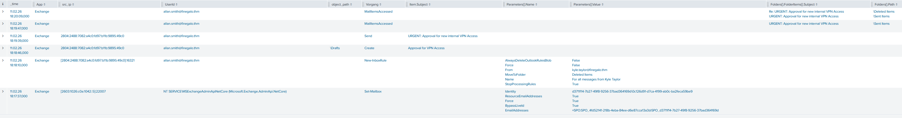

# M365 Monitoring Basics
https://tryhackme.com/room/m365monitoringbasics

## Task 1 - Introduction
- SOC analyst scenario
- **Microsoft Entra ID** for authentication and **Microsoft 365** (M365) for collaboration and email
- Multiple failed authentication attempts against a cloud account
- Followed by successful login
- After that suspicious behavior with user's M365 services

## Task 2 - What are Identity Providers
- Entra ID solves problems with a centralized authentication and authorization
- **Digital identity**
	- **Human identities**: people, such as employees, contractors, partners, or customers
	- **Workload identities**: software components, including applications, services, scripts, or containers, that need to authenticate to other systems
	- **Device identities:** physical devices like desktops, laptops, mobile phones, and devices. These identities are separate from the humans who use them
- **Identity Provider** (IdP): Responsible system for creating and managing these identities
	- e.g. Entra ID as cloud based IdP
- Benefits: centralized management, SSO, stronger authentication (e.g. MFA), better visibility/logging

### Questions
#### What type of application is Entra ID?
```
> Identity Provider
```

#### What type of identity is a server account?
```
> Device
```

## Task 3 - Identities as the Target
- **Entra ID is the gateway to everything**
- Outlook, Teams, SharePoint, and internal applications
- Single compromised account give legitimate access
- Interesting target for attackers
	- **Remote access from anywhere:** Authentication occurs over the internet, so attackers don’t need access to the internal network.
	- **Legitimate access to multiple services via :** One successful sign-in can unlock emails, files, chat, and connected apps for a user.
	- **Out of the radar of traditional tools:** Firewalls and endpoint tools may see nothing suspicious because the attacker is using valid credentials or the authentication is occurring outside of their visibility.
	- **Direct access to high-value resources:** Email and collaboration platforms contain sensitive data, internal communication, and often allow resetting account credentials and other authentication factors.

- IdP provide security controls, but often they aren't properly configured
- Common misconfigurations
	- **Lack of multi-factor authentication enforcement:** Attackers can gain access with simple stolen credentials, bypassing entirely.
	- **Overly permissive access policies:** Broad policies or group exclusions create gaps, allowing sign-ins from any location or exempting admin accounts from security requirements.
	- **Excessive administrative privileges:** Too many admin accounts or standing privileges increase the attack surface and, if compromised, provide full tenant control.
	- **Weak password policies:** Default settings may allow easily guessable passwords without protection against known breaches or common password lists.
	- **Disabled authentication risk policies:** Risky authentication attempts from suspicious or locations may be permitted if security policies aren’t enabled.
	- **Insufficient logging and monitoring:** Without active monitoring of sign-in and audit logs, suspicious activity can persist undetected for extended periods.

The logs can reveal to us:
- Successful and failed logins
- Reasons for failed logins (e.g., bad password)
- Account lockouts
- prompts and results
- Source IP address and users' geographic location
- Device and browser information
- Client/app used to authenticate (browser, mobile app, etc.).
- Conditional Access outcomes (allowed, blocked, required, etc.).

### Questions
#### What authentication resource can prevent attackers from authenticating with only a stolen password?
```
> MFA
```

#### What can help us detect and monitor cloud identity threats?
```
> Logs
```

## Task 4 - Entra ID Sign-in Logs
- Detailed logs for every authentication attempt, configuration change, and administrative action within a tenant
- What happened, when, where from, and often why it succeeded or failed.

### Entra ID Core Components
- **Users and Sign-ins (Authentication)**
	- every time a user attempts to authenticate to any service protected by Entra ID
	- successful logins, failed attempts, MFA challenges, and the context around each event (IP address, location, device, application, and others)
- **Roles and Access Decisions (Authorization)**
	- Changes to roles, group memberships, or permissions are all logged in audit events
- **Security Features**
	- **Multi-factor authentication** (Logs show whether MFA was required, prompted, satisfied, or bypassed)
	- **Conditional Access policies** (which policies were applied and their outcomes (allowed, blocked, required))
	- **Identity Protection** (native threat detection flags risky sign-ins (impossible travel, anonymous IP, password spray) and risky users)

### Sign-in Logs
- Multiple failed authentication attempts followed by a successful login

```c
index=scenario sourcetype="azure:aad:signin"
```

Example login attempt:
```js
{
  "id": "014adaeb-c9db-4119-8a9b-a9f68dd4b700",
  "createdDateTime": "2026-02-11T17:15:10Z",
  "userDisplayName": "John Doe",
  "userPrincipalName": "john.doe@contoso.onmicrosoft.com", // The user address
  "userId": "a1b2c3d4-e5f6-7890-a1b2-c3d4e5f67890",
  "appId": "4765445b-32c6-49b0-83e6-1d93765276ca",
  "appDisplayName": "OfficeHome", // Which application the user logged in to. In this case, the main web portal (office.com)
  "ipAddress": "203.0.113.45", // The IP address used by the user.
  "clientAppUsed": "Browser",
  "correlationId": "dc8fb3db-403c-43e4-b759-21aa137a143a",
  "conditionalAccessStatus": "success",
  "isInteractive": true,
  [...]
  "resourceDisplayName": "OfficeHome",
  "resourceId": "4765445b-32c6-49b0-83e6-1d93765276ca",
  "status": {
    "errorCode": 0, // The result of the authentication. Code 0 means successful.
    "failureReason": "Other.",
    "additionalDetails": null
 [...]
  "location": {  // Details about the location from the IP address used by the user.
    "city": "New York",
    "state": "New York",
    "countryOrRegion": "US",
    "geoCoordinates": {
      "altitude": null,
      "latitude": 40.7128,
      "longitude": -74.0060
    }
  },
  "appliedConditionalAccessPolicies": [ // Information about which access control policy was applied during the authentication process.
    {
      "id": "c63499f4-64b6-4943-bfc3-52fbb641ef10",
      "displayName": "Require MFA",
      "enforcedGrantControls": ["Block"],
      "enforcedSessionControls": [],
      "result": "notApplied"
    }
  ]
}
```

List all failed Sign-ins:
```c
index="scenario" sourcetype="azure:aad:signin" "status.errorCode"!=0
| stats count as event_count values(ipAddress) as ip_addresses
 values(appDisplayName) as applications values(status.errorCode) as errorCodes  by userPrincipalName
| sort - event_count
| table applications, userPrincipalName, ip_addresses, errorCodes, event_count
```

Common error codes for authentication alerts:
- `50126`: Invalid username or password
- `50053`: Account locked due to too many failed attempts
- `50074`: MFA required but not provided
- `50055`: Password expired

Lookup tool for error codes: https://login.microsoftonline.com/error

Login flow:



Code `50140` means that the user picked to keep signed in. We can also see, that all requests came from the same IP address: `2804:2488:7082:a4c0:fd97:b11b:9895:49c0`

List all successful Sign-ins from an IP address:
```c
index=scenario sourcetype="azure:aad:signin" "status.errorCode"=0 ipAddress="2804:2488:7082:a4c0:fd97:b11b:9895:49c0"
| stats values(ipAddress) as ip_addresses values(appDisplayName) as applications  by userPrincipalName
| table applications, userPrincipalName, ip_addresses
```

### Questions
#### What is the email address of the compromised identity?
```
> allan.smith@finegalo.thm
```

#### What is the IP address used by the attacker?
```
> 2804:2488:7082:a4c0:fd97:b11b:9895:49c0
```

#### What is the city of the IP address used by the attacker?
```
> Belo Horizonte
```

#### When was the first successful sign-in in the compromised account after the failure attempts?
Answer Format: 1/12/25 1:15:00.000 PM  
(Exact Splunk `Time` value)
```
Timestamp (see above screenshot)
> 11.02.26 18:16:53,000

Formatted
> 2/11/26 6:16:53.000 PM
```

#### What is the first application the attacker accessed after the office home page?
Answer Format: The exact value of the `appDisplayName` field.

```
> One Outlook Web
```

## Task 5 - Entra ID Audit Logs
- Identify the changes the attacker made -> **Audit Logs**
- Audit logs capture administrative actions and changes within Entra ID like
	- Resetting passwords to maintain access
	- Adding new MFA methods or devices
	- Assigning privileged roles to escalate access
	- Modifying user attributes
	- Registering malicious applications

### Hunting for Post-Compromise Activity
List all Audit logs
```c
index=scenario sourcetype="azure:aad:audit"
```

Interesting fields:
- `activityDisplayName`: The detailed activity or action that was performed by a user or app. All activities that generate logs are documented on this [Microsoft page (opens in new tab)](https://learn.microsoft.com/en-us/entra/identity/monitoring-health/reference-audit-activities) (e.g., "Change user password", "Disable account").
- `initiatedBy`: The account or app that performed the action. When the source of the action is a user account, this field contains its email address. In the case of an app, it will have the app name.
```js
initiatedBy:
 {
  app: {
    appId: null
    displayName: Microsoft password reset service // An app executed the change.
    servicePrincipalId: d6871dee-b91e-42a7-b98e-beeb5357dfff
    servicePrincipalName: null
  }
  user: null
  }
```

- `targetResources`: The account or object that has been changed or affected by an action.
```js
targetResources: [
{
   displayName: null
   groupType: null
   id: d15f0e8c-80f7-41c0-b861-207d79cbb734
   modifiedProperties: [
     {   
       displayName: ForceChangePassword   
       newValue: "True"   
       oldValue: "False" 
     } 
     {   
       displayName: Password // The Resource that was changed   
       newValue: null   
       oldValue: null 
     }   
   ]   
   type: User   
   userPrincipalName: email@example.thm // The target identity 
     } 
   ]
```

Showing those fields:



List changes targeting a specific user
```c
index=scenario sourcetype="azure:aad:audit" targetResources{}.userPrincipalName="allan.smith@finegalo.thm" 
| eval initiator=coalesce('initiatedBy.user.userPrincipalName', 'initiatedBy.app.displayName')
| sort - _time
| table _time, initiator, activityDisplayName, result, targetResources{}.userPrincipalName
```

List changes performed by a user
```c
index=scenario sourcetype="azure:aad:audit" initiatedBy.user.userPrincipalName="allan.smith@finegalo.thm" 
| sort - _time
| table _time, initiatedBy.user.userPrincipalName, activityDisplayName, result, targetResources{}.userPrincipalName
```

### Questions
#### What was the first change made by the attacker in the compromised user account?
Answer Format: Paste the exact value of `activityDisplayName`
```
> User started security info registration
```

#### What is the `activityDisplayName` that reveals **all** the details of the modified properties in a user?
```
> Update user
```

#### What is the second change made in the account?
Answer Format: Paste the exact value of the `activityDisplayName` field.
```
> Reset password (self-service)
```

## Task 6 - M365 Introduction
- What the attacker did with that access
- Entra ID tells you who authenticated
- **Microsoft 365 logs tell you what they did after**
- M365 is a collection of cloud-based productivity and collaboration services tied to Entra ID identities
	- **Exchange Online (Outlook):** Email, calendars, and mailbox management
	- **SharePoint Online:** Document storage, file sharing, and team sites.
	- **OneDrive:** Personal cloud storage.
	- **Teams:** Chat, meetings, and collaboration.
	- **Other services:** Power BI, Dynamics, and various Microsoft apps.

For an attacker with valid credentials, M365 services provide:
- **Access to sensitive communications:** Email contains business decisions, credentials, financial information, and confidential discussions.
- **Document repositories:** SharePoint and OneDrive store the company's intellectual property, customer data, and strategic plans.
- **Persistence mechanisms:** Mailbox rules, forwarding rules, and application permissions allow attackers to maintain access even after password changes.
- **Further credential harvesting:** Attackers can search for credentials, keys, or sensitive information in emails and files.

### M365 Relevant Logs
- Centralized in the **Unified Audit Log**, which captures events from Exchange, SharePoint, OneDrive, Teams, and other M365 services.

**Exchange (Mailbox) Logs:**
- Mailbox access and email operations (read, send, delete)
- Mailbox rule creation (often used for persistence or email exfiltration)
- Mailbox permission changes
- Forwarding rule creation

**SharePoint and OneDrive Logs:**
- File accessed, downloaded, or modified
- File sharing and permission changes
- Folder operations

**General M365 Activity:**
- Application permissions granted
- Service configurations changed
- Administrative actions performed

The complete reference for M365 audit logs can be found [here](https://learn.microsoft.com/en-us/purview/audit-log-activities).

## Task 7 - M365 Audit Logs
List all M365 Audit logs
```c
index="scenario" sourcetype="o365:management:activity"
```

Key fields:
- `Operation`: The specific action performed (e.g., "New-InboxRule", "FileAccessed", "Send").
- `UserId`: The account that performed the action, usually an email address.
- `ClientIP` or `ClientIPAddress`: The source IP address (Note that sometimes this information can be an Office 365 IP address. Ensure you always check the registrant for ClientIP).
- `Workload`: The M365 service where the action occurred (Exchange, SharePoint, OneDrive).
- `ObjectId`: The target resource (email address, file path, mailbox).

Audit logs with relevant information:



We can see that an inbox rule is created to move incoming mail from a specific sender to deleted items. Afterwards the attacker sends an email (probably to that sender). The last entry show that the attacker accessed the received response to that send mail.

### Post-Compromise
Some common post-compromise activities you should be aware of:

**Mailbox Manipulation:**
- Creation of inbox rules to delete, forward, or move emails
- Mass email deletion or moves to the deleted items
- Emails sent to external addresses
- Access from unusual IP addresses or locations

**File Operations:**
- Mass file downloads from SharePoint or OneDrive
- Access to sensitive or executive-level documents
- File sharing to external domains
- Downloads of files the user wouldn't normally access

List actions performed by a user
```c
index="scenario" sourcetype="o365:management:activity" UserId="allan.smith@finegalo.thm"
| sort - _time
| eval sourceIP=coalesce('ClientIP', 'ClientIPAddress')
| table _time, Operation, UserId, sourceIP, Workload, ObjectId
```

### Questions
All information can be found in the above screenshot.

#### What is the application used by the attacker?
Answer Format: Paste the exact value of the `Workload` field.
```
> Exchange
```

#### What is the change made in the user application by the attacker?
Answer Format: Paste the exact value of the `Operation` field.
```
> New-InboxRule
```

#### What is the subject of the email message sent by the attacker?
```
> URGENT: Approval for new internal VPN Access
```

#### When did the attacker access the response to the message?
Answer Format: 1/12/25 1:15:00.000 PM  
(Exact Splunk `Time` value)
```
Timestamp
> 11.02.26 18:20:09,000

Formatted
> 2/11/26 6:20:09.000 PM
```

#### Which path was the response stored in?
Answer Format: \PathName
```
> \Deleted Items
```

## Task 8 - Conclusion
Nothing interesting here.
